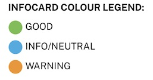

# Key Concepts

## RIPEstat is a self-contained "App"

The previous RIPEstat website contained a lot of separate information that made it difficult to focus on the core functionality that RIPEstat provides. In the redesign, we wanted RIPEstat to behave more like an app, and be conceived of as such.

## Responsive and mobile friendly

The RIPEstat UI adapts well to mobile, tablets, and desktop. It is even installable on mobile devices as a PWA (Progressive Web Application).

## User customisation

We have added many ways for users to customise how they are interacting with RIPEstat. This includes being able to save collections of information, setting the order of information, drilling into the details, and even setting language and theme preferences.

## Universal search context (resource, range, etc. applies to all displayed elements)

In the previous RIPEstat UI, each widget was a self-contained item with its own search box input, a variety of controls and different ways of retrieving information. We have vastly simplified how information is searched for in the majority of cases with a unified search bar whose contexts (of resource inputs and date ranges) are applied universally to all information queries at the same time.

## Simple to more complex insights

One of the more important goals for the team was to help users receive and be able to understand the results of a query as quickly as possible. To that end, we have designed infocards that start out with a simple, top-line status information that is easily digested. From there, users can expand each of these infocards for increasing levels of detail about their query. In addition, infocards are colour-coded by status so you can see when everything is great, what's neutral/informational, or when you might want to investigate something further.

## Shareability of insights

The RIPEstat UI makes it easy to share the collection of information you have configured, whether it be a snapshot in time or just the latest information. The system provides you an easily accessible share link so that others can see what you are seeing.