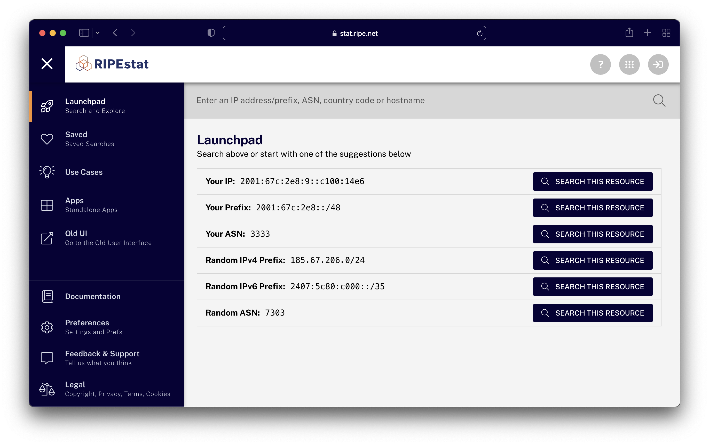

# Launchpad

The Launchpad is the place to start for exploring data in RIPEstat. It displays the entire collection of information available to you for a given search, and allows you to organise that information, save it, or share it.

<figure>
  
  <figcaption>The Launchpad</figcaption>
</figure>