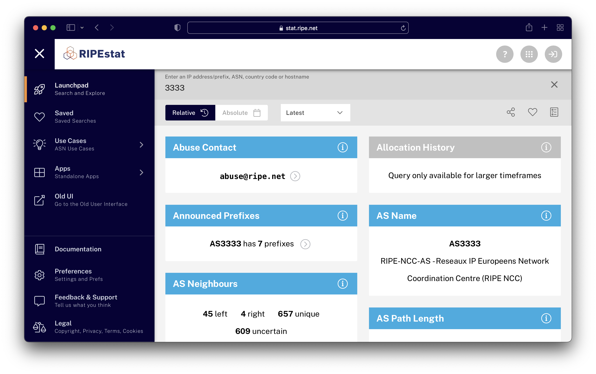
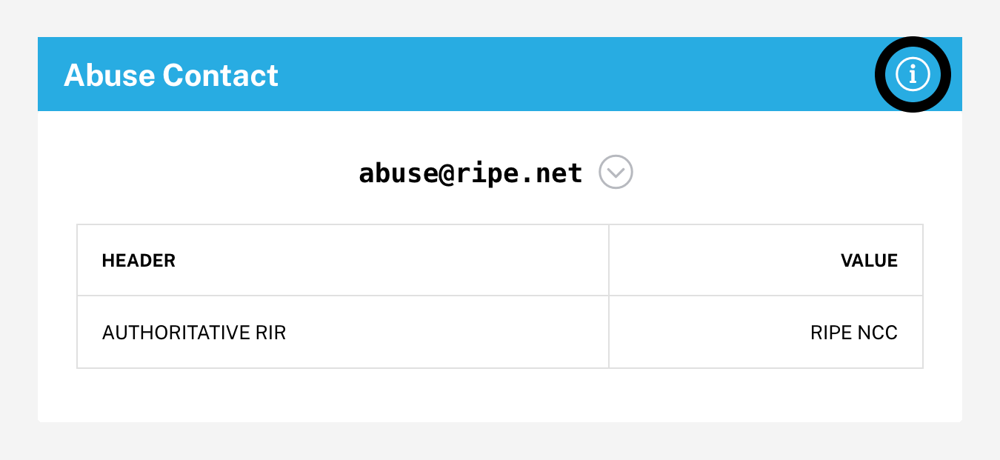
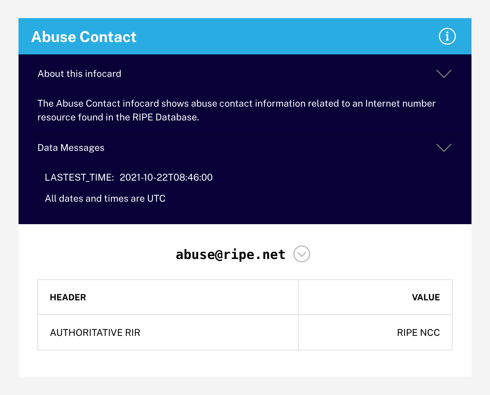

# Infocards

Infocards are discrete pieces of information about a resource. When grouped together in certain ways, they constitute a particular use case. We have assembled some common use cases for you under the Use Cases menu, but you can also create your own groupings with saved searches.

<figure>
  
  <figcaption>Search result on the Launchpad showing various infocards</figcaption>
</figure> 

## Anatomy of an Infocard

Each infocard consists of a titlebar and a content area. The titlebar contains the title as well as close button (on hover) and info button.

### Titlebar

You can use the titlebar to:

- Drag the infocard to another location relative to its sibling cards
- Display or hide info about the card and its data
- Hide the card (when hovering, an "x" will appear that when clicked on will hide the infocard)

<figure>
  
  <figcaption>Location of the info reveal/hide button on an infocard</figcaption>
</figure> 

<figure>
  
  <figcaption>Example of an expanded infocard with about and data info shown</figcaption>
</figure> 

### Content area

The main content area will generally show a short summary line about the queried resource. If there is more detailed information, it can be revealed by clicking the more info button. 