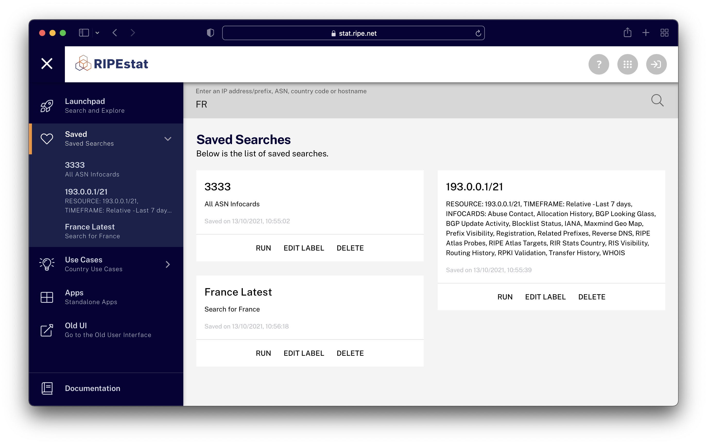
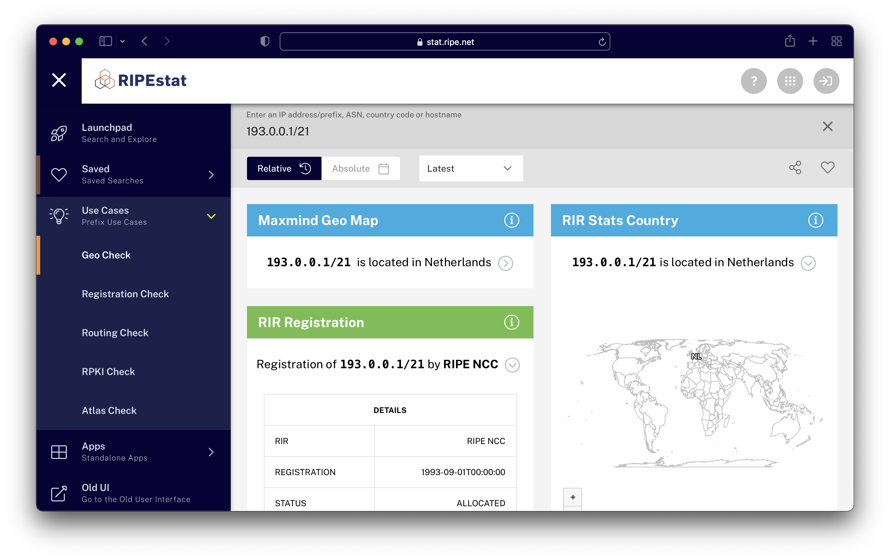

# Sidebar Menu Items

In addition to the all-important Launchpad mentioned above, the sidebar menu contains a variety of other useful sections.

## Saved

This menu item is the place that holds your saved searches, and allows you to edit their names and descriptions as well as run them by clicking in the each sub menu item created by a save.
<figure>
  
  <figcaption>Saved searches page</figcaption>
</figure>

## Use Cases

This menu will change depending on the type of search you have made in the search bar. For example, if you have searched for an ASN resource, this menu will be populated with ASN Use Cases like Geo Check and Registration Check (among others). You can click on any of these to filter the info cards for your search to the collection representing the particular use case.
<figure>
  
  <figcaption>Geo Check from the use cases menu</figcaption>
</figure>

## Apps

The standalone apps menu contains items that do not exactly fit the search bar paradigm of input + time window. This is because they represent information that is either too complex or takes too many inputs. Most of these exist in the previous UI, and clicking on one of these links will send the user to the older UI. The RIPEstat team will be evaluating and reworking these in the coming months to improve ways to integrate this type of information going forward. As with the Use Cases menu above, the Apps menu will also populate with apps that are appropriate to the search type entered.

## Old UI

Quite simply, this menu will take users directly to the previous interface in case there is something there that has not yet made it to the new UI, or because they are more comfortable searching for things in the older interface.

## Documentation

This menu directs users to complete documentation about the UI and data related to it (what you are reading now).

## Preferences

This menu will take you to the [Preferences page](../06-preferences.md), which allows users to set their preferred language, infocard layout width, infocard theme choice, and more.

<figure>
  
  <figcaption>The Preferences screen</figcaption>
</figure>

Preferences page contains a variety of user settings, which you can read about [here](../06-preferences.md)

## Feedback

This menu will launch a Usersnap feedback form that allows users to report any issues or feedback about the UI, including screenshots and annotations that will allow us to improve the UI for you.

## Legal

The legal menu contains all-important legal information related to RIPEstat.