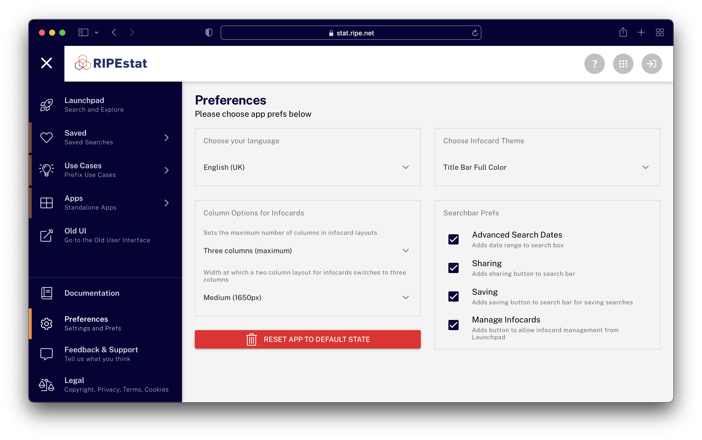

# Preferences
The new RIPEstat UI is more customizable than ever before. Below we present a tour of the Preferences page, which is accessible from the lower left sidebar menu.

<figure>
  
  <figcaption>The Preferences screen</figcaption>
</figure>

## Language
The RIPEstat UI supports multiple languages, and you can choose among them here. Most of the major interface menus have already been translated, and we are adding more translatable strings (for infocard and other items) all the time. If you are interested in providing translations in your language for strings that are still in English, you can do so with a RIPE NCC Access account. If you have such an account, you can contribute to translations [here](https://weblate.ripe.net/projects/ripestat-ui/).

## Column Options for Infocards
In this section you can set 1-3 maximum columns for displaying infocards, and if you have chosen 3 you can set the window width at which the layout will switch from 2 to 3 columns. This can help with allowing the width of infocards to be wider or narrower, depending on your preference.

## Themes
Infocards can be displayed in a variety of themes to suit your particular taste.

## Searchbar Prefs
In this section you can decide which elements will show in the lower part of the search bar. For example, if you like a very minimal interface and only ever search in the "latest" timeframe, unchecking all of these items will completely remove the lower part of the searchbar from the interface.