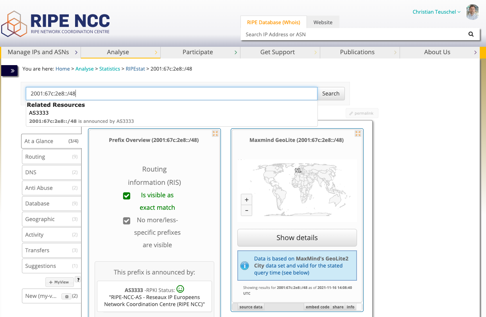

# RIPEstat Documentation for the old UI (aka UI2013)

This page describes RIPEstat's previous but still supported UI (aka UI2013), which is based on the RIPEstat Widget API. 

The landing page can be found under:

[https://stat.ripe.net/ui2013/](https://stat.ripe.net/ui2013/)

Or directly going to the result page for a resource:

[https://stat.ripe.net/ui2013/{resource}](https://stat.ripe.net/ui2013/as3333)

## Landing Page

The landing page is the entry point for looking up a resource. 

There are multiple ways to choose a resource:
- enter a resource manually in the input field
- use the a suggestion from the drop-down menu
- pick a sample resource ("Try one of these") or
- select your network resources as seen from external 

## Result Page

The result page is showing all the information that RIPEstat can offer for the lookup.

The information that you see is grouped in categories, this can be a data source or a use-case.

Please see the Widget API documententation for more details on what features the widgets offer.