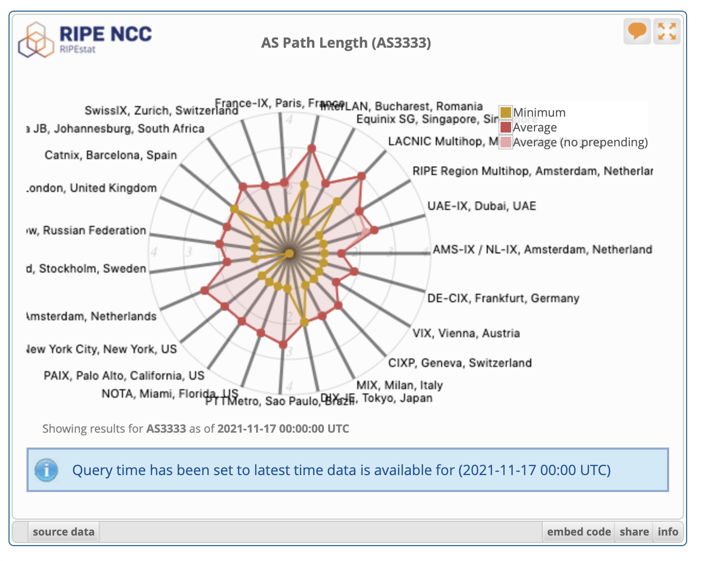
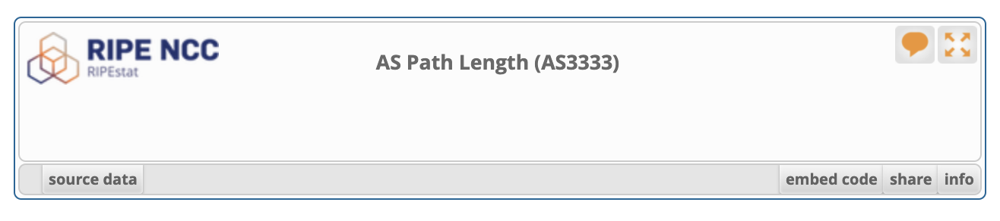
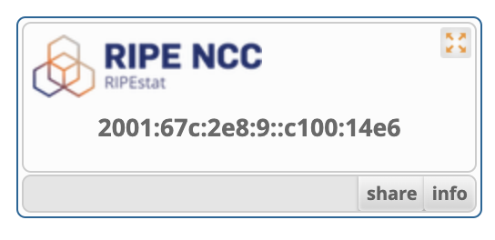
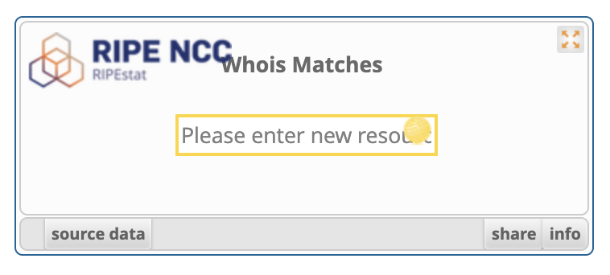

# RIPEstat Widget API

RIPEstat Widget API is a framework of visualisations that can be embedded in HTML websites. The content and appearance of the widgets are automatically rendered according to the configuration parameters supplied in the embedding code.

Data for the widgets is sources from the RIPEstat Data API. RIPEstat's previous UI (aka UI2013) has been based on the Widget API.

## Basic Embedding

A RIPEstat widget can be embedded in its most simple form using the following HTML code block:

```html

<script src="//stat.ripe.net/widget-api/widget_api.js"></script>
<div class="statwdgtauto"><script>ripestat.init("as-path-length",{"resource":"AS3333"})
</script></div>

```

In this example, **as-path-length** specifies the widget type, and **AS3333** which resource to render it for. You can configure these fields to adapt to the information you intend to show.

When embedded in an HTML webpage, this example code will render the following widget:



## Importing the Library

As seen in the previous sample code, the first line includes the RIPEstat Javascript library necessary to build the widget. This is loaded directly from the the RIPEStat servers, to ensure the latest version of the widgets are always available. The script include line should be:

```html

<script src="//stat.ripe.net/widget-api/widget_api.js"></script>

```

This include command can be present in the head or the body elements of the HTML document as long as it's done before the code which initialises the widget. If you have more than one RIPEstat widget on your webpage, you only need to include the library once, even though multiple includes will cause no harm.

## Initialisation methods

You can build a RIPEstat widget in two different ways:

#### 1 - Using init

```js

ripestat.init( 
	widget-type 
	[, { loading-parameters } ] 
	[, html-element-id ] 
	[, { styling-parameters } ] 
	[, load-callback() ]
)

```

Will build and load a widget of type **widget-type**. Using the remaining optional parameters, you can specify configuration details for its behaviour:  

*   **loading-parameters** - Define a map of the input parameters for the data to be displayed in the widget (example: resource, starttime, etc.)
*   **html-element-id** - You can specify an HTML ID to ensure that the widget is built at a certain document location, or to separate the div element from the script command
*   **styling-parameters** - Define a map of the styling parameters that define the layout of the widget (for example: size, disabled items, etc.)
*   **load-callback** - Since the content of the widget is loaded asynchronously via AJAX, this optional parameter specifies a function to be run once the loading of the data is complete

#### 2 - Using preload

```js

ripestat.preload( 
	widget-type 
	[, { loading-parameters } ] 
	[, html-element-id ] 
	[, { styling-parameters } ]
)

```

This initialisation method will build only the container of the widget, without loading the data. You can later trigger the data load using the RIPEstat class method "**load()**". The parameters are the same as the **ripestat.init** method except that there is no callback function.

This is an example of a widget with no loaded data:  



For both methods, if the **html-element-id** is not provided, empty, or equals **null**, the widget constructor will build it on the location of the **div** with the class name "**statwdgtauto**" which should be the parent element of the script call. Therefore, if you use the **html-element-id** field, the **`<div class="statwdgtauto">`** element is not needed and the script call does not need to be enclosed in this div.

If neither an **html-element-id** is provided nor a **div** with the class name "**statwdgtauto**" can be found, the widget initialiser will fail and launch a browser console exception.


## Data loading parameters

The data loading parameters can be used to control which RIPEstat data is loaded by the widget. The parameters change per widget type and some of them are required for certain widgets, while other ones might be optional parameters.

If a required parameter is not provided, the widget will be unable to load its data and will display an error message, such as:  

```html

<div align="center">

<div class="statwdgtauto"><script>ripestat.init("as-path-length", {})</script></div>

</div>

```

## Styling parameters

Several styling aspects of the widget can be configured to facilitate its embedding into different contexts. This is done using the optional styling parameters field.  
For example, the following styling parameters:

```js

ripestat.init("whats-my-ip", {}, null, {
	size: "mini",
	disable: ["title", "data", "embed-code"]
})	
	
```

Generate the following widget layout:




The styling parameters available are:

#### size

This defines the size of the widget.  
The width can be stated as a pixel value e.g. "300" means 300px or with these defaults (including width size):

*   **micro** (160px)
*   **mini** (256px)
*   **small** (360px)
*   **compact** (480px)
*   **medium** (640px) [default]
*   **large** (1280px)
*   **fit** (adjusts to the size of the parent element)

#### disable

This defines an array of items to remove from the widget layout. By default all are enabled. The items are:  

*   **title** - Disables the widget title
*   **container** - Disables the container border and the footer links
*   **logo** - Disables the RIPEstat logo
*   **feedback - Disables the top-right button that asks for feedback regarding the widget**
*   **maximize - Disables the top-right button for entering full-screen mode**
*   **data** - Disables the data button
*   **data-download** - Disables the URL to download the data directly from the RIPEstat data API
*   **embed-code** - Disables the grab button that shows the embedding code section for embedding in other webpages
*   **permalink** - Disables the permalink button that shows the url for sharing this exact widget view
*   **info** - Disables the info button that shows the information and methodology of the widget
*   **footer-buttons** - Disables all the footer buttons (data, grab, permalink and info)

#### show_controls

This argument let you enable an input field in the widget to query for different resources. Valid values are "yes" or "no". Additionally the presented text in the input field can be modified with the "resource_input_text" parameter. Default would be "Enter a resource" otherwise.

For example:

```js

ripestat.init("whois", {}, null, {
    size: "small",
    disable: ["title", "data", "embed-code"],
    show_controls: "yes",
    resource_input_text: "Please enter new resource"
})

```

Generates the following widget:




## Widget manipulation methods

The initialisation method of the widget returns an instance of the RIPEstat widget class. This instance can be used to further manipulate and communicate with the widget. For example:

```js

var my_widget = ripestat.init("as-path-length",{"resource":"AS3333"});
var my_title = my_widget.get_title();
my_widget.update({"resource":"AS123"});
var my_data_uri = my_widget.get_data_uri();
my_widget.reload();

```

The available class methods for widget manipulation are:  

*   **get_title()** - Returns the title of the widget.
*   **get_param(loading-param-name)** - Returns the current value of the provided loading parameter. For example: my_widget.get_param("resource").
*   **get_styling()** - Returns the current values of the provided styling parameters.
*   **get_data_uri()** - Returns the URI to get the data from the RIPEstat data API used in this widget.
*   **get_data()** - Returns a structure with the specific data currently in use by the widget. Returns null if there is currently no data loaded.
*   **load([callback-function])** - Load the data from the RIPEstat data API into the widget and display the content. Note that the data loading is done asynchronously and the data might not be available in the widget right after the method call returns. You can use the optional callback field to specify a function to run when the loading is complete.
*   **reset()** - Empties the widget and discards the current data, effectively returning it to the same state as when pre-loading.
*   **reload([callback-function])** - Reloads the most recent data from the RIPEstat API into the widget. The callback field functions identically to the load method.
*   **update({ new-loading-param: value, ... } [, callback-function])** - Update the data shown by the widget using new loading parameters.

## Currently available widgets

You can check all the available RIPEstat widget types using the method:

```js

ripestat.list_widgets()

```

This method returns a list of the widget types supported by RIPEstat. Currently, the available widgets are:

```

 "abuse-contact-finder"
 "address-space-hierarchy"
 "address-space-usage"
 "afrinic-transfer-history"
 "allocation-history"
 "announced-prefixes"
 "announced-prefixes-inrdb"
 "announced-prefixes-prototype"
 "announced-prefixes-ursa"
 "apnic-abuse-contact-finder"
 "apnic-irr-explorer"
 "apnic-transfer-history"
 "apply-for-a-probe"
 "as-overview"
 "as-overview-inrdb"
 "as-overview-ursa"
 "as-path-length"
 "as-path-length-inrdb"
 "as-path-length-ursa"
 "as-routing-consistency"
 "as-routing-consistency-inrdb"
 "as-routing-consistency-ursa"
 "asn-neighbours"
 "asn-neighbours-history"
 "asn-neighbours-history-inrdb"
 "asn-neighbours-history-ursa"
 "asn-neighbours-inrdb"
 "asn-neighbours-ursa"
 "atlas-ping-measurements"
 "atlas-ping-measurements-inrdb"
 "atlas-ping-measurements-ursa"
 "atlas-ping-measurements-with-export"
 "atlas-probe-deployment"
 "atlas-probe-traffic"
 "atlas-probe-traffic-inrdb"
 "atlas-probe-traffic-ursa"
 "atlas-probes"
 "atlas-streaming-one"
 "atlas-streaming-two"
 "atlas-targets"
 "backend-errors"
 "bandwidth"
 "bandwidth-history"
 "bgp-update-activity"
 "bgp-update-activity-inrdb"
 "bgp-update-activity-ng"
 "bgp-update-activity-ursa"
 "bgplay"
 "bgplay-inrdb"
 "bgplay-ursa"
 "blacklist"
 "blocklist"
 "caida-as-relationships"
 "country-asns"
 "country-resource-list"
 "country-routing-stats"
 "country-routing-stats-sg"
 "dns-chain"
 "dns-check"
 "forward-dns"
 "generic-column-graph"
 "generic-donut-graph"
 "generic-line-graph"
 "generic-map"
 "generic-pie-graph"
 "genericwidget"
 "genericwidgetmap"
 "geoloc"
 "global-networks"
 "historical-whois"
 "iana-registry-info"
 "interdomain-landscape"
 "ipv6-launch-day-forward-dns"
 "ipv6-launch-dns"
 "looking-glass"
 "looking-glass-beta"
 "looking-glass-old"
 "maxmind-geo-lite"
 "maxmind-geo-lite-announced-by-as"
 "maxmind-geo-lite-announced-by-as-history"
 "maxmind-geo-lite-history"
 "network-activity"
 "network-info"
 "performance-data"
 "point-of-contact"
 "prefix-count"
 "prefix-count-inrdb"
 "prefix-count-prototype"
 "prefix-count-ursa"
 "prefix-overview"
 "prefix-overview-inrdb"
 "prefix-overview-ursa"
 "prefix-routing-consistency"
 "prefix-routing-consistency-flow"
 "prefix-routing-consistency-inrdb"
 "prefix-routing-consistency-ursa"
 "prefix-size-distribution"
 "prefix-size-distribution-inrdb"
 "prefix-size-distribution-prototype"
 "prefix-size-distribution-ursa"
 "related-prefixes"
 "result-info-ipv6ld"
 "reverse-dns"
 "reverse-dns-consistency"
 "reverse-dns-consistency-inrdb"
 "reverse-dns-consistency-old"
 "reverse-dns-consistency-ursa"
 "reverse-dns-ip"
 "ripe-transfer-history"
 "rir-geo"
 "rir-geo-by-ip"
 "rir-geo-history"
 "rir-prefix-size-distribution"
 "rir-prefix-size-distribution-slash-eights"
 "rir-stats-country"
 "rir-stats-country-history"
 "ris-768"
 "ris-first-last-seen"
 "ris-full-table-threshold-history"
 "routequake"
 "routing-history"
 "routing-history-inrdb"
 "routing-history-old"
 "routing-history-prototype"
 "routing-history-ursa"
 "routing-status"
 "routing-status-inrdb"
 "routing-status-ng"
 "routing-status-old"
 "routing-status-ursa"
 "routing-table-statistics"
 "rpki-by-as"
 "rpki-by-country"
 "rpki-by-trust-anchor"
 "speedchecker-bandwidth-measurements"
 "suggestions"
 "syria-monitor"
 "upstream-visibility"
 "usage-data"
 "usage-details"
 "usage-overview"
 "visibility"
 "visibility-inrdb"
 "visibility-ursa"
 "whats-my-ip"
 "whois"
 
```

You can find more information about the several types, including which loading parameters are applicable to each widget from the [RIPEstat data API documentation](//stat.ripe.net/docs/data_api).

## Browser support

The RIPEstat widgets are supported by all the latest versions of the following major web browsers:

*   Firefox
*   Safari
*   Google Chrome
*   Internet Explorer

## Full-screen on load

Clicking the **Maxmize** button renders a widget in full-screen mode. The same behavior can be achieved by the URL parameter `show=maximized` but only on a single-widget page: `.../widget/<widget-name>`.  
E.g.: `https://stat.ripe.net/widget/whois#w.resource=as3333&w.show=maximized`

## New (Dutch) Cookie Law

According to the new (Dutch) Cookie Law we'd like to inform you about the (browsers) cookies that are used when you embed a widget:

<table>
<tbody>
<tr>
<th>Cookie Name</th>
<th>Purpose</th>
<th>Term</th>
</tr>
<tr>
<td>stat-session</td>
<td>A standard cookie for user identification and session persistance.</td>
<td>2 weeks</td>
</tr>
<tr>
<td>stat-csrftoken</td>
<td>Enhances security to protect from cross-site scripting attacks.</td>
<td>1 year</td>
</tr>
<tr>
<td>crowd.token_key</td>
<td>Used to identify logged in users among RIPE NCC services (Single Sign On)</td>
<td>Session</td>
</tr>
</tbody>
</table>

## Troubleshooting

Because of the variety of possible environments in which a RIPEstat widget can be embedded in, it is possible, even though uncommon, that conflicts occur between the widget and the parent html page.

Here are a few advices that can help prevent some of the common problems.

### jQuery related

The jQuery library is loaded automatically by the RIPEstat widget API, unless a jQuery library is already available in the environment at loading time. If there is one, then the currently available jQuery will be used by RIPEstat. Also, if jQuery is loaded by RIPEstat then it will be done in **noConflict** mode to avoid interference with other possible existing frameworks that utilise the '**$**' identifier, such as prototype.

Therefore, if you use jQuery in your page, it's advised to follow these guidelines:

*   Make sure to include jQuery **before** the RIPEstat widget api library. Including it after may cause the widgets to malfunction.
*   Use a recent version of jQuery. Older versions might not be supported by RIPEstat.

### Ajax related

RIPEstat widget initialisation and manipulation can be done assynchronously via Ajax methods without problems. However, it is advised that the loading of the widget_api.js library is **not** done asynchronously to ensure it is always present before the loading of the base html document finishes.

### CSS related

In order to prevent your page styling from affecting the layout of the RIPEstat widgets, it's advised to keep the namespace of your CSS properties specific to the elements to be styled. If CSS properties of generic html tags are modified, this might cause the visual layout of the widgets to change.

### Other

If you notice a conflict between your web page and a RIPEstat widget which cannot be solved by any of the methods mentioned above, it's advised to include the RIPEstat widget code inside an **iframe** to isolate the widget environment and avoid the interference with the parent webpage.

Lastly, feel free to contact us at [stat at ripe.net](mailto:stat@ripe.net) for more information or to report any specific issue related to the RIPEstat widget API.