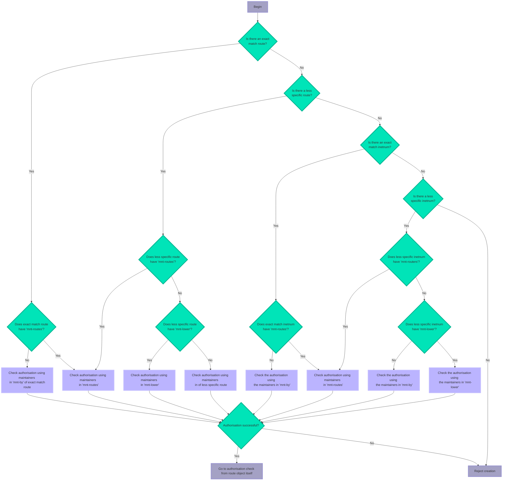

# Route Object Creation Flowchart

```mermaid
flowchart TB
A[Begin]:::initLastNodes --> B{Is there an exact <br> match route?}:::decisionNodes


B --> |Yes| C{Does exact match route <br> have 'mnt-routes'?}:::decisionNodes
B --> |No| D{Is there a less <br> specific route?}:::decisionNodes
C --> |No| F[Check authorisation using maintainers <br> in 'mnt-by' of exact match route]:::operationNodes
C --> |Yes| E[Check authorisation using maintainers <br> in 'mnt-routes']:::operationNodes

D --> |Yes| G{Does less specific route <br> have 'mnt-routes'?}:::decisionNodes
D --> |No| H{Is there an exact <br> match inetnum?}:::decisionNodes
G --> |Yes| E[Check authorisation using maintainers <br> in 'mnt-routes']:::operationNodes
G --> |No| I{Does less specific route <br> have 'mnt-lower'?}:::decisionNodes
I --> |Yes| J[Check authorisation using maintainers <br> in 'mnt-lower']:::operationNodes
I --> |No| K[Check authorisation using maintainers <br> in of less specific route]:::operationNodes

H --> |Yes| L{Does exact match inetnum <br> have 'mnt-routes'?}:::decisionNodes
H --> |No| M{Is there a less <br> specific inetnum?}:::decisionNodes
L --> |No| N[Check the authorisation using <br> the maintainers in 'mnt-by']:::operationNodes
L --> |Yes| O[Check authorisation using maintainers <br> in 'mnt-routes']:::operationNodes

M --> |Yes| P{Does less specific inetnum <br> have 'mnt-routers'?}:::decisionNodes
M --> |No| Q[Reject creation]:::initLastNodes
P --> |Yes| O[Check authorisation using maintainers <br> in 'mnt-routes']:::operationNodes
P --> |No| R{Does less specific inetnum <br> have 'mnt-lower'?}:::decisionNodes
R --> |No| S[Check the authorisation using <br> the maintainers in 'mnt-by']:::operationNodes
R --> |Yes| T[Check the authorisation using <br> the maintainers in 'mnt-lower']:::operationNodes


F --> U{Authorisation successful?}:::decisionNodes
E --> U
J --> U
K --> U
N --> U
O --> U
S --> U
T --> U

U --> |Yes| V[Go to authorisation check from route object itself]:::initLastNodes
U --> |No| Q

%% Class Definitions
%% =================

classDef initLastNodes fill:#a4a1c4,stroke:#9b96cf,stroke-width:4px
classDef decisionNodes fill:#00e4b8,stroke:#00b693,stroke-width:4px
classDef operationNodes fill:#bbb4ff,stroke:#c2bcff,stroke-width:4px


```
