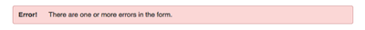
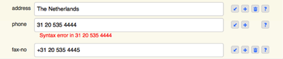
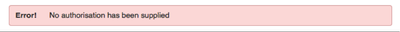
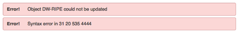

# RIPE Database Documentation

**RIPE Database Documentation**

* [1.1 RIPE Database Documentation Overview](#ripe-database-documentation-overview)
* [1.2 Intended Audience](#intended-audience)
* [1.3 Conventions Used in the RIPE Database Documentation](#conventions-used-in-the-ripe-database-documentation)

* [2.1 Purpose and Content of the RIPE Database](#purpose-and-content-of-the-ripe-database)
* [2.1.1 Purpose of the RIPE Database](#purpose-of-the-ripe-database)
* [2.1.2 RIPE Internet Number Registry](#ripe-internet-number-registry)
* [2.1.3 The RIPE Internet Routing Registry](#the-ripe-internet-routing-registry)
* [2.1.4 Reverse Delegation in the RIPE Database](#reverse-delegation-in-the-ripe-database)
* [2.1.5 Domain Names](#domain-names)
* [2.1.6 Administration of Internet Resources](#administration-of-internet-resources)
* [2.1.7 Mirrored Databases](#mirrored-databases)
* [2.1.8 Criteria for a Mirrored Database](#criteria-for-a-mirrored-database)
* [2.1.9 I Want to Change Something in the RIPE Database](#i-want-to-change-something-in-the-ripe-database)
* [2.1.10 RIPE Database Terms and Conditions](#ripe-database-terms-and-conditions)
* [2.2.1 Background of the RIPE Database](#background-of-the-ripe-database)
* [2.2.2 Versions of the RIPE Database](#versions-of-the-ripe-database)
* [2.3.1 Personal Data in the RIPE Database](#personal-data-in-the-ripe-database)
* [2.3.2 Database Management](#database-management)
* [2.3.3 Responsibilities of the RIPE NCC and Data Maintainers](#responsibilities-of-the-ripe-ncc-and-data-maintainers)

* [3.1 Database Objects](#database-objects)
* [3.2 Primary and Secondary Objects](#primary-and-secondary-objects)
* [3.3 List of Primary Objects](#list-of-primary-objects)
* [3.4 List of Secondary Objects](#list-of-secondary-objects)
* [3.5 The Attributes in Database Objects](#the-attributes-in-database-objects)
* [3.6 Attribute Names](#attribute-names)
* [3.7 Attributes in an Object](#attributes-in-an-object)
* [3.8 Attribute Values](#attribute-values)
* [3.8.1 Split Values](#split-values)
* [3.8.2 End-of-line Comments](#end-of-line-comments)
* [3.8.3 List Values](#list-values)
* [3.9 Attribute Properties](#attribute-properties)
* [3.9.1 Presence](#presence)
* [3.9.2 Repeat](#repeat)
* [3.9.3 Indexed](#indexed)
* [3.10 How to Organise Your Data](#how-to-organise-your-data)
* [3.10.1 Using the Organisation Object](#using-the-organisation-object)
* [3.10.2 Using the Role Object](#using-the-role-object)
* [3.10.3 Abuse Details](#abuse-details)
* [3.10.4 Who Maintains the Data?](#who-maintains-the-data)
* [3.10.5 How do I keep an audit trail of changes to my data?](#how-do-i-keep-an-audit-trail-of-changes-to-my-data)

* [4 RPSL Object Types](#rpsl-object-types)
* [4.1 Description of Attributes Common to all Objects](#description-of-attributes-common-to-all-objects)
* [4.2.1 Description of the AUT-NUM Object](#description-of-the-aut-num-object)
* [4.2.2 Description of the DOMAIN Object](#description-of-the-domain-object)
* [4.2.3 Description of the INET6NUM Object](#description-of-the-inet6num-object)
* [4.2.4 Description of the INETNUM Object](#description-of-the-inetnum-object)
* [4.2.5 Description of the ROUTE Object](#description-of-the-route-object)
* [4.2.6 Description of the ROUTE6 Object](#description-of-the-route6-object)
* [4.2.7 Description of the AS-SET Object](#description-of-the-as-set-object)
* [4.2.8 Description of the FILTER-SET Object](#description-of-the-filter-set-object)
* [4.2.9 Description of the INET-RTR Object](#description-of-the-inet-rtr-object)
* [4.2.10 Description of the PEERING-SET Object](#description-of-the-peering-set-object)
* [4.2.11 Description of the ROUTE-SET Object](#description-of-the-route-set-object)
* [4.2.12 Description of the RTR-SET Object](#description-of-the-rtr-set-object)
* [4.3.1 Description of the AS-BLOCK Object](#description-of-the-as-block-object)
* [4.3.2 Description of the IRT Object](#description-of-the-irt-object)
* [4.3.3 Description of the KEY-CERT Object](#description-of-the-key-cert-object)
* [4.3.4 Description of the MNTNER Object](#description-of-the-mntner-object)
* [4.3.5 Description of the ORGANISATION Object](#description-of-the-organisation-object)
* [4.3.6 Description of the PERSON Object](#description-of-the-person-object)
* [4.3.7 Description of the POEM Object](#description-of-the-poem-object)
* [4.3.8 Description of the POETIC-FORM Object](#description-of-the-poetic-form-object)
* [4.3.9 Description of the ROLE Object](#description-of-the-role-object)

* [5 Available Databases](#available-databases)
* [5.1 RIPE Database](#ripe-database)
* [5.2 TEST Database](#test-database)
* [5.3 Release Candidate Database (RC)](#release-candidate-database-rc)
* [5.4 Experimental Databases](#experimental-databases)

* [6 Methods of Updating the RIPE Database](#update-methods)
* [6.1 RIPE Database RESTful API](#ripe-database-restful-api)
* [6.2 Webupdates](#webupdates)
* [6.3 Syncupdates](#syncupdates)
* [6.4 Email Updates](#email-updates)
* [6.4.1 MIME Support](#mime-support)
* [6.4.2 Subject Line Keywords](#subject-line-keywords)

* [7.1 Format of the Update Message](#format-of-the-update-message)
* [7.2 Accessing the Object Templates](#accessing-the-object-templates)
* [7.3 Object Processing](#object-processing)
* [7.4 Update Operations](#update-operations)
* [7.5 Historical Data](#historical-data)
* [7.6 Special Considerations for Object Creation](#special-considerations-for-object-creation)
* [7.7 Garbage Collection](#garbage-collection)
* [7.8 Dry-run](#dry-run)

* [8 Set Objects](#set-objects)

* [Notifications](#notifications)
* [9.1 Acknowledgment Message](#acknowledgment-message)
* [9.1.1 Email Acknowledgement Message](#email-acknowledgement-message)
* [9.1.2 Syncupdates Acknowledgement Message](#syncupdates-acknowledgement-message)
* [9.1.3 Webupdates Acknowledgement Message](#webupdates-acknowledgement-message)
* [9.1.4 RESTful API Acknowledgement Message](#restful-api-acknowledgement-message)
* [9.2 Notification Messages](#notification-messages)
* [9.2.1 Notification Attributes](#notification-attributes)
* [9.2.2 Format of the Notification Message](#format-of-the-notification-message)

* [10 Authorisation](#authorisation)
* [10.1 Authorisation Model](#authorisation-model)
* [10.2.1 MD5 Password](#md5-password)
* [10.2.2 PGP Key](#pgp-key)
* [10.2.3 X.509 Certificate](#x509-certificate)
* [10.2.4 Single Sign-On](#single-sign-on)
* [10.3 Security of Data Using Authorisation](#security-of-data-using-authorisation)
* [10.4 Protection of PERSON and ROLE Objects](#protection-of-person-and-role-objects)
* [10.5 Protection of AUT-NUM Object Space](#protection-of-aut-num-object-space)
* [10.6 Protection of Address Space](#protection-of-address-space)
* [10.7 Protection of Route(6) Object Space](#protection-of-route6-object-space)
* [10.8 Protection of Reverse Delegation Objects](#protection-of-reverse-delegation-objects)
* [10.9 Protection of Objects with Hierarchical Names](#protection-of-objects-with-hierarchical-names)
* [10.10 Protecting Membership of a Set](#protecting-membership-of-a-set)
* [10.11 Referencing an ORGANISATION Object](#referencing-an-organisation-object)
* [10.12 Referencing an IRT Object](#referencing-an-irt-object)
* [10.13 Force Delete Functionality](#force-delete-functionality)

* [11 How to Query the RIPE Database](#how-to-query-the-ripe-database)
* [11.1 The Structure of a Query](#the-structure-of-a-query)
* [11.2 Web Query Form](#web-query-form)
* [11.3 RESTful API Queries](#restful-api-queries)
* [11.3.1 API Lookup](#api-lookup)
* [11.3.2 API Search](#api-search)
* [11.4 Command Line Queries](#command-line-queries)
* [11.4.1 Netcat](#netcat)
* [11.4.2 Telnet](#telnet)
* [11.4.3 Whois Client](#whois-client)
* [11.5 Query Responses](#query-responses)

* [12 Access to Personal Data](#access-to-personal-data)

* [13.1 Queries Using Primary and Lookup Keys](#queries-using-primary-and-lookup-keys)
* [13.2 Queries for IP Networks](#queries-for-ip-networks)
* [13.2.1 Default Queries for IP Network](#default-queries-for-ip-network)
* [13.2.2 Exact Match Queries](#exact-match-queries)
* [13.2.3 More Specific Range Queries](#more-specific-range-queries)
* [13.2.4 Less Specific Range Queries](#less-specific-range-queries)
* [13.2.5 Less Specific Range Queries For Referenced IRT Objects](#less-specific-range-queries-for-referenced-irt-objects)
* [13.3 More and Less Specific Lookups For Reverse Domains](#more-and-less-specific-lookups-for-reverse-domains)
* [13.4 Inverse Queries](#inverse-queries)
* [13.5 Grouping the RIPE Database Output](#grouping-the-ripe-database-output)
* [13.6 Filtering the Query Response](#filtering-the-query-response)
* [13.7 IRR Toolset Support](#irr-toolset-support)
* [13.8 Persistent Connections and Keeping State](#persistent-connections-and-keeping-state)
* [13.9 RIPE NCC Global Resource Service](#ripe-ncc-global-resource-service)
* [13.10.1 The “-T” (“--select-types”) Query Flag](#the--t---select-types-query-flag)
* [13.10.2 The “-K” (“--primary-keys”) Query Flag](#the--k---primary-keys-query-flag)
* [13.10.3 The “-t” (“--template”) Query Flag](#the--t---template-query-flag)
* [13.10.4 The “-v” (“--verbose”) Query Flag](#the--v---verbose-query-flag)
* [13.10.5 The “-q” Query Flag](#the--q-query-flag)
* [13.10.6 The “-a” (“--all-sources”) Query Flag](#the--a---all-sources-query-flag)
* [13.10.7 The “-s” (“--sources”) Query Flag](#the--s---sources-query-flag)
* [13.10.8 The “-F” (“--brief”) Query Flag](#the--f---brief-query-flag)
* [13.10.9 The “--valid-syntax” and “--no-valid-syntax” Query Flags](#the---valid-syntax-and---no-valid-syntax-query-flags)
* [13.10.10 The “-c” (“--irt”) Query Flag](#the--c---irt-query-flag)
* [13.10.11 The “-C” (“--no-irt”) Query Flag](#the--c---no-irt-query-flag)
* [13.11 Referenced Objects in Query Response](#referenced-objects-in-query-response)
* [13.12 Historical Queries](#historical-queries)

* [Appendix A- Syntax of Object Attributes](#appendix-a--syntax-of-object-attributes)

# RIPE Database Documentation Overview

This is the starting point for information about the RIPE Database. Everything that you need to know to use the RIPE Database will be described within these pages. If anything is missing or unclear, please [contact us](https://www.ripe.net/contact-form?topic=ripe_dbm) and we will do our best to help.

The format of this documentation is a Master Index with headings and sub-headings. Each of these (sub-)headings links to a separate web page. This web page may be an index page to a series of other web pages. This documentation explains the RIPE Database in a large collection of small documents on specific topics with a comprehensive index so that the information is easy to find.

There is a [Glossary of Terms and Definitions](https://www.ripe.net/manage-ips-and-asns/db/support/documentation/glossary) that explains the meaning of commonly used terminology, phrases, words and acronyms related to the RIPE Database. There is also a set of references to other articles, standards and agreements relating to the RIPE Database.

There is a strong relationship between the full set of documentation and software releases. With every new release, the whole set of documents will be updated to reflect the changes in the software. The previous sets of documentation will still be available to view online or download as a PDF document.

These documents describe the technical features of the RIPE Database and how to use it. For a full explanation of why the RIPE Database works the way it does you may need to refer to the relevant [RIPE Documents](https://www.ripe.net/publications/docs/ripe-documents).

# Intended Audience

This documentation has been written for both casual and experienced users of the RIPE Database. This documentation assumes a basic knowledge of computing. It also covers more technical aspects for users who wish to run their own local instance of the RIPE Database software.

# Conventions Used in the RIPE Database Documentation

The following conventions are used:

* &lt;label&gt; indicates a placeholder or syntax.
* [option] indicates optional text or command argument.
* **bold font** indicates an object type.
* “attribute:” indicates an attribute of an object.
* ‘value' indicates the value of an attribute.

The term “RIPE Database” is used in several ways depending on the context. It may mean the:

* Entire service
* Database software
* Interface
* Logical database
* Database contents

Where there is any doubt, we will clarify what is being discussed.

# Purpose and Content of the RIPE Database

The RIPE NCC has been tasked by the RIPE community to maintain a database of Internet resource information. Some of this information is confidential between the RIPE NCC and the resource holder and some of it is publically available. The RIPE Network Management Database, more often referred to as the RIPE Database, provides the public view of this data. Some of the management details for maintaining Internet resources in this database are also confidential, for example MD5 password hashes. The RIPE Database provides access to this private data for resource holders.

The RIPE Database holds data for three separate registries:

* [RIPE Internet Number Registry (RIPE INR)](https://www.ripe.net/manage-ips-and-asns/db/support/documentation/glossary/ripe-internet-number-registry-ripe-inr)
* [RIPE Internet Routing Registry (RIPE IRR)](https://www.ripe.net/manage-ips-and-asns/db/support/documentation/glossary/ripe-internet-routing-registry-ripe-irr)
* Reverse Delegation and ENUM Registry

These could be three independent databases, however the information in each of them is related to each other. It was therefore decided to integrate the three registries into one logical database. In practise, it is also one physical database.

## Purpose of the RIPE Database

The RIPE Database contains information for the following purposes:

* Ensuring the uniqueness of Internet number resource usage through registration of information related to the resources and their Registrants and Maintainers (RIPE INR)
* To provide accurate registration information of these resources in order to meet a variety of operational requirements
* Publishing routing policies by network operators (RIPE IRR)
* Facilitating coordination between network operators (network problem resolution, outage notification etc.)
* Provisioning of Reverse Domain Name System (DNS) and ENUM delegations
* Scientific research into network operations and topology
* Providing information to parties involved in disputes over Internet number resource registrations to parties who are legally authorised to receive such information.

## RIPE Internet Number Registry

Global Internet resources are allocated by the Internet Assigned Numbers Authority (IANA) to five Regional Internet Registries (RIRs). The RIPE Internet Number Registry (RIPE INR) contains details of the Internet resources managed by the RIPE NCC within the RIPE NCC service region. These details in the RIPE Database are maintained jointly by the RIPE NCC and the Registrants of those resources. The RIPE INR also contains details of sub-allocations and assignments made from these resources by the Registrants. This information is maintained in the RIPE Database by the Registrants of those resources.

The information includes the organisations that hold the resources, where the allocations were made, and contact details for the networks. Dates of when changes were made to this information are also included, and some of the historical information is also available.

## The RIPE Internet Routing Registry

The RIPE Internet Routing Registry (IRR) is part of a global distribution of databases by which network operators can publish their routing policies and their routing announcements so that other network operators can make use of the data. In addition to making Internet topology visible, the IRR is used by network operators to look up peering agreements, determine optimal policies, and more recently, to configure their routers.

Each RIR has its own IRR. There are also many independent IRRs, for example RADb. A resource holder can register their routing information in any of the IRR databases. Most of the larger IRRs mirror each others' routing information. Therefore, it is only necessary to enter this information into one IRR. 

Only resources allocated to the RIPE region can be registered in the RIPE IRR. 

The benefits of the IRR are only realised when registered routing policies are kept up-to-date, and reflect routing announcements in the 'real world'.

## Reverse Delegation in the RIPE Database

The RIPE Database is used as the management database to produce the DNS zones RIPE Internet Number Resources. It can provide the information for each delegated IPv4 and IPv6 range registered in the reverse DNS.

The information is stored in routing policy specification (RPSL) format as **domain** objects. The name of each **domain** object is the reverse DNS zone under in-addr.arpa or ip6.arpa or e164.arpa. The "nserver:" attributes in each **domain** object define the officially delegated DNS name servers- the “NS” in DNS zone contents.

## Domain Names

The RIPE Database used to contain information about domain names for Top Level Domain Registries based in the RIPE NCC service region as well as a few other regions. These were all removed from the RIPE Database by the end of 2011. The RIPE Database now contains no information about forward domain names. Further information about domain names can be found on the [IANA ccTLD web page](https://www.iana.org/domains/root/db).

## Administration of Internet Resources

IANA is responsible for ensuring the uniqueness of the full set of Internet resources. This includes the full range of IPv4 and IPv6 addresses and the whole 32-bit Autonomous System (AS) Number range. IANA allocates blocks of these resources to each of the five RIRs for them to distribute to their members and end users.

The RIPE Database contains large placeholder allocation objects to represent the range of IPv4 and IPv6 addresses that have been allocated by IANA to the RIPE NCC. Not all of this address space has been allocated yet by the RIPE NCC to LIRs or end users.

The RIPE Database also holds details of legacy Internet resources. "Legacy" is the term given to those Internet number resources that were distributed before (or outside of) the current system of hierarchical distribution by the Regional Internet Registries (RIRs). Legacy Internet resources were transferred to the RIPE NCC from the IANA's central registry according to the location of their legal organisation contact at the time.

Legacy address space represented in the RIPE Database is structured into an administrative hierarchy. For every legacy hierarchy in the RIPE Database there is one **inetnum** that sits at the top of the hierarchy. The RIPE NCC considers the holder of this **inetnum** as the top-level legacy resource holder. All more specifics to this object are considered to have some business or contractual or historical relationship with the top-level legacy resource holder.

It is intended that the RIPE Database must only hold information about IP addresses that the RIPE NCC is administratively responsible for. There may still be some historical data that needs cleaning up.

The full range of 32-bit AS Numbers are represented in the RIPE Database by the **as-block** objects. All ASNs assigned by the RIPE NCC are represented in the RIPE Database by **aut-num** objects.

It should be noted that the RIPE Database is part of the global Internet Routing Registry. It may contain **route(6)** objects relating to any address space. This does not indicate any authoritative or administrative control over these Internet resources by the RIPE NCC.

There is a link between the number registry and the routing registry in order to authorise the creation of these **route(6)** objects. As a result, the originating ASN must be represented in the RIPE Database. Because of this requirement, many **aut-num** objects have been created in the RIPE Database that are copies of ASNs that the RIPE NCC is not administratively responsible for. This can sometimes cause confusion when the copied **aut-num** object in the RIPE Database reflects different contact details or routing policy to the object held in the database of the authoritative RIR.

## Mirrored Databases

The RIPE Global Resource Service (GRS) provides resource information mirrored from several other databases. These are held in physically separate databases but logically part of the RIPE Database service. They can be queried using several of the RIPE Database interfaces. The information is updated daily from the authoritative source.

The following databases are mirrored:

 * AFRINIC
 * APNIC
 * ARIN
 * Jpirr
 * LACNIC
 * RADb
 * (RIPE GRS)

To view the up-to-date list of mirrored databases, perform the following query:

    whois.ripe.net -q sources

More information about this is available in the [RIPE Database Query Reference Manual](https://www.ripe.net/manage-ips-and-asns/db/support/documentation/ripe-database-query-reference-manual).

## Criteria for a Mirrored Database

Databases mirrored by the RIPE NCC must satisfy certain conditions.

The mirrored database must be:

 * Public
 * Large
 * Useful to users in the RIPE NCC service region

The RIPE NCC reserves the final judgement on mirroring a database. You can request the RIPE NCC to mirror a database by [contacting us](https://www.ripe.net/contact-form?topic=ripe_dbm). 

## I Want to Change Something in the RIPE Database

Changes can be proposed to the RIPE Database purpose and content by anyone from the RIPE community using the [RIPE Policy Development Process](https://www.ripe.net/publications/docs/ripe-614).

## RIPE Database Terms and Conditions

The legal statement of what the RIPE Database is, and how it can be used is defined in the [RIPE Database Terms and Conditions](https://www.ripe.net/manage-ips-and-asns/db/support/documentation/documentation/terms?searchterm=ripe+database+terms). While the information in the RIPE Database is made freely available to the public, it is all subject to these terms and conditions.

# History of the RIPE Database

* [Background of the RIPE Database](#background-of-the-ripe-database)
* [Versions of the RIPE Database](#versions-of-the-ripe-database)

## Background of the RIPE Database

From the very first RIPE Meeting in 1989, the need for some sort of registry had been identified. In the early years of RIPE, this consisted of documenting the use of IPv4 address space in the RIPE region on a voluntary basis. The actual address space was not distributed by RIPE.

From August 1992, the newly established RIPE NCC started distributing address space in its service region. Allocations made by the RIPE NCC have always been documented in the registry by the RIPE NCC and the Local Internet Registries (LIRs).
The RIPE NCC address registry was set up to serve two purposes:

1. A comprehensive public record of the address space for which the RIPE NCC has administrative responsibility. This concerns both address space allocated by the RIPE NCC and address space allocated by others and transferred to the administrative responsibility of the RIPE NCC.
1. A comprehensive public recording of the current holders of the address space. With the exhaustion of IPv4 address space, there will be no more unallocated IPv4 address space. However, the need for an accurate registry will remain.

Transparency and accountability about the administration of Internet number resources has always been very important. Publication of the registry is an essential element of this transparency and accountability.
The registry plays an important part in the operational coordination between Internet operators.
The Internet Routing Registry (IRR) was established in 1995. Its purpose is to ensure stability and consistency of the Internet-wide routing by sharing information between network operators.

Originally, the RIPE Database was used by many Domain Name Registries as their ccTLD authoritative registry database. For some of the larger ccTLD registries, the RIPE Database was not their authoritative database but held a lot of duplicated information from the Domain Registries. In some cases, it just held a top-level forward domain object and used a “refer:” attribute to re-direct any queries to their authoritative whois service. Because this was a mixed up and incomplete system, it was decided at RIPE 57 in October 2008 to remove all forward domain information from the RIPE Database. This was completed in January 2011.

## Versions of the RIPE Database

The original first version of the RIPE Database no longer exists and we have no information about it.

The second version of the RIPE Database was written in PERL and used files to store the data rather than a database. The data was in the [ripe-181](https://www.ripe.net/ripe/docs/ripe-181) format. This version provided a clear separation of routing information from allocation details.

Version 3 was released in April 2001. In this version, the old RIPE Database ripe-181 format was converted to the new [RPSL format](https://datatracker.ietf.org/doc/html/rfc2622). The software was written in C and the data was stored in a MySQL database.

The basic design of the data model is still the same now. Since its release several years ago, many additional features have been added. New object types were added in 2004, including the **organisation** object. When the RIPE NCC started to encourage the adoption of IPv6, theRIPE Database software was made fully compliant with IPv6 and additional object types were added for this: **inet6num** and **route6**.

Web forms were introduced for both queries and updates shortly after this version was released. These have been constantly revised over the years and are still subject to regular minor improvements and occasional major improvement.

A RESTful API was introduced, which was deployed to production in 2013.

The software underwent a major re-factor, still in C, in 2004. It was totally rewritten in Java in 2012, for queries, and early 2013- for updates. The database backend was switched from MySQL to MariaDB in 2016.

This database software is also used, with some local modifications, by APNIC and AFRINIC.

# Personal Data, Database Management and Responsibilities

* [Personal Data in the RIPE Database](#personal-data-in-the-ripe-database)
* [Database Management](#database-management)
* [Responsibilities of the RIPE NCC and Data Maintainers](#responsibilities-of-the-ripe-ncc-and-data-maintainers)

## Personal Data in the RIPE Database

The RIPE NCC provides the software and the hardware infrastructure to operate the RIPE Database service. The RIPE NCC also provides 24/7 monitoring and engineering support to maximise reliability, availability and performance. There is a customer support service to provide assistance to those using the RIPE Database..

Most personal data is not registered in the RIPE Database by the RIPE NCC but by others (generally, those responsible for the specific Internet number resources or by the data subjects themselves). The RIPE NCC has only limited, control (and in some cases, no control) over the personal data stored in the RIPE Database. The purpose and means of processing personal data registered in the RIPE Database are not determined by the RIPE NCC but by the RIPE community. However, the RIPE NCC is the organisation that implements and/or oversees the implementation of instructions given by the RIPE community. In that sense, the RIPE NCC could be seen as the responsible party for processing personal data in the RIPE Database in accordance with the Dutch Data Protection Act.

Steps are taken to prevent bulk access to personal data and limits exist on how many personal data objects can be queried in a 24-hour period. In some situations, the data made available in some forms is dummified. This is a process by which information that could identify a person or organisation is removed from the output.

Anyone whose personal details have been entered into the public RIPE Database should have been informed by the person/organisation that entered those details. If you find your personal details within the RIPE Database and you had no knowledge of this, you should, firstly, raise this issue with the person/organisation that entered those details. You may find it is a condition of a contract that provides your Internet services, but you had not realised it.

If you want these details corrected or completely removed from the RIPE Database you should again, in the first instance, contact that same person/organisation that maintains this data in the RIPE Database. If they do not comply with your request to your satisfaction, the RIPE NCC has a procedure for the removal of personal contact details from the RIPE Database. You must realise that the consequences of removing such data may result in the cancellation of some services. That is a matter you must take up with the service provider.

For more information regarding Personal Data in the RIPE Database, please refer to the RIPE NCC Data Protection Report where more information can be found about the processing of personal data and the applicable legal framework.

## Database Management

The RIPE NCC is tasked by the RIPE community to manage the RIPE Database as a public service. Although the RIPE NCC has limited control over the personal data registered in the RIPE Database and is not responsible for all of the operational data content, there are occasions when the RIPE NCC may correct or delete RIPE Database data:

 * According to accepted RIPE Policy Proposals/RIPE Documents
 * To comply with applicable law
 * If so ordered by any competent court
 * To fulfil any legal obligation
 * When a breach of the Terms and Conditions has occurred
 * For management operations of the RIPE Database
 * If data is inaccurate
 * If data has been entered by someone who is not authorised to do so
 * If an individual has requested the removal of their personal data

This list may change over time and is not exhaustive. For further details please refer to the Terms and Conditions.

## Responsibilities of the RIPE NCC and Data Maintainers

In terms of managing the RIPE Database public service, there are some things the RIPE NCC is and is not responsible for.

 * The RIPE NCC does not guarantee the accuracy, completeness or availability of the RIPE Database or of the data contained therein.
 * The Maintainer is responsible for keeping all data maintained by them accurate and up-to-date, including correct contact details. The data must be good enough to allow the RIPE NCC to contact the Maintainer or Registrant within a reasonable time without having to get information from another source.
 * The Maintainer who enters personal data into the RIPE Database has a responsibility to inform the individual to whom the data pertains and to obtain his/her explicit consent for the entry in the public RIPE Database if required by law.
 * The RIPE NCC is not responsible for the use of any registered Internet number resources nor is the RIPE NCC responsible for any issues that may arise from this use.
 * The RIPE NCC is not responsible for any issues arising from the use of any information contained within the public RIPE Database.

This list may change over time and is not exhaustive. For further details please refer to the [Terms and Conditions](https://www.ripe.net/data-tools/support/documentation/terms).

# Database Objects

The RIPE Database contains records of:

* Allocations and assignments of IP address space (the IP address registry or INR);
* Reverse domain registrations;
* Routing policy information (the Internet Routing Registry or IRR);
* Contact information (details of people who are registered as contacts for the Internet resources used in the operation of networks or routers, and their organisations).

The records in the RIPE Database are known as ‘objects'. Routing Policy Specification Language (RPSL) defines the basic syntax of database objects. For further information see [RFC 2622](https://tools.ietf.org/html/rfc2622). But, over the years, practical operations have resulted in a number of deviations from the basic RPSL definition. Many extensions have also been made to the RIPE implementation of RPSL for the RIPE Database. Some features of RPSL were never implemented and others have been removed as requirements changed. For engineering-minded people, these database objects (records) should not be confused with the objects used in object-orientated programming languages that are used to write the software.

There are many types of objects in the database. These are described in the section: ['RPSL Object Types'](#rpsl-object-types). Objects contain a piece of information relating to an Internet resource or a supporting or administrative function. Objects can reference other objects and these references must be followed to obtain the full description of an Internet resource. Inheritance is not used, which means that some references must be duplicated across large numbers of objects.

# Primary and Secondary Objects

Objects in the RIPE Database naturally fall into two categories, primary and secondary.

Primary objects contain operational data. For example **inetnum** and **aut-num** objects hold Internet resource information. Also, **route** and **domain** objects hold details of routing agreements and reverse delegations.

Secondary objects provide supporting and administrative details for primary objects. For example, **person** objects hold contact information for someone related to an Internet resource. Or **organisation** objects hold details of resource holders.

# List of Primary Objects

These are the currently supported objects in the RIPE Database that are considered to be primary data.

| Object Type | Description |
| --- | --- |
| **aut-num** | Holds information about an Automonous System (AS) Number. If it has “status: ASSIGNED” it is an authoritative resource assigned by the RIPE NCC and is part of the number registry (INR). It can also describe the external routing policy of the AS and is then part of the routing registry (IRR). |
| **domain** | Reverse domain registrations. Any changes made to **domain** objects in the RIPE Database are reflected in the DNS zone files. |
| **inet6num** | Allocations and assignments of IPv6 address space. |
| **inetnum** | Allocations and assignments of IPv4 address space. |
| **route** | IPv4 route advertised on the Internet. |
| **route6** | IPv6 route advertised on the Internet. |
| **as-set** | Set of **aut-num** objects. |
| **filter-set** | Set of routes matched by its filter. |
| **inet-rtr** | Internet router. |
| **peering-set** | Set of peerings. |
| **route-set** | Set of routes. |
| **rtr-set** | Set of routers. |

# List of Secondary Objects

These are the currently supported objects in the RIPE Database that are considered to be secondary data.

| Object Type | Description |
| --- | --- |
| **as-block** | Delegation of a range of Autonomous System (AS) Numbers to a given Regional Internet Registry or marked as reserved. |
| **irt** | Contact and authentication information about a Computer Security Incident Response Team (CSIRT). |
| **key-cert** | Public key certificate that is stored on the server, to be used with a **mntner** object for authentication when performing updates. |
| **mntner** | Authentication information needed to authorise creation, deletion or modification of the objects protected by the **mntner**. |
| **organisation** | Details of an organisation that hold some resources. |
| **person** | Technical, administrative and DNS zone contacts. Also sometimes used to show an End User of a resource who has no involvement in the management of the resource. Contains personal information. |
| **poem** | Humorous poem to keep network engineers happy. |
| **poetic-form** | Type of humour for a poem object. |
| **role** | Technical, administrative, DNS zone and abuse contacts - describes a role performed by one or more people. Should contain business information only. |

# The Attributes in Database Objects

All objects in the RIPE Database have the same structure. They contain a set of ‘attribute-value' pairs in plain text. These ‘attribute-value' pairs can take different forms. Attributes are sometimes referred to as ‘keys'.

All the database content is currently in Latin-1 encoding. Any characters not in Latin-1 is automatically converted to Latin-1. Any characters without an equivalent in Latin-1 are substituted with a question mark character. One exception is that IDN domain names in email address attributes are automatically converted to Punycode.

When an object is stored in the database, the full text supplied by the user is stored as a single item as close as possible to what the user supplied. This means that the attributes and values are almost unchanged and the order is maintained. The spacing between the attributes and values may be adjusted to align the values and make them easier to read. Parts of the object are also extracted from the text and stored in separate tables and indexes along with some generated metadata to help with database functionality.

This is a list of changes that are made to the data supplied by the user:

* Generate or change supplied values for generated attributes
* Add missing "status:" to an **aut-num** object with generated value
* Set/reset "status:" to 'LEGACY' on more specific objects to a legacy object
* Change all attribute names to lower case
* Change source value to upper case
* Remove a trailing dot on reverse domain keys
* Remove tabs and excess spaces from **inetnum** ranges and **inet(6)num** status values
* Remove leading zeroes from **inetnum** ranges
* Convert **inetnum** prefix value to a range
* Convert inet6num values to canonical format
* Remove end of line comments from primary and type attributes
* Join up split values in primary and type attributes

In some cases an information message is added to the acknowledgement sent back to the user making the update. For example:

    ***Info:    Value 193.in-addr.arpa. converted to 193.in-addr.arpa

# Attribute Names

Attribute names have a precisely defined syntax and only use alphanumeric and characters and hyphens (-). They are not case-sensitive, but the software converts them all to lower case. The attribute name must start at column 0 and must immediately be followed by a colon (`:`). No spaces or tabs are allowed anywhere within the name, before the name, or in-between the attribute name and the colon. For example, the below notation is correct:
    mntner: TEST-DBM-MNT
This is correct because there is no space between the colon (`:`) and the attribute name (mntner).

The software is very strict on these points, but they are common user mistakes. There are many aspects to the formatting of attributes and values and the relationship between them. It is not easy to change just one element of this formatting.

# Attributes in an Object

The first attribute must have the same name as the object type. This identifies the object type. The currently available object types are shown in the sub-sections, ['List of Primary Objects'](#list-of-primary-objects) and ['List of Secondary Objects'](#list-of-secondary-objects). If the type is not recognised, that part of an update message will be seen as a paragraph of text and will be disregarded with an appropriate error message. If the unrecognised type is in a query, it will be rejected with an error.

Other attributes can appear in any order, but most people stick to the order as shown in the object templates (see the section ['RPSL Object Types'](#rpsl-object-types)). Each object type is defined to have a set of possible attributes. The set for each object type is defined within the software and shown in the template.

Each instance of an object type is uniquely defined by a primary key. For most object types, the primary key is normally the value of the first attribute. In some cases, it is a different attribute value or a composite of more than one attribute value. The primary key only has to be unique within an object type. Objects of different types can sometimes have the same primary key, as long as the key fits the syntax for both object types. For example ‘FRED' is a valid name for a **mntner** object. ‘FRED' is also a valid “nic-hdl:” value, which is the primary key for a **person** or **role** object.

Each attribute name must start on a separate line. However, not every line needs an attribute as values can continue over several lines. A blank line marks the end of an object . Technically this is two consecutive newline characters, \n\n. For this reason, you cannot include a completely blank line in the middle of an object.

# Attribute Values

The value part of the attribute-value pair starts after the colon (`:`). It can immediately follow the colon, or spaces or tabs may be used to separate them. The format and content of a value is determined by the [syntax definition](#appendix-a--syntax-of-object-attributes) for that attribute within that object type. The same attribute name may be used in more than one object type. Often, the syntax definition will be the same for an attribute regardless of which object type it is used in. For example, the “admin-c:” attribute appears in most object types with the same definition of its syntax. But sometimes the attribute may be defined in a different way in different object types. For example “status:” is used in **inetnum**, **inet6num** and **aut-num** objects. For each of these object types, “status:” has a different meaning with a different pre-defined set of values.

The value can contain some pre-defined keywords at any place within the value as determined by the syntax definition for that attribute within that object type. It can also contain references to other objects and free text. You can refer to other objects by using their primary key values. These references and the keywords have a precisely defined syntax. If the objects you refer to do not already exist in the database, you will see error messages and your update will fail. The free text has no syntax, but may only contain Latin-1 recognisable characters.

Some attribute values may contain spaces and tab characters to help make the information easier to read, as long as the syntax definition allows it. Note that spaces work better than tabs, as tabs can display differently on different machines.

If an attribute is included in an object, it must have a value unless the value is defined as free text. Even generated attributes, if included in the object, must have a syntactically valid value. The software may change this value, however, if the value is missing there will be a syntax error.

## Split Values

In most cases, a value can be split over multiple lines. Each continuation line must start with a space, tab or plus (+) in column zero. Continuation lines do not include the attribute name.

An object cannot have a blank line inside it because this would mark the end of the object. A blank continuation line must start with the ‘+' sign in column zero.

An example of a correct continuation line:

    address:  Singel 258
    +
          Amsterdam 

Note the ‘+' in column zero on the second, blank line.

Values cannot be split in the first attribute, which defines the object type, or in the primary key attribute(s). If this is done, the software will re-combine these attributes into a single-line value. The update will not fail.

When parsing an object, the software will internally recombine continuation line values into a single value for processing. The values from multiple lines are joined with a single space in-between them. Therefore, it is also not possible to split a value in the middle of a word or within any text string. The object is stored in the database with any valid split values.

## End-of-line Comments

In most cases, an end of line comment can be added at the end of a value. These start with a hash (#) and continue until the end of the physical line (a newline character ‘\n'). If a value is split over several lines, any or all of the lines may include an end of line comment. You cannot continue the comment on another line- these comments always stop at the end of the line in which they start. An end of line comment cannot start at column 0. It is possible to add end of line comments on several consecutive lines, which together form a block of text. However, for long comments, it is better to use the "remarks:" attribute.

    admin-c: dw-ripe  # these NIC Handles
    tech-c:  dw-ripe  # form a set of contacts
    zone-c:  dw-ripe  # for this object

Any free form value cannot contain a hash (#) character, as this would be recognised as the start of a comment. Although the software does not process comments, in some situations it does strip off the comments before using the values.

If split values and end of line comments are used together, the software strips off the end of line comments before the split values are combined.

End of line comments cannot be added to the first attribute value, which defines the object type, or to the primary key attribute(s) value. If this is done the software will strip them off. The update will not fail. These comments are also not allowed on the “source:” attribute value. If one is added here, the update will fail.

Long, end of line comments or long, free form attribute values can cause problems. Some email clients automatically break lines at certain points. If your email client does this on an update message then your update will fail. It may not be obvious at first sight that this has happened. Fortunately, there are many other options for submitting updates if this problem occurs.

## List Values

Some attributes allow the value to be a list. This must be a comma-separated list with no spaces allowed. These attributes can be viewed in the [Appendix](#appendix-a--syntax-of-object-attributes).

# Attribute Properties

Attributes can be used in different ways in different objects. Currently, there are three properties that apply to all attributes:

* Presence
* Repeat
* Indexed

The allowed attributes for any object type are shown in the object templates (see the section ['RPSL Object Types'](#rpsl-object-types)).

## Presence

Not all allowed attributes need to be present in every instance of the object type. The table below shows how presence is defined for an attribute. The same attribute name may have a different presence defined in different object types. For example “status:” is mandatory in an **inetnum** object, but generated in an **aut-num** object.

**Types of ‘presence' of an Attribute**

| Type | Description |
| --- | --- |
| [mandatory] | You must include at least one instance of this attribute in all objects of this type. |
| [optional] | This attribute is optional in the objects of this type and you can leave it out. If you choose to include this attribute then the value must also be included. |
| [required] | The syntax rules define this attribute as optional. However, additional business rules require this attribute under some circumstances. |
| [generated] | These attributes are generated if you leave them out. If you include the attribute and provide the value, it may be replaced by a value determined by the software. |

## Repeat

Attributes can have single or multiple values. Note that it is the value that matters more than the attribute here. An attribute can only take a comma-separated list of values if it is defined as multiple.

For an attribute defined as single in an object template, there can only be one instance of this attribute in an object of that type and it can only have a single value (even if this attribute is defined as being able to have a list of values).

For an attribute defined as multiple in an object template, there can be many instances of this attribute in an object of that type. If any of these attributes can have a list of values then it is allowed for multiple attributes.

There is no limit on the number of times a multiple attribute can be added to an object. But there is an overall limit on the size of an object.

| Type | Description |
| --- | --- |
| [single] | Objects can only contain one instance of this ‘attribute–value' pair. |
| [multiple] | Objects may contain more than one instance of this attribute. For some attributes, an instance may contain a list of values, separated by commas. |

## Indexed

Many attribute values are indexed within the database. This is necessary to provide fast, efficient lookups of data. All objects' primary keys are indexed. These and any other indexed value may be used to do standard lookups or reverse lookups.

A standard lookup is where you look for an object that contains the specified value. Where this value can be found in an object depends on the index tables built with that attribute value.

An inverse lookup is where you look for objects that contain the specified value in the list of specified attribute types. (See more about indexed searches in the section on Querying the RIPE Database.)

    whois –i mnt-by,mnt-lower,mnt-routes: AARDVARK-MNT

Indexes are built internally within the database. This property does not affect nor put any restrictions on the data entered by a user.

**Table 3.5 Types of ‘indexes' of an Attribute**

| Type | Description |
| --- | --- |
| [lookup key] | This attribute is indexed. |
| [inverse key] | This attribute is in the "reverse" index. |
| [primary key] | This attribute is (part of) the primary key for this object type. |

# How to Organise Your Data

There are many different types of objects in the RIPE Database. Some of them can be used in different ways. How you use them makes a big difference to the workload needed to maintain the data.

The RIPE Database is intended for those who have, or will soon have Internet resources. This database is a public registry with a well-defined purpose. See [‘Purpose of the RIPE Database'](#purpose-of-the-ripe-database) for more details. You can create many objects in the RIPE Database without any resources. But if these objects are not referenced by any resource object within a specified time period they will all be deleted. See the section on [Garbage Collection](#garbage-collection) for more details.

Resource holders using the RIPE Database need a basic set of objects:

* organisation
* role
* person
* mntner

For new members, this set of objects will be set up by the RIPE NCC as part of the [new LIR process](https://www.ripe.net/participate/member-support/become-a-member). How you use these objects will affect how much maintenance you need to perform later.

## Using the Organisation Object

The **organisation** object was introduced in 2004, long after the RIPE Database data model was designed. The **organisation** object can make life easier in some situations.

Consider all users as organisations, whether they are multinational companies, universities or individuals. To use the RIPE Database, each of these organisations needs a set of data objects that represent their business model. The organisation must have:

1. People who can be contacted
1. These people have defined roles in the business
1. These roles include responsibility for Internet resources
1. These resources need authorisation tokens to protect them
1. These tokens may need public keys.

This set of objects represents your organisation. When the organisation is an individual who has been assigned some PI space, they may need several objects in the database. Multinational companies may have many hundreds of thousands of objects.

The **organisation** object was introduced as a way of keeping track of these sets of objects. The idea is to put the organisational identity of the entity at the centre by defining its **organisation** object. The organisation's business model can then be mapped out by creating the objects from the list above as appropriate. Each of these objects can be directly linked to the **organisation** object using the "org:" attribute. Or for a simplified model, link the **mntner** objects using the "org:" attribute in each **mntner** object. All objects must be maintained, so there is an indirect reference back to the **organisation** object through the **mntner** objects.

Some multinational companies may have a distributed business model with different parts of the organisation responsible for different parts of their network. In this situation additional **organisation** objects can be created. These objects can reference the main **organisation** object through their own "org:" attribute. This allows users to keep track of the entire company's data or the parts delegated to different sections of the company.

By using these “org:” references, bulk changes to data are very much simplified. Tools can be written and deployed more easily. New ideas can be rolled out quickly across an entire data set. The more structured you make your data, the more easily it is to automate processes.

When the **organisation** object was first introduced there was some resistance to make references to it for fear of the public or competitors being able to map out their business. But now that there are so many ways to (inverse) query the data, it is not difficult to find all resources or customers of any organisation. If you don't set up your data in a structured way, the management of the data becomes more complicated.

Basically the **organisation** object should be the centre of your presence in the RIPE Database. All your human resources and Internet resources and authentication tokens should hang off this central point.

## Using the Role Object

The **person** and **role** objects are often said to be interchangeable:

* They share the same name space in the RIPE Database, but names can be duplicated.
* The NIC Handles are only unique across the two object types combined, so both object types can't exist with the same NIC Handle.
* Either a **role** or **person** object can be used everywhere that requires a reference to a contact, with only a couple of exceptions where it must be one type or the other.

However, these two objects have very different functions. A **person** object holds personal details about an individual. A **role** object should describe a business function or operational unit and may reference the individual people responsible for this activity. References to **person** objects are optional in the **role** object.

Using **role** objects makes large-scale changes easier. The principle is the same if you have ten objects or 10,000 objects in the database. However, problems most commonly occur when dealing with a very large number of objects.

Many organisations create a large number of objects that directly reference a **person** object, and experience difficulties if this person leaves the company. The organisation may be responsible for many objects of different types, possibly with several different mntner objects protecting them, and finding them and getting all the authorisations right to change the references can easily become a problem.

Working within certain guidelines can help avoid this situation:

Only use a person object as a holder of personal information
Only reference a person object in role objects
Reference the role objects in all the other places where contact data is required
If the person responsible for a business role or function changes, then it is only necessary to modify a few role objects to reference a different person object. All references to the role objects remain valid. The scale of the changes you need to make is very much reduced.

Even if you have only a handful of objects in the database, it is good practice to do this. Your business may grow, and time restraints mean that you may not go back and change things until you absolutely have to do so. This is how these objects were designed for use, but as this practice was never enforced by software business rules, much of the database still makes direct references to person objects.

## Abuse Details

The **irt** object (Internet Response Team) was introduced to identify a Computer Security Incident Response Team (CSIRT) for handling serious network problems like DOS attacks. It was later modified to make it usable for more general abuse. But all the old ways of documenting abuse were also still available. Now with the introduction of “abuse-c:” this general abuse is moving away from the **irt** object again. After a data cleanup, the **irt** object will only be used for CSIRT teams again and should not be used to handle general abuse complaints.

General abuse is now handled by the **organisation** object. This should reference an abuse handling **role** object with an “abuse-c:” attribute. This **role** object must include an "abuse-mailbox:" attribute. All RIPE NCC allocated address space and direct end user assignments, represented by **inet(6)num** and **aut-num** objects, should reference an **organisation** object directly. All more specific address space objects inherit this reference. The abuse handler for this address space and all the more specific address space to that specified by the **inet(6)num** object is determined by the referenced **organisation** object.

There is a query flag ("-c") which will return the **irt** object, if one exists, for any specified **inet(6)num** object. There is also another query flag ("-b") that will find the indirectly referenced **role** object, extract the "abuse-mailbox:" attribute and return brief details including the email address from the **role** object.

## Who Maintains the Data?

This is one of those areas that some users don't pay much attention to, but it is one of the most important questions regarding the use of the RIPE Database. Anyone authorised to maintain your data can cause serious damage to your network, your business and the business of your customers if they make a mistake. Authorisation is an all or nothing concept. You cannot authorise someone to create and modify customer's details but not delete it, for example.

For details of the technical workings of authorisation see the section, ['Authorisation'](#authorisation). This section is about how to set up who can authorise what.

The authorisation model is based on the **mntner** object. This is a box that holds credentials. There are different types of credentials with passwords, PGP certificates and single sign-on (SSO) usernames being the main ones. At the time of writing, these credentials don't need to match anyone who is registered in the RIPE Database with a **person** object. They are simply lists of credentials that can belong to anyone. It is therefore not possible for the database software to identify ‘who' authorised an update. The introduction of SSO as a credential is a step in this direction.

Every object in the RIPE Database must now be protected by a **mntner** object referenced by a “mnt-by:” attribute. The **mntner** object is also protected by a “mnt-by:” attribute. Normally, this references itself.

For a small organisation with only a few objects in the database you may decide that you only need one **mntner** object. This is created with one or more credentials and maintains itself. Every object you create in the RIPE Database is maintained by this **mntner** object. The people whose credentials are in the **mntner** object all have equal and full control over all of your database objects. They can create, modify and delete anything. Because of the anonymous way credentials are used in the **mntner** object, the software cannot identify which credential made the update, only that a specific **mntner** object was used.

For larger organisations with potentially hundreds of thousands of objects in the database you may want to distribute authority to maintain data. How you distribute it depends on your business model. One example could be for a multi-national organisation with customers in different countries to partition your address space allocations by country. You could have a separate team managing the network in each country, each with their own **mntner** object. The “mnt-lower:” attribute on the partitioned allocations restricts control to those teams.

Another possibility is to have separate teams handling address space, reverse delegations and routing. This can be set up using the appropriate “mnt-xxx:” attributes. For example “mnt-routes:”.

You may also want to control who can grant authority to manage your data. Normally a **mntner** object maintains itself. This means anyone who has a credential in that **mntner** object can also change the **mntner** object. So they can add another password so that another person can make changes. In a large organisation, you may want a security team to control the **mntner** objects. In this case you can create a **mntner** object for the security team. All other **mntner** objects are maintained by this security team **mntner**. Only the security team can then allow someone else authority to maintain some data by adding their credential to the appropriate **mntner** object.

## How do I keep an audit trail of changes to my data?

You can use notifications to keep track of changes to your data. This section details how to set up who gets notified of what.

The ['Notifications'](#notifications) section details the technical workings of notifications and how to set up who gets notified of what.

There are many ways to set up notifications. If you want to know everything, you should use the **mntner** objects. All of your data is maintained by one or more **mntner** objects. These objects have a mandatory attribute “upd-to:”. This lets you know if someone is trying to hack into your data. Any update to objects maintained by this **mntner** object that fails on authorisation gets notified to this email address. There is also an optional attribute “mnt-nfy” in the **mntner** object. This notifies you of every successful update to any object maintained by this **mntner** object.

Most people direct notifications to individuals in the organisation, which is adequate if those individuals want to know about changes to objects they have some responsibility for, or interest in. However, these emails are often missed, ignored or simply deleted. If there is an issue that results from a change made some time ago, the information you received about the change may have been lost.

One way to keep an audit trail of changes is to set up a specific email address that you can reference in all of your **mntner** objects, in both email attribute types. You can set up a script that monitors that email address and archives all emails to a log file or database. You then have an audit trail of changes made to your objects. One thing that is missing is the acknowledgement message. For email updates, this is only returned to the address that submits the update. For web form updates or RESTful API updates, there is no acknowledgement message sent anywhere. The response is returned to the web session. However, for all updates, the software still generates the human-readable acknowledgement message that is returned in response to an email update. This is logged internally in the RIPE NCC's update logs, but only sent to the user if the update was submitted by email. Without a copy of this acknowledgement message, it is not possible to have a complete audit trail of who did what and when they did it.

# RPSL Object Types

In this section, the many types of objects in the RIPE Database are described. Objects contain a piece of information relating to an Internet resource or a supporting or administrative function.

For each object, a template shows which attributes are allowed for this type. The properties of the attributes are also shown, as they apply to the attributes within this object type. Following the template, some description is included about the definition and use of the included attributes.

In the object templates, required attributes are shown as ‘optional*'. This is because the concept of ‘required' was added long after the data model and syntax mechanism was designed. It is handled at a later stage by applying business rules built into the software. These templates are used by the software to apply syntax checks. We don't want to document them in a way that is significantly different to the way the software applies them. We want to make it clear that there is a difference between purely ‘optional' and ‘required'.

# Description of Attributes Common to all Objects

* **“org:” –** this optional attribute references the primary key, or id, of an **organisation** object that currently exists in the database.
The referenced object contains details of the organisation that holds Internet resources or secondary objects to help manage resources in the RIPE Database. In some situations, this attribute is required.

* **“admin-c:” –** this attribute is optional in some objects and mandatory in others. It references the primary key, or NIC Handle, of either a **role** or **person** object. It should always reference a **role** object, except in the **role** object where it optionally references nested **role** objects or a **person** object.
The reference must be the contact details of an on-site administrative contact. This contact may be a single person, or it may be a role within the organisation that more than one person takes on. These people may or may not be listed in the role object.

* **“tech-c:” –** this attribute is optional in some objects and mandatory in others. It references the primary key, or Nic Handle, of either a **role** or **person** object. It should always reference a **role** object, except in the **role** object where it optionally references nested **role** objects or a **person** object.
The reference must be the contact details of a technical contact. This contact may be a single person, or it may be a role within the organisation that more than one person takes on. These people may or may not be listed in the **role** object.

* **"remarks:" –** this optional attribute can be any free format text, within the allowable encoding. This attribute can even have a blank value and be used as a spacer to separate different parts of the information in an object.
Some objects have very complex arrangements in their remarks with lots of formatting and style to create a layout that almost personalises their data. Keep in mind that it is data and the RIPE Database is not the best place to display ASCII art. The best advice on using remarks is to ‘keep it simple'.

* **"notify:" –** this optional attribute specifies an email address to which notifications of changes to an object will be sent. Only the email addresses from the “notify:” attribute values contained in ‘this' object will be notified of changes to ‘this' object. Only successful changes will be notified.
Within the RIPE NCC, we can override this notification mechanism. For example, if the community agrees on a syntax change that affects many objects in the database, this change may be done as a bulk update by the RIPE NCC. In some cases, the RIPE NCC does not want to trigger hundreds of thousands or even millions of emails to be sent as part of the implementation of an agreed change.

* **"mnt-by:" –** this mandatory attribute references the primary key, or name, of a **mntner** object that currently exists in the database. This **mntner** object's credentials must authorise any operations performed on the object that contains this attribute. The **mntner** object must exist in the database before it can be referenced in other objects.
In some objects, the **mntner** object referenced in a “mnt-by:” attribute can have a range of additional powers. This is explained in more detail in the section ['Authorisation'](#authorisation). When this applies, it will be stated in the object template descriptions.

* **“created:” –** This attribute reflects when the object was created in the RIPE Database. Because a large number of objects were imported in bulk from a previous incarnation of the RIPE Database on 21 September 2001, the actual "created" time for these objects can be very difficult or impossible to find. Because ISO 8601 does not support an "undefined" notation, the following date and time is used: 1970-01-01T00:00:00Z

* **“last-modified:” –** This attribute reflects when it was last changed. If an object has never been changed, the value of this attribute will be the same as the "created:" attribute. If an object was part of the bulk import on 21 September 2001 and has never been modified, the original import date and time was used for this attribute. This attribute will not be modified as a result of bulk changes, applied to the database by the RIPE NCC, that have no semantic meaning. An example of this is when an attribute is deprecated and removed from all objects containing it.

* **“source:” –** The "source:" attribute should specify the authoritative registry where the object is registered. In the RIPE Database, all source values are set to ‘RIPE'. The same value is used even when the object is a copy of a resource from another registry.
The source may be appended with a software-generated end-of-line comment ‘# Filtered'. This is not part of the stored data. It may be generated when the object is displayed, depending on the query flags used. (Note that users cannot add end-of-line comments to a source attribute. Please see ['End of Line Comments'](#end-of-line-comments) for more information.)
For the RIPE TEST Database the source value is ‘TEST' for all objects. This may also be appended with ‘# Filtered'.
For the Global Resource Service (GRS), the RIPE NCC mirrors several other resource databases. The source value reflects which of the mirrored databases returned the query result. For example ‘APNIC-GRS' if the queried resource was found in the mirror of the APNIC Database.

# Descriptions of Primary Objects

* [Description of the AUT-NUM Object](#description-of-the-aut-num-object)
* [Description of the DOMAIN Object](#description-of-the-domain-object)
* [Description of the INET6NUM Object](#description-of-the-inet6num-object)
* [Description of the INETNUM Object](#description-of-the-inetnum-object)
* [Description of the ROUTE Object](#description-of-the-route-object)
* [Description of the ROUTE6 Object](#description-of-the-route6-object)
* [Description of the AS-SET Object](#description-of-the-as-set-object)
* [Description of the FILTER-SET Object](#description-of-the-filter-set-object)
* [Description of the INET-RTR Object](#description-of-the-inet-rtr-object)
* [Description of the PEERING-SET Object](#description-of-the-peering-set-object)
* [Description of the ROUTE-SET Object](#description-of-the-route-set-object)
* [Description of the RTR-SET Object](#description-of-the-rtr-set-object)

## Description of the AUT-NUM Object

Below is the object template for the **aut-num** object. It lists all possible attributes that are allowed in this object type. Required attributes are shown as ‘optional*'.

    Attribute Name   Presence   Repeat     Indexed 
    aut-num:         mandatory  single     primary/lookup
    as-name:         mandatory  single    
    descr:           mandatory  multiple  
    member-of:       optional   multiple   inverse
    import-via:      optional   multiple  
    import:          optional   multiple  
    mp-import:       optional   multiple  
    export-via:      optional   multiple  
    export:          optional   multiple  
    mp-export:       optional   multiple  
    default:         optional   multiple  
    mp-default:      optional   multiple  
    remarks:         optional   multiple  
    org:             optional*  single     inverse
    sponsoring-org:  optional   single
    admin-c:         mandatory  multiple   inverse
    tech-c:          mandatory  multiple   inverse
    abuse-c:         optional   single     inverse
    status:          generated  single    
    notify:          optional   multiple   inverse
    mnt-by:          mandatory  multiple   inverse
    created:         generated  single
    last-modified:   generated  single
    source:          mandatory  single  

The **aut-num** object serves a dual purpose in the database. As part of the RIPE Internet Number Registry, it contains the registration details of an Autonomous System Number (ASN) resource assigned by the RIPE NCC. As part of an Internet Routing Registry, it allows routing policies to be published. It refers to a group of IP networks that have a single and clearly defined external routing policy, operated by one or more network operators – an Autonomous System (AS). This is the only primary object that crosses over between these two registries in the RIPE Database.

Because of this crossover between the two registries contained within the RIPE Database, authorisation for creation of **route(6)** objects can and must be provided by both the address space holder and the holder of the AS number. For more details, see the section ['Authorisation'](#authorisation).

The number part of an ASN is a 32-bit number. Historically, these were 16-bit numbers. But when the pool of available numbers was running low, they were extended to 32 bits. In theory, there is no difference between a 16-bit ASN and a 32-bit ASN, except perhaps the size of the number. One is just a subset of the other. For technical reasons, some users still prefer a 16-bit ASN.

The primary key value will be in this format:

‘ASn' where ‘n' is a 32-bit unsigned, number in the range 0: 4,294,967,295.

Leading zeroes (AS065536) are not allowed and will be removed (AS65536) by the database software.

**Description of Attributes Specific to the AUT-NUM Object**

* **"aut-num:"** – the registered AS Number of the Autonomous System (AS) that this object describes. It must start with the two letters ‘AS'.
* **“as-name:”** – a symbolic name of the AS. Must be a single word of letters, numbers and the characters ‘-‘ and ‘_'.
* **“descr:”** - A short description related to the object.
* **"member-of:"** - references a set object that this AS wants to be a member of. This membership claim must be acknowledged by a respective "mbrs-by-ref:" attribute in the referenced set object.
* **"import:"**, **"export:"** and **"default:"** - specify the IPv4 routing policies of the AS.
* **"import-via:"** and **"export-via:"** - specify routing policies regarding non-adjacent networks. These attributes help participants of Multi-Lateral Peering services to inform the intermediate autonomous system what routing policy should be applied towards other participants.
* **"mp-import:"**, **"mp-export:"** and **"mp-default:"** - specify IPv4, IPv6 and multicast routing policies.
* **"org:"** – single-valued to make sure that only one organisation is responsible for this resource. This is a required attribute in the **aut-num** object. If the “status:” value is ‘ASSIGNED' then the object must have an “org:” attribute.
* **“sponsoring-org:”** – references an **organisation** object representing the sponsoring organisation that is administratively responsible for the resource. This value is generated by the software and synchronised with the registry information. If a resource is no longer subject to a contract with the sponsoring organisation, or a contract is signed with a new sponsoring organisation, this will be updated in the registry information for this resource. The **aut-num** object in the RIPE Database will then be synchronised with the changes. A user cannot set, remove or change this value. An **aut-num** object can be created without this attribute. But the RIPE NCC can remove the attribute during a period in-between the ending of a contract with one sponsoring organisation and the signing of a contract with a new sponsoring organisation.
* **“status:”** – There are three different categories of **aut-num** objects in the RIPE Database. This generated “status:” attribute clearly shows which category an **aut-num** object belongs to. The categories are:
    * ‘ASSIGNED', - all AS Number resources assigned by the RIPE NCC
    * ‘LEGACY' - all legacy AS Numbers used within the RIPE region but not assigned by the RIPE NCC
    * ‘OTHER' – any **aut-num** that is not one of the above, typically a non-authoritative copy of an **aut-num** from another RIR region used for routing authentication in the RIPE Database
A user cannot set, remove or change this value. It is determined from the status noted for this resource in the registry information and set by the software when the object is updated. An update to an **aut-num** object will never fail because of a missing “status:” attribute or incorrect value. The software will add or correct it. The status of an **aut-num** is only administrative. It does not affect the usage of an **aut-num** for any routing purpose or impact certification in any way.
* **“abuse-c:”** – This attribute references an abuse contact object. If present, this overrides any existing reference on a referenced **organisation** object. This can only be a **role** object that contains an "abuse-mailbox:" attribute. Making this reference will remove any query limits for that **role** object, which must only include business data (no personal information).
* **“mnt-by:”** – This attribute may have extra powers in addition to its default behaviour. In the absence of any “mnt-routes:” attributes, the **mntner** objects listed in the “mnt-by:” attributes can authorise the creation of **route(6)** objects originated by this AS number. For more details, see the section ['Authorisation'](#authorisation).

## Description of the DOMAIN Object

Below is the object template for the **domain** object. It lists all possible attributes allowed in this object type.

    Attribute Name    Presence       Repeat       Indexed
    domain:           mandatory      single       primary/lookup
    descr:            mandatory      multiple
    org:              optional       multiple     inverse
    admin-c:          mandatory      multiple     inverse
    tech-c:           mandatory      multiple     inverse
    zone-c:           mandatory      multiple     inverse
    nserver:          mandatory      multiple     inverse
    ds-rdata:         optional       multiple     inverse
    remarks:          optional       multiple
    notify:           optional       multiple     inverse
    mnt-by:           mandatory      multiple     inverse
    created:          generated      single
    last-modified:    generated      single
    source:           mandatory      single

The **domain** object is mainly for registering reverse delegations (number-to-name translations) in both the RIPE Database and the DNS zone files. The RIPE Database is used as the management database for producing the DNS zones. No forward domain names are stored in the RIPE Database. [IANA](https://www.iana.org/) provides information about forward domains.

Reverse DNS delegations allow applications to map to a domain name from an IP address. Reverse delegation is achieved by use of the special domain names in-addr.arpa (IPv4) and ip6.arpa (IPv6).

The **domain** object is also used for registering ENUM delegations using the domain name e164.arpa.

For IPv4 addresses, a dash is allowed in the fourth octet of the reverse address. This allows for reverse DNS delegations for address space that doesn't fall on octet boundaries as specified in [RFC 2317](https://www.ietf.org/rfc/rfc2317.txt). A dash is not allowed in any other octet. For example:

    IPv4 address range
    10.2.1.6 - 10.2.1.25

    reverse delegation
    6-25.1.2.10.in-addr.arpa

This is created in the RIPE Database as a single object, including the dash in the range. The DNS provisioning software handles the dash notation and propagates this delegation to the zone file. The range 0-255 is a special case and is not allowed in the fourth octet. Modification and deletion can be performed on this single object in the database. Any change is propagated into the zone file by the DNS provisioning software.

Reverse DNS zones in the RIPE Database do not allow child objects. From a DNS view, only the parent object is effective. Business rules in the database software check for hierarchies when a reverse **domain** object is being created. If either a less or more specific **domain** object already exists, the creation of the new object is rejected.

**Description of Attributes Specific to the DOMAIN Object**

* **“domain:”** - This is the reverse delegation address or range. It can be for IPv4 or IPv6 addresses or an ENUM phone number. If a trailing dot is included it will be removed from the stored record.
* **“descr:”** - A short description related to the object.
* **“zone-c:”** - This attribute references the primary key, or NIC Handle, of either a **role** or **person** object. It should always reference a **role** object, except in the **role** object where it optionally references nested **role** objects or a **person** object.
* **“nserver:”** - The "nserver:" attributes in each **domain** object define the officially delegated DNS nameservers (the ‘NS' in DNS zone contents). If a trailing dot is included it will be removed from the stored record. The nameserver name can optionally be followed by an IPv4 or IPv6 address as a glue record.
* **“ds-rdata:”** – This attribute holds information about a signed delegation record for DNS Security Extensions (DNSSEC).

## Description of the INET6NUM Object

Below is the object template for the **inet6num** object. It lists all possible attributes that are allowed in this object type. Required attributes are shown as ‘optional*'.

    Attribute Name    Presence    Repeat     Indexed
    inet6num:         mandatory   single     primary/lookup key
    netname:          mandatory   single     lookup key
    descr:            mandatory   multiple  
    country:          mandatory   multiple  
    geofeed:          optional    single
    geoloc:           optional    single    
    language:         optional    multiple  
    org:              optional*   single     inverse key
    sponsoring-org:   optional    single    
    admin-c:          mandatory   multiple   inverse key
    tech-c:           mandatory   multiple   inverse key
    abuse-c:          optional    single     inverse key
    status:           mandatory   single    
    assignment-size:  optional*   single    
    remarks:          optional    multiple  
    notify:           optional    multiple   inverse key
    mnt-by:           mandatory   multiple   inverse key
    mnt-lower:        optional    multiple   inverse key
    mnt-routes:       optional    multiple   inverse key
    mnt-domains:      optional    multiple   inverse key
    mnt-irt:          optional    multiple   inverse key
    created:          generated   single
    last-modified:    generated   single
    source:           mandatory   single

An **inet6num** object contains information on allocations and assignments of IPv6 address space resources. This is one of the main elements of the RIPE Internet Number Registry.

**Hierarchy of INET6NUM Objects**

The **inet6num** objects cover many different types of data in the RIPE Database. The [policy on issuing IPv6 addresses in the RIPE NCC service region](http://www.ripe.net/publications/docs/ipv6-policy) explains more about the process of allocating and assigning addresses. This policy has changed a number of times over the years and some of the data in the RIPE Database was set up under previous policy conditions. The following paragraphs try to outline how this physical data in the RIPE Database is structured and how to make sense of it.

They are arranged in a hierarchical structure starting with a root object ::/0. This root object is there for data management reasons. It does not mean the RIPE NCC has any administrative authority over the whole IPv6 address space.

The next level down in the hierarchy after the root object includes placeholder objects representing the blocks of address space that the RIPE NCC is administratively responsible for. Most allocations to members are from the placeholder objects. However, there are also some allocations to members that have no parent placeholder object. All of these objects, from the root object down to and including the allocations to members, have the same status value of ‘ALLOCATED-BY-RIR'. There are no differences in the status to distinguish between blocks allocated by IANA to the RIPE NCC and allocations made by the RIPE NCC to members. For this you need to look at the “mnt-lower:”. For the blocks allocated by IANA to the RIPE NCC, the “mnt-lower:” has a RIPE NCC **mntner**, or it has no “mnt-lower:” which defaults to the “mnt-by:”. For allocations made from these administrative blocks to members, the “mnt-lower:” has the member's **mntner**. Some objects also include remarks highlighting that they are allocations from IANA to the RIPE NCC.

RIPE NCC also makes assignments to end users and TLD operators from the placeholder administrative objects. These are recognised by the “status:” and the “mnt-by:”. In most cases, these assignments will have the status ‘ASSIGNED PI' or ‘ASSIGNED ANYCAST'. Some of the earlier direct assignments still have the status ‘ASSIGNED'. These can still be recognised, as they should have a RIPE NCC mntner as one of the joint “mnt-by:” attributes.

Within the hierarchy, these allocations and assignments made from the administrative blocks are on the same level. They all have a placeholder object as their parent. All of these allocations and assignments are required to have a reference to an **organisation** object. Although the “org:” attribute is syntactically optional in an **inet6num** object, this requirement is set by software business rules.

The same principle applies to the assignments made from these administrative blocks. These are jointly managed by the RIPE NCC and either the End User or the sponsoring organisation. The sponsoring organisation is a RIPE NCC member who handles the End User's administration for this resource with the RIPE NCC.

An assignment is the lowest level of the hierarchy. There can be no more specific objects. For the allocations, the hierarchy can continue down several levels of more specific objects. All objects more specific to the allocation are created and managed in the RIPE Database by the member organisation, not by the RIPE NCC.

The allocation can be partitioned to match the member organisation's business structure, or the member can create an aggregation object with part of the allocation. Assignments of a fixed size will be made from this aggregation object. Finally, any part of the address space may be assigned to an End User. Again, the assignment is the lowest level, or an end point, for that part of the hierarchy. All of these levels can be recognised by the status values.

**Description of Attributes Specific to the INET6NUM Object**

* **“inet6num:”** – This specifies a block of IPv6 addresses that the **inet6num** object presents. The block may be one or more addresses.
Addresses can only be expressed in a prefix notation. The prefix is converted to a canonical format where necessary and an informational message will be returned to the user if this conversion is done.
The format expresses addresses as a 128-bit number in hexadecimal groups of two bytes with colon separators between the groups . There is the possibility of using a shorthand notation for strings of consecutive zeros. Leading zeros from any two-byte group will be removed by the software. In this case, an informational message will be returned to the user.
* **“netname:”** – This is a name given to a range of IP address space. A netname is made up of letters, digits, the underscore character and the hyphen character. The first character of a name must be a letter, and the last character of a name must be a letter or a digit. It is recommended that the same netname be used for any set of assignment ranges used for a common purpose, such as a customer or service. 
* **“descr:”** – A short description related to the object.
* **“country:”** – This identifies a country using the ISO 3166 2-letter country codes. It has never been specified what this country represents. It could be the location of the head office of a multi-national company, where the server centre is based, or the home of the End User. Therefore, it cannot be used in any reliable way to map IP addresses to countries.
* **"geofeed:"** – Contains a URL referencing a CSV file containing geolocation data for the resource. The geofeed format is defined in [RFC 8805](https://datatracker.ietf.org/doc/rfc8805/).
* **“geoloc:”** – The geolocation coordinates for the resource in decimal degrees notation. Format is latitude followed by longitude, separated by a space. Latitude ranges from [-90,+90] and longitude from [-180,+180]. All more specific objects to the **inet6num** object containing this attribute inherit this data.
* **“language:”** – Identifies the language as a two-letter code from the ISO 639-1 language code list. All more specific objects to the **inet6num** object containing this attribute inherit this data.
* **“org:”** – single valued to make sure that only one organisation is responsible for this resource. This is a required attribute. In some cases, there are business rules to ensure that it is present. If the **inet6num** object is (jointly) maintained by the RIPE NCC then the object must have an “org:” attribute.
* **“sponsoring-org:”** – references an **organisation** object representing the sponsoring organisation that is administratively responsible for the resource. If a resource is no longer subject to a contract with the sponsoring organisation, or a contract is signed with a new sponsoring organisation, this will be updated in the registry information for this resource. The **inet6num** object in the RIPE Database will then be synchronised with the changes. A user cannot set, remove or change this value. An **inet6num** object can be created without this attribute. The software will generate the correct value if it is required. The RIPE NCC will remove the attribute during a period in-between the ending of a contract with one sponsoring organisation and the signing of a contract with a new sponsoring organisation.
* **“abuse-c:”** – This attribute references an abuse contact object. If present, this overrides any existing referenced **organisation**, or **"abuse-c:"** attribute present in the hierarchy of this object . This can only be a **role** object that contains an "abuse-mailbox:" attribute. Making this reference will remove any query limits for that **role** object, which must only include business data (no personal information).
* **“status:”** – The status is used to show the different types of data stored in an **inetnum** object and the relative positions within a hierarchy. It can take one of these values:
    * ALLOCATED-BY-RIR – This is mostly used to identify blocks of addresses for which the RIPE NCC is administratively responsible and allocations made to members by the RIPE NCC.
    * ALLOCATED-BY-LIR – This is equivalent to the **inetnum** status ‘SUB-ALLOCATED PA'. A member can sub-allocate part of an allocation to another organisation. The other organisation may take over some of the management of this sub-allocation. However, the RIPE NCC member is still responsible for the whole of their registered resources, even if some parts of it have been sub-allocated to another organisation. Provisions have been built in to the RIPE Database software to ensure that the member is always technically in control of their allocated address space.
With the **inet6num** object there is no equivalent to the **inetnum** ‘LIR-PARTITIONED' status values allowing partitioning of an allocation by a member for internal business reasons.
    * AGGREGATED-BY-LIR – With IPv6, it is not necessary to document each individual End User assignment in the RIPE Database. If you have a group of End Users who all require blocks of addresses of the same size, say a /56, then you can create a large, single block with this status. The “assignment-size:” attribute specifies the size of the End User blocks. All assignments made from this block must have that size. It is possible to have two levels of ‘AGGREGATED-BY-LIR'.
    * ASSIGNED – These are assignments made by a member from their allocations to an End User.
    * ASSIGNED PI – These are assignments made by the RIPE NCC directly to an End User. In most cases, there is a member acting as the sponsoring organisation who handles the administrative processes on behalf of the End User. The sponsoring organisation may also manage the resource and related objects in the RIPE Database for the End User.
    * ASSIGNED ANYCAST – This address space has been assigned for use in TLD anycast networks. 
* **“assignment-size:”** – This specifies the common size of all individual assignments aggregated into one block with the status ‘AGGREGATED-BY-LIR'. This attribute is required to be present if the **inet6num** object has this status. The individual assignments do not need to be represented in the RIPE Database. But one or more assignments may be included if the member wishes to specify them for any reason.
* **“mnt-lower:”** – This attribute references **mntner** objects that provide a set of authorisation tokens used for hierarchical object creation. These tokens are used to authorise the creation of the one level more specific (child) objects to the **inet6num** with the “mnt-lower:” attribute. If there is no “mnt-lower:” attribute, the “mnt-by:” authorises the creation of the child objects. This is explained in more detail in the section ['Authorisation'](#authorisation).
* **“mnt-domains:”** – This attribute references **mntner** objects that provide a set of authorisation tokens used for **domain** object creation for reverse delegation. These tokens are used to authorise the creation of the domain objects whose prefixes are contained within the range of addresses set by the inet6num with the “mnt-domains:” attribute. Depending on the hierarchical relationship between the inet6num and domain objects, the “mnt-lower:” and “mnt-by:” attributes may also be used. This is explained in more detail in the section ['Authorisation'](#authorisation).
* **“mnt-routes:”** – This attribute references **mntner** objects that provide a set of authorisation tokens that may be used for **route6** object creation. Authorisation for **route6** object creation is the most complex. This is explained in more detail in the section ['Authorisation'](#authorisation).
* **“mnt-irt:”** – Despite its name, this attribute is not a reference to a **mntner** object. It references an **irt** object, which is a contact data object, like the role object. Authorisation is required from the **irt** object to be able to add this reference. These references apply in a hierarchical way. So where an “irt:” attribute is included, all more specifics to that **inet6num** object inherit the reference.

## Description of the INETNUM Object

Below is the object template for the **inetnum** object. It lists all possible attributes allowed in this object type. Required attributes are shown as ‘optional*'.

    Attribute Name    Presence   Repeat     Indexed
    inetnum:          mandatory  single     primary/lookup key
    netname:          mandatory  single     lookup key
    descr:            optional   multiple  
    country:          mandatory  multiple  
    geofeed:          optional   single
    geoloc:           optional   single    
    language:         optional   multiple  
    org:              optional*  single     inverse key
    sponsoring-org:   optional   single    
    admin-c:          mandatory  multiple   inverse key
    tech-c:           mandatory  multiple   inverse key
    abuse-c:          optional   single     inverse key
    status:           mandatory  single    
    remarks:          optional   multiple  
    notify:           optional   multiple   inverse key
    mnt-by:           mandatory  multiple   inverse key
    mnt-lower:        optional   multiple   inverse key
    mnt-routes:       optional   multiple   inverse key
    mnt-domains:      optional   multiple   inverse key
    mnt-irt:          optional   multiple   inverse key
    created:          generated  single
    last-modified:    generated  single
    source:           mandatory  single  

An **inetnum** object contains information on allocations and assignments of IPv4 address space resources. This is one of the main elements of the RIPE Internet Number Registry.

**Hierarchy of INETNUM Objects**

The **inetnum** objects cover many different types of data in the RIPE Database. The [policy on issuing IPv4 addresses in the RIPE NCC service region](https://www.ripe.net/docs/ipv4-policies) explains more about the process of allocating and assigning addresses within the region. This policy has changed many times over the years. Some of the data in the RIPE Database was set up under previous policy conditions. The following paragraphs outline how this physical data in the RIPE Database is structured and how to make sense of it.

They are arranged in a hierarchical structure starting with a root object 0/0. This root object is there for data management reasons. It does not mean the RIPE NCC has any administrative authority over the whole IPv4 address space.

The next level down in the hierarchy after the root object includes placeholder objects representing the /8 ranges of address space that the RIPE NCC is administratively responsible for. There are also top-level legacy objects. These are outside the administrative control of the RIPE NCC but still used by resource holders within the RIPE NCC service region. These are generally smaller than a /8 but hierarchically on the same level. In other words, the root object is the parent of all the top-level legacy objects and these /8 placeholder objects. There may be other placeholder objects outside these /8 objects for historical reasons. These will be cleaned up at some point in the future. There are also some allocations to members that have no parent placeholder object.

The different types of data can be recognised by the “status:” and “mnt-lower:” attribute values. The root object and all the placeholder objects will have a status ‘ALLOCATED UNSPECIFIED'. But some of the member allocations may also have this status. If it has this status and has a RIPE NCC **mntner** as the “mnt-lower:”, then it is an administrative block. All the legacy objects will have the status ‘LEGACY'.

The RIPE NCC has directly issued address space to its members and End Users from the placeholder administrative objects. Again, these are recognised by the “status:” and “mnt-lower:” attribute values. Most allocations to members have a status ‘ALLOCATED PA'. But a few will also have the status ‘ALLOCATED UNSPECIFIED'. They will all have the members **mntner** as “mnt-lower:”. The assignments made by the RIPE NCC will have a status ‘ASSIGNED PI' or ‘ASSIGNED ANYCAST'.

Within the hierarchy, these allocations and assignments made from the administrative blocks are on the same level. They all have the placeholder objects as their parent. All of these allocations and assignments are required to have a reference to an **organisation** object. Although the “org:” attribute is syntactically optional in an **inetnum** object, this requirement is set by software business rules.

The member allocation objects are partly managed by the RIPE NCC and partly by the member. Because of this joint management, there are two maintainers on the object as the “mnt-by:” - these are the RIPE NCC **maintainer** and the LIR's [default maintainer](https://www.ripe.net/manage-ips-and-asns/db/support/security/maintainers#:~:text=The%20Default%20Maintainer). If no default maintainer is present yet, the LIR must select it on [the LIR Portal account details](https://my.ripe.net/#/account-details) page. After doing this, the default maintainer will be reflected on all existing and new objects that have joint responsibility. Business rules determine which attributes can only be changed by the RIPE NCC and which ones can be changed by the LIR.

The same principle applies to the assignments made from these administrative blocks. These are jointly managed by the RIPE NCC and either the End User or the sponsoring organisation. The sponsoring organisation is a RIPE NCC member who handles the End User's administration for this resource with the RIPE NCC.

An assignment is the lowest level of the hierarchy. There can be no more specific objects. For the allocations, the hierarchy can continue down several levels of more specific objects. All objects more specific to the allocation are created and managed in the RIPE Database by the member organisation, not by the RIPE NCC.

The allocation can be partitioned to match the member organisation's business structure, or part of it can be sub-allocated to another organisation. Finally, any part of it may be assigned to an End User. Again, the assignment is the lowest level or end point for that part of the hierarchy. All of these levels can be recognised by the status values.

The top-level legacy objects are also jointly managed by the resource holder and the RIPE NCC. Some values in these objects have business rules preventing the resource holder from changing the values. All other parts of the object can be edited in the same way as any other object. Below the top-level legacy object, the resource holder can create as many levels of hierarchy as they wish. All the objects in this legacy hierarchy will have the same status value of ‘LEGACY'. So it is not possible to identify, for example, sub-allocations or assignments in the legacy hierarchy by status.

**Description of Attributes Specific to the INETNUM Object**

* **“inetnum:”** – This specifies a range of IPv4 addresses that the **inetnum** object presents. The range may be one or more addresses.

Addresses can be expressed in either range or prefix notation. If prefix notation is used, the software will convert this to range notation and an informational message will be returned to the user. The end address must always be greater than or equal to the start address.

The range notation expresses addresses as 32-bit whole numbers in dotted quad notation. Leading zeros from any quad will be removed by the software and an informational message will be returned to the user.

* **“netname:”** – This is a name given to a range of IP address space. A netname is made up of letters, digits, the underscore character and the hyphen character. The first character of a name must be a letter, and the last character of a name must be a letter or a digit. It is recommended that the same netname be used for any set of assignment ranges used for a common purpose, such as a customer or service.
* **“descr:”** - A short description related to the object.
* **“country:”** – This identifies a country using the ISO 3166-2 letter country codes. It has never been specified what this country represents. It could be the location of the head office of a multi-national company or where the server centre is based or the home of the End User. Therefore, it cannot be used in any reliable way to map IP addresses to countries.
* **"geofeed:"** - Contains a URL referencing a CSV file containing geolocation data for the resource. The geofeed format is defined in [RFC 8805](https://datatracker.ietf.org/doc/rfc8805/).
* **“geoloc:”** - The geolocation coordinates for the resource in decimal degrees notation. Format is latitude followed by longitude, separated by a space. Latitude ranges from [-90,+90] and longitude from [-180,+180]. All more specific objects to the **inetnum** object containing this attribute inherit this data.
* **“language:”** - Identifies the language as a two-letter code from the ISO 639-1 language code list. All more specific objects to the **inetnum** object containing this attribute inherit this data.
* **“org:”** – single-valued to make sure that only one organisation is responsible for this resource. This is a required attribute. In some cases, there are business rules to ensure that it is present. If the **inetnum** object is (jointly) maintained by the RIPE NCC then the object must have an “org:” attribute.
* **“sponsoring-org:”** – references an **organisation** object representing the sponsoring organisation that is administratively responsible for the resource. This value is generated by the software and synchronised with the registry information. If a resource is no longer subject to a contract with the sponsoring organisation, or a contract is signed with a new sponsoring organisation, this will be updated in the registry information for this resource. The **inetnum** object in the RIPE Database will then be synchronised with the changes. A user cannot set, remove or change this value. An **inetnum** object can be created without this attribute. The software will generate the correct value if it is required. The RIPE NCC will remove the attribute during a period in-between the ending of a contract with one sponsoring organisation and the signing of a contract with a new sponsoring organisation.
* **“abuse-c:”** – This attribute references an abuse contact object. If present, this overrides any existing referenced **organisation**, or * **"abuse-c:"** attribute present in the hierarchy of this object . This can only be a **role** object that contains an "abuse-mailbox:" attribute. Making this reference will remove any query limits for that **role** object, which must only include business data (no personal information).
* **“status:”** – The status is used to show the different types of data stored in an **inetnum** object and the relative positions within a hierarchy. It can take one of these values:
    * ‘ALLOCATED UNSPECIFIED' – This is mostly used to identify blocks of addresses for which the RIPE NCC is administratively responsible. Historically, a small number of allocations made to members have this status also.
    * ‘ALLOCATED PA' – These are allocations made to members by the RIPE NCC.
    * ‘LIR-PARTITIONED PA' – This is to allow partitioning of an allocation by a member for internal business reasons.
    * ‘SUB-ALLOCATED PA' – A member can sub-allocate a part of an allocation to another organisation. The other organisation may take over some of the management of this sub-allocation. However, the RIPE NCC member is still responsible for the whole of their registered resources, even if parts of it have been sub-allocated. Provisions have been built in to the RIPE Database software to ensure that the member is always technically in control of their allocated address space.
    * ‘ASSIGNED PA' – These are assignments made by a member from their allocations to an End User.
    * ‘ASSIGNED PI' – These are assignments made by the RIPE NCC directly to an End User. In most cases, there is a member acting as the sponsoring organisation who handles the administrative processes on behalf of the End User. The sponsoring organisation may also manage the resource and related objects in the RIPE Database for the End User.
    * ‘ASSIGNED ANYCAST' - This address space has been assigned for use in TLD anycast networks.
    * ‘LEGACY' – These are resources that were allocated to users before the RIPE NCC was set up.

* **“mnt-lower:”** – This attribute references **mntner** objects that provide a set of authorisation tokens used for hierarchical object creation. These tokens are used to authorise the creation of the one-level more specific (child) objects to the **inetnum** with the “mnt-lower:” attribute. If there is no “mnt-lower:” attribute, the “mnt-by:” authorises the creation of the child objects. This is explained in more detail in the section, ['Authorisation'](#authorisation)
* **“mnt-domains:”** - This attribute references **mntner** objects that provide a set of authorisation tokens used for **domain** object creation for reverse delegation. These tokens are used to authorise the creation of the **domain** objects whose prefixes are contained within the range of addresses set by the **inetnum** with the “mnt-domains:” attribute. Depending on the hierarchical relationship between the **inetnum** and **domain** objects, the “mnt-lower:” and “mnt-by:” attributes may also be used. This is explained in more detail in the section, ['Authorisation'](#authorisation)
* **“mnt-routes:”** - This attribute references **mntner** objects that provide a set of authorisation tokens that may be used for **route** object creation. Authorisation for **route** object creation is the most complex. This is explained in more detail in the section, ['Authorisation'](#authorisation)
* **“mnt-irt:”** - This attribute is not a reference to a **mntner** object. It references an **irt** object, which is a contact data object, like the **role** object. Authorisation is required from the **irt** object to be able to add this reference. These references apply in a hierarchical way. Therefore, where an “irt:” attribute is included, all more specifics to that **inetnum** object inherit the reference. This is explained in more detail in the section on Abuse Handling.

## Description of the ROUTE Object

Below is the object template for the **route** object. It lists all possible attributes that are allowed in this object type.

    Attribute Name  Presence   Repeat     Indexed
    route:          mandatory  single     primary/lookup key
    descr:          mandatory  multiple  
    origin:         mandatory  single     primary/inverse key
    pingable:       optional   multiple  
    ping-hdl:       optional   multiple   inverse key
    holes:          optional   multiple  
    org:            optional   multiple   inverse key
    member-of:      optional   multiple   inverse key
    inject:         optional   multiple  
    aggr-mtd:       optional   single    
    aggr-bndry:     optional   single    
    export-comps:   optional   single    
    components:     optional   single    
    remarks:        optional   multiple  
    notify:         optional   multiple   inverse key
    mnt-lower:      optional   multiple   inverse key
    mnt-routes:     optional   multiple   inverse key
    mnt-by:         mandatory  multiple   inverse key
    created:        generated  single
    last-modified:  generated  single
    source:         mandatory  single

A **route** object contains routing information for IPv4 address space resources. This is one of the main elements of the RIPE Internet Routing Registry.

Each interAS route (also known as an interdomain route) originated by an Autonomous System can be specified by using a **route** object for IPv4 addresses.

Authorisation for creating **route** objects is quite complex. There are multiple scenarios depending on who administers the address space. Because the RIPE INR and IRR are part of the same logical database, they can both be used for authorisation if the address space is RIPE NCC administered resources. For more details on this see the section, ['Authorisation'](#authorisation).

Please refer to [RFC 2622](https://tools.ietf.org/html/rfc2622) for more information on the specific routing information attributes in the **route** object. 

**Description of Attributes Specific to the ROUTE Object**

* **“route:”** – This specifies the IPv4 address prefix of the route. Together with the "origin:" attribute, these constitute a combined primary key of the **route** object. 
The address can only be specified as a prefix. It can be one or more IP addresses.
* **“descr:”** - A short description related to the object.
* **“origin:”** - AS Number of the Autonomous System that originates the route into the interAS routing system. The corresponding **aut-num** object for this Autonomous System may not exist in the RIPE Database.
* **“pingable:”** - Allows a network operator to advertise an IP address of a node that should be reachable from outside networks. This node can be used as a destination address for diagnostic tests. The IP address must be within the address range of the **route** object containing this attribute.
* **“ping-hdl:”** - References a person or role capable of responding to queries concerning the IP address(es) specified in the 'pingable' attribute.
* **“holes:”** – These attributes form a list of the component address prefixes that are not reachable through the aggregate route (that part of the address space is possibly unallocated).
* **“member-of:”** – This attribute identifies a set object that this **route** object wants to be a member of. This membership claim, however, should be acknowledged by a corresponding "mbrs-by-ref:" attribute in the referenced set object.
* **“inject:”** – These attributes specify which routers perform the aggregation and when they perform it.
* **“aggr-mtd:”** – This attribute specifies how the aggregate is generated.
* **“aggr-bndry:”** – This attribute defines a set of Autonomous Systems, which form the aggregation boundary.
* **“export-comps:”** – This attribute defines the set's policy filter, a logical expression which, when applied to a set of routes, returns a subset of these routes.
* **“components:”** – This attribute defines the component routes used to form the aggregate.
* **“mnt-lower:”** - Provides a set of authorisation tokens used for hierarchical object creation. These tokens are used to authorise the creation of the one level more specific (child) objects to the **route** with the “mnt-lower:” attribute. This is only used if the parent **route** object does not contain an “mnt-routes:” attribute. If there is no “mnt-routes:” or “mnt-lower:” attribute, the “mnt-by:” authorises the creation of the child objects. For more details see the section on Authorisation.
* **“mnt-routes:”** - Provides a set of authorisation tokens that may be used for exact match or more specific **route** object creation. For an exact match **route** object- if there is no “mnt-routes:” attribute, the “mnt-by:” is used. For a more specific **route** object the “mnt-lower may also be used, if present.
The "mnt-routes:" attribute can include an optional list of prefix ranges inside curly brackets ("{}") or the keyword "ANY". This should follow the reference to the maintainer. The default, when no additional set items are specified, is "ANY" or all more specifics.

## Description of the ROUTE6 Object

Below is the object template for the **route6** object. It lists all possible attributes that are allowed in this object type.

    Attribute Name  Presence   Repeat     Indexed
    route6:         mandatory  single     primary/lookup key
    descr:          mandatory  multiple  
    origin:         mandatory  single     primary/inverse key
    pingable:       optional   multiple  
    ping-hdl:       optional   multiple   inverse key
    holes:          optional   multiple  
    org:            optional   multiple   inverse key
    member-of:      optional   multiple   inverse key
    inject:         optional   multiple  
    aggr-mtd:       optional   single    
    aggr-bndry:     optional   single    
    export-comps:   optional   single    
    components:     optional   single    
    remarks:        optional   multiple  
    notify:         optional   multiple   inverse key
    mnt-lower:      optional   multiple   inverse key
    mnt-routes:     optional   multiple   inverse key
    mnt-by:         mandatory  multiple   inverse key
    created:        generated  single
    last-modified:  generated  single
    source:         mandatory  single 

A **route6** object contains routing information for IPv6 address space resources. This is one of the main elements of the RIPE Internet Routing Registry.

Each interAS route (also known as an interdomain route) originated by an Autonomous System can be specified by using a **route6** object for IPv6 addresses.

Authorisation for creating **route6** objects is quite complex. There are four scenarios depending on who administers the address space and the AS Number. Because the RIPE INR and IRR are part of the same logical database, they can both be used for authorisation if the address space and/or AS Number are RIPE NCC administered resources. Where one or both are not administered by the RIPE NCC authorisation is bypassed but with the illusion of being genuine authorisation. For more details see the section ['Authorisation'](#authorisation).

**Example ROUTE6 object including all optional attributes:**

    route6:        fc00:600::/32
    descr:         Route
    origin:        AS3333
    mnt-by:        CHILD-MB-MNT
    components:    protocol BGP4 { 0:0:0:0:1:1:1:1/10^+}
                   protocol OSPF { 0:0:0:0:1:1:1:1/12^+}
    inject:        at 1.2.3.4 action pref=100; upon HAVE-COMPONENTS { 0:0:0:0:1:1:1:1/0, 0:0:0:0:1:1:1:1/0 }
    inject:        at rtrs-myset:AS2:rtrs-test:AS777234
    inject:        at AS777234:rtrs-myset:AS2:rtrs-test:AS7777234
    inject:        action community = {65535:295};
    inject:        action community = {65535:20};
    inject:        upon HAVE-COMPONENTS {::/8}
    export-comps:  { fc00:600::/48 }
    holes:         fc00:600::/48, fc00:600::/56, fc00:600::/64
    aggr-bndry:    AS771234:AS-mytest:AS3:AS-test:AS775234
    aggr-mtd:      outbound AS771234:AS-mytest:AS3:AS-test:AS775234
    member-of:     AS200200:rs-test
    member-of:     AS3333:rs-test
    mnt-routes:    LIR-MNT { fc00:600::/36^+, fc00:600::/36^-, fc00:600::/16^36-48, fc00:600::/16^42, fc00:600::/56}
    mnt-routes:    LIR2-MNT      anY
    created:       1970-01-01T00:00:00Z
    last-modified: 2012-01-01T15:30:45Z
    source:        TEST

Please refer to [RFC 2622](https://tools.ietf.org/html/rfc2622) for more information on the specific routing information attributes in the **route6** object. 

**Description of Attributes Specific to the ROUTE6 Object**

* **“route6:”** – This specifies the IPv6 address prefix of the route. Together with the "origin:" attribute, these constitute a combined primary key of the **route6** object.
The address can only be specified as a prefix. It can be one or more addresses.
* **“descr:”** - A short description related to the object.
* **“origin:”** - AS Number of the Autonomous System that originates the route into the interAS routing system. The corresponding **aut-num** object for this AS must already exist in the RIPE Database.
* **“pingable:”** - Allows a network operator to advertise an IP address of a node that should be reachable from outside networks. This node can be used as a destination address for diagnostic tests. The IP address must be within the address range of the route6 object containing this attribute.
* **“ping-hdl:”** - References a person or role capable of responding to queries concerning the IP address(es) specified in the 'pingable' attribute.
* **“holes:”** – These attributes form a list of the component address prefixes that are not reachable through the aggregate route (that part of the address space is possibly unallocated).
* **“member-of:”** – This attribute identifies a set object that this **route6** object wants to be a member of. This membership claim, however, should be acknowledged by a corresponding "mbrs-by-ref:" attribute in the referenced set object.
* **“inject:”** – These attributes specify which routers perform the aggregation and when they perform it.
* **“aggr-mtd:”** – This attribute specifies how the aggregate is generated.
* **“aggr-bndry:”** – This attribute defines a set of Autonomous Systems, which form the aggregation boundary.
* **“export-comps:”** – This attribute defines the set's policy filter, a logical expression which when applied to a set of routes returns a subset of these routes.
* **“components:”** – This attribute defines the component routes used to form the aggregate.
* **“mnt-lower:”** - Provides a set of authorisation tokens used for hierarchical object creation. These tokens are used to authorise the creation of the one level more specific (child) objects to the **route6** with the “mnt-lower:” attribute. This is only used if the parent **route6** object does not contain an “mnt-routes:” attribute. If there is no “mnt-routes:” or “mnt-lower:” attribute, the “mnt-by:” authorises the creation of the child objects. For more details see the section ['Authorisation'](#authorisation).
* **“mnt-routes:”** - Provides a set of authorisation tokens that may be used for exact match or more specific **route6** object creation. For an exact match **route6** object- if there is no “mnt-routes:” attribute, the “mnt-by:” is used. For a more specific **route6** object- the “mnt-lower may also be used, if present. 
The "mnt-routes:" attribute can include an optional list of prefix ranges inside curly backets ("{}") or the keyword "ANY". This should follow the reference to the maintainer. The default, when no additional set items are specified, is "ANY" or all more specifics.

## Description of the AS-SET Object

Below is the object template for the **as-set** object. It lists all possible attributes that are allowed in this object type.

    Attribute Name  Presence   Repeat     Indexed
    as-set:         mandatory  single     primary/lookup key
    descr:          mandatory  multiple
    members:        optional   multiple  
    mbrs-by-ref:    optional   multiple   inverse key
    remarks:        optional   multiple  
    org:            optional   multiple   inverse key
    tech-c:         mandatory  multiple   inverse key
    admin-c:        mandatory  multiple   inverse key
    notify:         optional   multiple   inverse key
    mnt-by:         mandatory  multiple   inverse key
    mnt-lower:      optional   multiple   inverse key
    created:        generated  single
    last-modified:  generated  single
    source:         mandatory  single 

To specify policies, it is often useful to define sets of objects. An **as-set** object forms a set of AS Numbers that can be referenced in many of the places where an AS Number reference can be used. Sets can be built with hierarchical names and can also include direct references to other sets. References can also be made indirectly by using the “mbrs-by-ref:” attribute. For more details see the section about [sets](#set-objects).

**Description of Attributes Specific to the AS-SET Object**

* **“as-set:”** – This attribute defines the name of the set which must start with ‘as-‘. It can be a hierarchical name with components separated by a colon (‘:'). At least one component must be an **as-set** name. The others can be more set names or AS Numbers. All the set name components of a hierarchical name have to be as-set names. For more details see the section on sets.
* **“descr:”** – A short description related to the object.
* **“members:”** – These attributes list the direct members of the set. They can be either lists of AS Numbers, or other **as-set** names.
* **“mbrs-by-ref:”** – These attributes can be used in all set objects. They allow indirect population of a set. If this attribute is used, the set also includes objects of the corresponding type (**aut-num** objects for as-set, for example) that are protected by one of these maintainers and whose "member-of:" attributes refer to the name of the set. If the value of a "mbrs-by-ref:" attribute is ANY, any object of the corresponding type referring to the set is a member of the set. If there are no "mbrs-by-ref:" attributes, the set is defined explicitly by the "members:" attributes. For more details see the section about sets.
* **“mnt-lower:”** – When creating hierarchical sets, more specific object creations can be authorised using the “mnt-lower:”, if present. Otherwise the “mnt-by:” **mntner** objects can be used for authorisation. For more details see the section about sets.

## Description of the FILTER-SET Object

Below is the object template for the **filter-set** object. It lists all possible attributes that are allowed in this object type. Required attributes are shown as ‘optional*'.

    Attribute Name  Presence   Repeat     Indexed
    filter-set:     mandatory  single     primary/lookup key
    descr:          mandatory  multiple
    filter:         optional   single  
    mp-filter:      optional   single     
    remarks:        optional   multiple  
    org:            optional   multiple   inverse key
    tech-c:         mandatory  multiple   inverse key
    admin-c:        mandatory  multiple   inverse key
    notify:         optional   multiple   inverse key
    mnt-by:         mandatory  multiple   inverse key
    mnt-lower:      optional   multiple   inverse key
    created:        generated  single
    last-modified:  generated  single
    source:         mandatory  single 

To specify routing policies, it is often useful to define sets of objects. A **filter-set** object defines a set of routes that match the criteria that you specify in your 'filter' – in other words, it filters out the routes that you do not want to see. The policy filter can match routes using any BGP path attribute, such as the destination address prefix, AS-path, or community attributes. Although the “filter:” and “mp-filter:” attributes are ‘single', they can be composite by using the operators AND, OR, and NOT.

Sets can be built with hierarchical names. Unlike other set objects **the filter-set** object does not include the “members:” or "mbrs-by-ref:" attributes.

**Description of Attributes Specific to the FILTER-SET Object**

* **“filter-set:”** – This attribute defines the name of the set which must start with ‘fltr-‘. It can be a hierarchical name with components separated by a colon (`:`). At least one component must be a **filter-set** name. The others can be more set names or AS Numbers. All the set name components of a hierarchical name must be **filter-set** names. For more details, see the section about sets.
* **“descr:”** – A short description related to the object.
* **“filter:”** – This attribute defines the policy filter of the set. This is a logical expression which, when applied to a set of routes, returns a subset of these routes. These are the ones that you want to filter in or filter out. A **filter-set** object is required by business rules to include either a “filter:” or an “mp-filter:” attribute. One of these must exist, but you cannot include both attributes.
* **“mp-filter:”** – This attribute extends the "filter:" attribute to allow you to specify IPv4 or IPv6 prefixes and prefix ranges. A **filter-set** object is required by business rules to include either a “filter:” or an “mp-filter:” attribute. One of these must exist, but you cannot include both attributes.
* **“mnt-lower:”** – When creating hierarchical sets, more specific object creations can be authorised using the “mnt-lower:”, if present, otherwise they can be authorised by “mnt-by:” **mntner** objects. For more details see the section about sets.

## Description of the INET-RTR Object

Below is the object template for the **inet-rtr** object. It lists all possible attributes that are allowed in this object type.

    Attribute Name  Presence     Repeat       Indexed
    inet-rtr:       [mandatory]  [single]     [primary/lookup key]
    descr:          [mandatory]  [multiple]   [ ]
    alias:          [optional]   [multiple]   [ ]
    local-as:       [mandatory]  [single]     [inverse key]
    ifaddr:         [mandatory]  [multiple]   [inverse key]
    interface:      [optional]   [multiple]   [ ]
    peer:           [optional]   [multiple]   [ ]
    mp-peer:        [optional]   [multiple]   [ ]
    member-of:      [optional]   [multiple]   [inverse key]
    remarks:        [optional]   [multiple]   [ ]
    org:            [optional]   [multiple]   [inverse key]
    admin-c:        [mandatory]  [multiple]   [inverse key]
    tech-c:         [mandatory]  [multiple]   [inverse key]
    notify:         [optional]   [multiple]   [inverse key]
    mnt-by:         [mandatory]  [multiple]   [inverse key]
    created:        [generated]  [single]     [ ]
    last-modified:  [generated]  [single]     [ ]
    source:         [mandatory]  [single]     [ ]

An **inet-rtr** object specifies a router and its peering protocols with other routers. Canonical DNS name aliases can be set up as well as specifying which AS Number owns/operates the router.

**Description of Attributes Specific to the INET-RTR Object**

* **“inet-rtr:”** – This attribute is a valid DNS name of the router described by this object. It cannot end with a dot.
* **“descr:”** – A short description related to the object.
* **“alias:”** – Each optional “alias:” attribute is a canonical DNS name for the router.
* **“local-as:”** – This attribute specifies the AS Number of the AS which owns/operates this router.
* **“ifaddr:”** - This attribute specifies the interface address and mask length within an Internet router, as well as an optional action to set other parameters on this interface.
* **“interface:”** – This attribute specifies an interface address, This can be multi-protocol. It can have an optional action, examples being RPSL preferences, prepending and MED. Also an optional tunnel definition can be included.
* **“peer:”** – This attribute specifies the details of any interior or exterior router peering. This can be specified using either an IP address of the peer router or its **inet-rtr** name. A group of peers can be specified using an **rtr-set** name or a peering-set name. If **peering-set** name form is used, only the peerings in the corresponding **peering set** that are with this router are included.
* **“mp-peer:”** – This attribute extends the "peer:" attribute to support both IPv4 and IPv6 addresses.
* **“member-of:”** - references a set object that this router wants to be a member of. This membership claim must be acknowledged by a respective "mbrs-by-ref:" attribute in the referenced set object.

## Description of the PEERING-SET Object

Below is the object template for the **peering-set** object. It lists all possible attributes that are allowed in this object type. Required attributes are shown as ‘optional*'.

    Attribute  Name  Presence   Repeat     Indexed 
    peering-set:     mandatory  single     primary/lookup key
    descr:           mandatory  multiple
    peering:         optional*  single  
    mp-peering:      optional*  single
    remarks:         optional   multiple  
    org:             optional   multiple   inverse key
    tech-c:          mandatory  multiple   inverse key
    admin-c:         mandatory  multiple   inverse key
    notify:          optional   multiple   inverse key
    mnt-by:          mandatory  multiple   inverse key
    mnt-lower:       optional   multiple   inverse key
    created:         generated  single
    last-modified:   generated  single
    source:          mandatory  single   

To specify routing policies, it is often useful to define sets of objects. A **peering-set** object defines a set of peerings that you specify in the “peering:” or “mp-peering:” attribute. It identifies all the peerings between a (set of) local routers and a (set of) peer routers. Although the “peering:” and “mp-peering:” attributes are ‘single', they can be composite by using the operators AND, OR, and EXCEPT. EXCEPT is equivalent to ‘AND NOT'.

Sets can be built with hierarchical names. Unlike other set objects the **peering-set** object does not include the “members:” or "mbrs-by-ref:" attributes.

**Description of Attributes Specific to the PEERING-SET Object**

* **“peering-set:”** – This attribute defines the name of the set which must start with ‘prng-‘. It can be a hierarchical name with components separated by a colon (‘:'). At least one component must be a **peering-set** name. The others can be more set names or AS Numbers. All the set name components of a hierarchical name have to be **peering-set** names. For more details see the section ['Set Objects'](#set-objects).
* **“descr:”** – A short description related to the object.
* **“peering:”** – This attribute defines a peering that you can use to import or export routes. A **peering-set** object is required by business rules to include either a “peering:” or an “mp-peering:” attribute. One of these must exist, but you cannot include both attributes.
* **“mp-peering:”** – This attribute extends the "peering:" attribute to allow you to specify IPv4 or IPv6 prefixes and prefix ranges. A **peering-set** object is required by business rules to include either a “peering:” or an “mp-peering:” attribute. One of these must exist, but you cannot include both attributes.
* **“mnt-lower:”** – When creating hierarchical sets, more specific object creations can be authorised using the “mnt-lower:”, if present, otherwise the “mnt-by:” **mntner** objects. For more details see the section ['Set Objects'](#set-objects).

## Description of the ROUTE-SET Object

Below is the object template for the **route-set** object. It lists all possible attributes that are allowed in this object type.

    Attribute Name  Presence   Repeat     Indexed
    route-set:      mandatory  single     primary/lookup key
    descr:          mandatory  multiple
    members:        optional   multiple  
    mp-members:     optional   multiple  
    mbrs-by-ref:    optional   multiple   inverse key
    remarks:        optional   multiple  
    org:            optional   multiple   inverse key
    tech-c:         mandatory  multiple   inverse key
    admin-c:        mandatory  multiple   inverse key
    notify:         optional   multiple   inverse key
    mnt-by:         mandatory  multiple   inverse key
    mnt-lower:      optional   multiple   inverse key
    created:        generated  single
    last-modified:  generated  single
    source:         mandatory  single   

A **route-set** object is a set of route prefixes and not a set of database **route** objects. Sets can be built with hierarchical names and can also include direct references to other sets. References can also be made indirectly by using the “mbrs-by-ref:” attribute. For more details see the section on Sets.

Where a **route-set** is expected (e.g. “members:” attribute of the **route-set** object), an AS number ASx defines the set of routes that are originated by ASx; and an **as-set** AS-X defines the set of routes that are originated by the ASes in AS-X. A route p is said to be originated by ASx if there is a **route** object for p, with ASx as the value of the “origin:” attribute.

**Description of Attributes Specific to the ROUTE-SET Object**

* **“route-set:”** – This attribute defines the name of the set which must start with ‘rs-‘. It can be a hierarchical name with components separated by a colon (‘:'). At least one component must be a **route-set** name. The others can be more set names or AS Numbers. All the set name components of a hierarchical name have to be **route-set** names. For more details see the section on Sets.
* **“descr:”** – A short description related to the object.
* **“members:”** – These attributes list the direct members of the set. They can be either address prefixes or ranges, other **route-set** names, lists of AS Numbers, or as-set names. An address prefix or a **route-set** name in a members attribute can be optionally followed by a range operator.
* **“mp-members:”** – Extends the “members:” attribute to include IPv6 address prefixes.
* **“mbrs-by-ref:”** – These attributes can be used in all set objects. They allow indirect population of a set. If this attribute is used, the set also includes objects of the corresponding type (**aut-num**, **route-set** or **as-set** objects for **route-set**, for example) that are protected by one of these maintainers and whose "member-of:" attributes refer to the name of the set. If the value of a "mbrs-by-ref:" attribute is ‘ANY', any object of the corresponding type referring to the set is a member of the set. If there are no "mbrs-by-ref:" attributes, the set is defined explicitly by the "members:" attributes. For more details see the section ['Set Objects'](#set-objects).
* **“mnt-lower:”** – When creating hierarchical sets, more specific object creations can be authorised using the “mnt-lower:”, if present, otherwise the “mnt-by:” **mntner** objects. For more details see the section ['Set Objects'](#set-objects).

## Description of the RTR-SET Object

Below is the object template for the **rtr-set** object. It lists all possible attributes that are allowed in this object type.

    Attribute Name  Presence   Repeat     Indexed
    rtr-set:        mandatory  single     primary/lookup key
    descr:          mandatory  multiple
    members:        optional   multiple  
    mp-members:     optional   multiple  
    mbrs-by-ref:    optional   multiple   inverse key
    remarks:        optional   multiple  
    org:            optional   multiple   inverse key
    tech-c:         mandatory  multiple   inverse key
    admin-c:        mandatory  multiple   inverse key
    notify:         optional   multiple   inverse key
    mnt-by:         mandatory  multiple   inverse key
    mnt-lower:      optional   multiple   inverse key
    created:        generated  single
    last-modified:  generated  single
    source:         mandatory  single   

A **rtr-set** object defines a set of routers. Sets can be built with hierarchical names and can also include direct references to other sets. References can also be made indirectly by using the “mbrs-by-ref:” attribute. For more details, see the section ['Set Objects'](#set-objects).

**Description of Attributes Specific to the RTR-SET Object**

* **“rtr-set:”** – This attribute defines the name of the set which must start with ‘rtrs-‘. It can be a hierarchical name with components separated by a colon (‘:'). At least one component must be an **rtr-set** name. The others can be more set names or AS Numbers. All the set name components of a hierarchical name have to be rtr-set names. For more details, see the section ['Set Objects'](#set-objects).
* **“descr:”** – A short description related to the object.
* **“members:”** – These attributes list the direct members of the set. They can be **inet-rtr** names, or IPv4 addresses, or other **rtr-set** names.
* **“mp-members:”** – This attribute extends the “members:” attribute to include IPv6 addresses.
* **“mbrs-by-ref:”** – These attributes can be used in all set objects. They allow indirect population of a set. If this attribute is used, the set also includes objects of the corresponding type (**inet-rtr** or other **rtr-set** objects for **rtr-set**, for example) that are protected by one of these maintainers and whose "member-of:" attributes refer to the name of the set. If the value of a "mbrs-by-ref:" attribute is ‘ANY', any object of the corresponding type referring to the set is a member of the set. If there are no "mbrs-by-ref:" attributes, the set is defined explicitly by the "members:" attributes. For more details, see the section ['Set Objects'](#set-objects).
* **“mnt-lower:”** – When creating hierarchical sets, more specific object creations can be authorised using the “mnt-lower:”, if present. Otherwise, it can be authorised using the “mnt-by:” **mntner** objects. For more details, see the section ['Set Objects'](#set-objects).

# Descriptions of Secondary Objects

* [Description of the AS-BLOCK Object](#description-of-the-as-block-object)
* [Description of the IRT Object](#description-of-the-irt-object)
* [Description of the KEY-CERT Object](#description-of-the-key-cert-object)
* [Description of the MNTNER Object](#description-of-the-mntner-object)
* [Description of the ORGANISATION Object](#description-of-the-organisation-object)
* [Description of the PERSON Object](#description-of-the-person-object)
* [Description of the POEM Object](#description-of-the-poem-object)
* [Description of the POETIC-FORM Object](#description-of-the-poetic-form-object)
* [Description of the ROLE Object](#description-of-the-role-object)

## Description of the AS-BLOCK Object

Below is the object template for the **as-block** object. It lists all possible attributes that are allowed in this object type.

    Attribute Name  Presence   Repeat     Indexed
    as-block:       mandatory  single     primary/lookup
    descr:          optional   multiple  
    remarks:        optional   multiple  
    org:            optional   single     inverse
    notify:         optional   multiple   inverse
    mnt-lower:      optional   multiple   inverse
    mnt-by:         mandatory  multiple   inverse
    created:        generated  single
    last-modified:  generated  single
    source:         mandatory  single  

An **as-block** object delegates a range of AS Numbers to a given RIR. Only the RIPE Database Administrators can create **as-block** objects. The set of **as-block** objects covers the full range of 16-bit and 32-bit AS Numbers. These objects prevent anyone other than the RIPE Database administrators from creating **aut-num** objects in the RIPE Database for AS Numbers that are administered by the RIPE NCC. The authorisation is set up so that anyone can create **aut-num** objects in the RIPE Database as copies of AS Numbers administered by other RIRs.

The primary key value will be in this format:

‘ASn - ASm' where n and m is a 32-bit unsigned, numbers in the range 0: 4,294,967,295. The values of n and m can be the same representing a block of one AS Number.

Leading zeroes (AS1 - AS065536) are not allowed and will be removed (AS1 - AS65536) by the database software.

**Description of Attributes Specific to the AS-BLOCK Object**

* **"as-block:"** – the range of AS Numbers covered by this block.
* **“descr:”** - A short description related to the object.
* **“mnt-lower:”** – This attribute controls who is able to create **aut-num** objects in the RIPE Database for the range of AS Numbers covered by this **as-block** object. See the section ['Authorisation'](#authorisation) for more information.

## Description of the IRT Object

Below is the object template for the **irt** object. It lists all possible attributes that are allowed in this object type.

    Attribute Name   Presence   Repeat     Indexed
    irt:            mandatory  single     primary/lookup key
    address:        mandatory  multiple  
    phone:          optional   multiple  
    fax-no:         optional   multiple  
    e-mail:         mandatory  multiple   lookup key
    signature:      optional   multiple  
    encryption:     optional   multiple  
    org:            optional   multiple   inverse key
    admin-c:        mandatory  multiple   inverse key
    tech-c:         mandatory  multiple   inverse key
    auth:           mandatory  multiple   inverse key
    remarks:        optional   multiple  
    irt-nfy:        optional   multiple   inverse key
    notify:         optional   multiple   inverse key
    mnt-by:         mandatory  multiple   inverse key
    created:        generated  single
    last-modified:  generated  single
    source:         mandatory  single   

The **irt** object was introduced to represent a Computer Security Incident Response Team (CSIRT). This object includes security information for use by CSIRT teams as they communicate with each other.

The **irt** object may only be referenced from **inetnum** and **inet6num** objects to show which CSIRT is responsible for handling computer and network incidents for that address range. Use is made of the hierarchical nature of address space. Any reference in an **inet(6)num** object to an **irt** object applies not only to the referencing object but also to all more specific address space. So the more specific objects inherit the reference to the **irt** object. When querying address space for an **irt** reference, the query software takes account of this inheritance and queries up the hierarchy looking for the nearest applicable **irt** object reference. This information is returned when any more specific **inet(6)num** object is queried. Where **irt** references are made at multiple points in an address space hierarchy, the closest less specific reference applies.

Adding a reference to an **irt** object requires authorisation from the maintainer of the **irt** object. This is handled using the “auth:” attribute of the **irt** object. Although the reference to an **irt** object from an **inet(6)num** object is made using the “mnt-irt:” attribute, it should be clear that the **irt** object is not a **mntner** object. The **irt** object contains contact information and is more similar to a **role** object than a **mntner** object.

The contact details provided by an **irt** object must be business information and must not contain any personal information.

**Description of Attributes Specific to the IRT Object**

* **"irt:"** – This attribute is a single word name for the response team starting with ‘IRT-‘.
* **“address:”** - This is a full postal address for the business contact represented by this **irt** object.
* **“phone:”** – This is a phone number for the business contact represented by this **irt** object. It specifies a telephone number in international format. It must start with a '+' followed by the international country code, area code and number, optionally followed by an extension number.
* **“fax-no:”** - This is a fax number for the business contact represented by this **irt** object.
* **“e-mail:”** – This is an email address of a business role, organisation or CSIRT team represented by this **irt** object.
* **“signature:”** – This attribute references a **key-cert** object in the RIPE Database representing a public key used by the CSIRT team to sign their correspondence.
* **“encryption:”** – This attribute references a **key-cert** object in the RIPE Database representing a public key used to encrypt correspondence sent to the CSIRT team.
* **“auth:”** – This attribute defines the authentication scheme to be used to authorise the addition of a reference to this **irt** object. It has the same authentication options as described in the the sub-section ['Description of the mntner Object'](#description-of-the-mntner-object).
* **“irt-nfy:”** – This attribute specifies a business email address to be notified when a reference to this **irt** object is added or removed.

## Description of the KEY-CERT Object

Below is the object template for the **key-cert** object. It lists all possible attributes that are allowed in this object type.

    Attribute Name  Presence   Repeat     Indexed
    key-cert:       mandatory  single     primary/lookup key
    method:         generated  single    
    owner:          generated  multiple  
    fingerpr:       generated  single     inverse key
    certif:         mandatory  multiple  
    org:            optional   multiple   inverse key
    remarks:        optional   multiple  
    notify:         optional   multiple   inverse key
    admin-c:        optional   multiple   inverse key
    tech-c:         optional   multiple   inverse key
    mnt-by:         mandatory  multiple   inverse key
    created:        generated  single
    last-modified:  generated  single
    source:         mandatory  single    

A **key-cert** object holds a public key certificate, available by querying the RIPE Database. Anyone who needs to use authorisation in the RIPE Database and who has a private key can store their public key in a **key-cert** object. It is used with the **mntner** and **irt** objects. You cannot create a public/private key pair using the RIPE Database software. You must use some external software to create your keys and then copy the certificate data into the **key-cert** object.

Currently, the RIPE Database supports two types of keys, PGP and X.509.

The PGP certificate can be used to authorise updates to the RIPE Database and for signing and encrypting correspondence with a CSIRT using an **irt** object (see the sub-sections ['Description of the irt Object'](#description-of-the-irt-object) and [‘Description of the mntner Object'](#description-of-the-mntner-object) for more details). The “key-cert:” attribute takes the format ‘PGP-nnnnnnnn' where the key-id nnnnnnnn is a hexadecimal number. These keys are compliant with the Open PGP Message Format. PGP keys using an Elliptic Curve algorithm are not currently supported (e.g. Curve 25519, NIST, SECG, ECC Brainpool etc.).

The X.509 certificate can be used to sign and encrypt correspondence with a CSIRT using an **irt** object. It may work in some circumstances for authorising updates to the RIPE Database but we cannot guarantee this. The “key-cert:” attribute takes the format ‘X509-nnn' where key-id nnn is an integer number starting with 1. If you want to create an X.509 **key-cert** object, you should specify the value as ‘AUTO-xx'. The next available number will be assigned by the software. If you delete an X.509 **key-cert** object, it is not possible to recreate it with the same key-id.

The "method:", "owner:" and "fingerpr:" attributes are all generated by the software. It is not necessary to include these attributes when you create or modify one of these objects. If any of them are supplied, the software will check the values. If the value is wrong for any reason, the software will replace the supplied values with generated values. In this case, a warning will be returned to the user.

**Description of Attributes Specific to the KEY-CERT Object**

* **"key-cert:"** – This attribute specifies the key-id. This is used in “auth:” attributes of the mntner and irt objects.
* **“method:”** – This attribute defines the type of the public key. Currently, only PGP and X509 are supported.
* **“owner:”** – This attribute specifies the owner of the public key. This information must be supplied when you create the key. The RIPE Database software extracts this information from the key data when the **key-cert** object is created.
* **“fingerpr:”** – This attribute is an identifier of the public key. The RIPE Database software extracts this information from the key data when the **key-cert** object is created.
* **“certif:”** – The value of the public key should be supplied either using multiple "certif:" attributes, or in one "certif:" attribute. In the first case, this is easily done by exporting the key from your local key ring in ASCII-armored format and adding the string "certif:" to the start of each line of the key. In the second case, line continuation should be used to represent an ASCII-armored format of the key. All the lines of the exported key must be included, not forgetting the begin and end markers and the empty line that separates the header from the key body.

## Description of the MNTNER Object

Below is the object template for the **mntner** object. It lists all possible attributes that are allowed in this object type.

    Attribute Name  Presence   Repeat     Indexed
    mntner:         mandatory  single     primary/lookup key
    descr:          mandatory  multiple  
    org:            optional   multiple   inverse key
    admin-c:        mandatory  multiple   inverse key
    tech-c:         optional   multiple   inverse key
    upd-to:         mandatory  multiple   inverse key
    mnt-nfy:        optional   multiple   inverse key
    auth:           mandatory  multiple   inverse key
    remarks:        optional   multiple  
    notify:         optional   multiple   inverse key
    mnt-by:         mandatory  multiple   inverse key   
    created:        generated  single
    last-modified:  generated  single
    source:         mandatory  single  

Objects in the RIPE Database are protected using **mntner** objects. A **mntner** object is an anonymous box containing the credentials needed to authorise creation, deletion or modification of any objects that it protects by whomever maintains this data. Currently, these credentials are MD5 passwords or PGP keys or Single Sign-On user names from the RIPE NCC Access system. The syntax also allows for X.509 certificates, but these are not fully implemented throughout the whois software.

Objects are protected by a **mntner**, if they contain a reference to the **mntner** in the object. This is done by including a "mnt-by:" attribute. Other “mnt-xxx:” attributes offer hierarchical protection. The "mnt-by:" attribute is mandatory in all object types.

Most users set the "mnt-by:" value in a **mntner** to reference itself. That makes it maintain itself. But this is not always the case. There are situations where someone wants to control who maintains a set of objects. This can be done by using mnt-a to maintain mnt-b. The object mnt-b contains the credentials to maintain a set of data. These credentials are set up by mnt-a.

To update an object protected by a **mntner** the authorisation must be passed from one of the "auth:" values in the **mntner** object referenced in one of the "mnt-by:" attributes of the updated object. This means that the correct credential for one of the "auth:" values must be supplied as part of the update. If an object references more than one **mntner** in the "mnt-by:" attributes, they act as a logical 'OR'. If the authorisation is passed by any "auth:" value from any of the referenced **mntner* objects, then the update will be authorised.

The "mnt-lower:", "mnt-routes:" and "mnt-domains:" attributes all provide for hierarchical authorisation. These also work in a logical 'OR' when multiple values are included in an object. How they are used is described in the object descriptions where these attributes are valid.

For more detailed information about using mntner attributes, see the section [‘Authorisation'](#authorisation).

**Description of Attributes Specific to the MNTNER Object**

* **"mntner:"** – This attribute specifies the name of the **mntner** object. It should end in ‘-mnt', but the software has never enforced this.
* **“descr:”** – A short description related to the object.
* **“upd-to:”** – This attribute specifies an email address where a notification will be sent when an attempt to update an object protected by this **mntner** is unsuccessful due to authorisation failure. If there are multiple attributes, all specified email addresses will receive a direct email to that address.
* **“mnt-nfy:”** – This attribute specifies the email address where a notification will be sent when an object protected by this **mntner** is successfully updated. If there are multiple attributes, all specified email addresses will receive a direct email to that address.
* **“auth:”** – This attribute defines an authentication scheme to be used. Any of the current authentication schemes used by the RIPE Database are allowed.

## Description of the ORGANISATION Object

Below is the object template for the **organisation** object. It lists all possible attributes that are allowed in this object type.

    Attribute Name    Presence   Repeat     Indexed
    organisation:     mandatory  single     primary/lookup key
    org-name:         mandatory  single     lookup key
    org-type:         mandatory  single    
    descr:            optional   multiple  
    remarks:          optional   multiple  
    address:          mandatory  multiple  
    phone:            optional   multiple  
    fax-no:           optional   multiple  
    e-mail:           mandatory  multiple   lookup key
    geoloc:           optional   single    
    language:         optional   multiple  
    org:              optional   multiple   inverse key
    admin-c:          optional   multiple   inverse key
    tech-c:           optional   multiple   inverse key
    abuse-c:          optional*  single     inverse key
    ref-nfy:          optional   multiple   inverse key
    mnt-ref:          mandatory  multiple   inverse key
    notify:           optional   multiple   inverse key
    mnt-by:           mandatory  multiple   inverse key
    created:          generated  single
    last-modified:    generated  single
    source:           mandatory  single   

The **organisation** object provides information about an organisation that has registered an Internet resource in the RIPE Database. This may be a company, non-profit group or individual. It was introduced as a means to link together all of the human and Internet resources related to one organisation.

This object is the central starting point for managing data in the RIPE Database. All your other objects are related to this object. If you manage any aspect of any resource then you should have an **organisation** object so that other people know who you are, what you maintain and how to contact you.

The **organisation** object should only contain business information. Even if the organisation is an individual, it should not include any personal information.

Adding references to an **organisation** object requires authorisation from the organisation. Removing them does not need any authorisation. The maintainer of the **organisation** object can choose to be notified when any reference is added or removed.

This object is created for new members by the RIPE NCC with “org-type: LIR”. These objects are required to include an “abuse-c:” attribute referencing an abuse contact object.

The member **organisation** objects are partly managed by the RIPE NCC and partly by the member. Because of this joint management, with the RIPE NCC **mntner** as the “mnt-by:”, these objects are locked out of normal updates by members. The parts that the member can change can only be edited in the [LIR Portal](https://lirportal.ripe.net/) Object Editors.

**Description of Attributes Specific to the ORGANISATION Object**

* **"organisation:"** – This attribute specifies the ID of an **organisation** object. When creating an object, you must specify an "AUTO" ID by setting the value of the attribute to "AUTO-1" or "AUTO-1&lt;letterCombination&gt;", so the database will assign the ID automatically. The ID will always start with the string ‘ORG-‘. If deleted, it is not possible to recreate an **organisation** object with the same ID.
* **“org-name:”** – This attribute specifies the name of the organisation that this **organisation** object represents in the RIPE Database.
* **“org-type:”** – This attribute specifies the type of the organisation. It takes one of the following fixed values. Uses can only create organisation objects with the type ‘OTHER'. The rest of the values can only be set by the RIPE NCC.
    * 'IANA' – Only used for Internet Assigned Numbers Authority
    * 'RIR' – Only used for the five Regional Internet Registries
    * 'NIR' – This is for National Internet Registries (there are no NIRs in the RIPE NCC service region, but it is used by APNIC)
    * 'LIR' – This represents all the Local Internet Registries (the RIPE NCC members)
    * 'WHITEPAGES' – A little-used historical idea for people who have a ‘significant' presence in the industry but who don't manage any resources in the RIPE Database.
    * 'DIRECT_ASSIGNMENT' – Used for organisations who have a direct contract with RIPE NCC
    * 'OTHER' – This represents all organisations that do not fit any of the above categories.
* **“descr:”** – A short description related to the object.
* **“phone:”** – This is a phone number for the business contact represented by this **organisation** object. It specifies a telephone number in international shorthand. It must start with a '+' followed by the international country code, area code and number, optionally followed by an extension number.
* **“fax-no:”** – This is a fax number for the business contact represented by this **organisation** object.
* **“e-mail:”** – This is a business email address for the organisation represented by this object.
* **“geoloc:”** – The geolocation coordinates for the resource in decimal degrees notation. Format is latitude followed by longitude, separated by a space. Latitude ranges from [-90,+90] and longitude from [-180,+180].
* **“language:”** – Identifies the language as a two-letter code from the ISO 639-1 language code list.
* **“abuse-c:”** – This attribute references an abuse contact object. This can only be a **role** object that contains an "abuse-mailbox:" attribute. Making this reference will remove any query limits for that **role** object, which must only include business data (no personal information).
* **“ref-nfy:”** – This attribute specifies an email address where a notification will be sent when a reference to an **organisation** object is added or removed. If there are multiple attributes, all specified email addresses will receive a direct email to that address.
* **“mnt-ref:”** – This attribute references **mntner** objects that provide a set of authorisation tokens used for creating references to this **organisation** object in any other object.
* **“address:”** – This is a full postal address for the business contact represented by this **organisation** object.

## Description of the PERSON Object

Below is the object template for the **person** object. It lists all possible attributes that are allowed in this object type.

    Attribute Name    Presence   Repeat     Indexed 
    person:           mandatory  single     lookup key
    address:          mandatory  multiple  
    phone:            mandatory  multiple  
    fax-no:           optional   multiple  
    e-mail:           optional   multiple   lookup key
    org:              optional   multiple   inverse key
    nic-hdl:          mandatory  single     primary/lookup key
    remarks:          optional   multiple  
    notify:           optional   multiple   inverse key
    mnt-by:           mandatory  multiple   inverse key
    created:          generated  single
    last-modified:    generated  single
    source:           mandatory  single  

The **person** object provides information about a real person. The original intention was that this should only be used for contacts responsible for technical or administrative issues relating to Internet resources registered in the RIPE Database. However, the business model used by many resource holders is to also document End User customers who have been assigned a resource. One of its purposes is defined as a contact database for people who manage resources. It is not easy to distinguish between customers and contacts from the **person** object, unless it is documented in “remarks:”. The **person** object is the only object in the RIPE Database that should contain any personal information. The "person:" attribute is not the primary key of this object, even though it is the first attribute. The name in the “person:” attribute can be changed by the user.

The **person** and **role** objects are the only objects where the first attribute is not (even part of) the primary key of the database object. For these objects the primary key is the “nic-hdl:” attribute. Both these objects ‘share' the use of the primary key. So it is not possible to have a **person** object with the same “nic-hdl:” value as a **role** object. The two objects have become almost interchangeable and in most situations either can be used. But it is not possible to convert one into the other. It is not possible to determine if an object is a **person** or **role** object from the “nic-hdl:”.

If a **person** object is deleted, it is not possible to recreate it with the same NIC Handle. This rule was only introduced in 2009. Before that date, the NIC Handles could be re-used. Some caution should be exercised when looking at the history of objects that reference NIC Handles. A **person** or **role** object in the database that currently has that NIC handle may not be the same person or contact as the one using this NIC Handle in the historical reference.

**Description of Attributes Specific to the PERSON Object**

* **"person:"** – This attribute specifies the full name of the contact person. It must have at least two words in the name.
* **“address:”** – This is a full postal address for the contact represented by this object.
* **“phone:”** – This is a phone number for the contact represented by this object. It specifies a telephone number in international format. It must start with a '+' followed by the international country code, area code and number., optionally followed by an extension number.
* **“fax-no:”** – This is a fax number for the contact represented by this object.
* **“e-mail:”** – This is an email address for the contact represented by this object.
* **“nic-hdl:”** – This attribute specifies the ID of a **person** object. When creating an object, you can specify an "AUTO" ID by setting the value of the attribute to ‘AUTO-1' or ‘AUTO-1&lt;letterCombination&gt;', so the database will assign the ID automatically. If an AUTO ID is requested, it will always end with the source name, e.g. ‘-RIPE'. If you choose the value yourself you can use a two-letter international country code instead of the source at the end or you can just leave out this suffix. For example DW-RIPE, DW-NL and DW are all valid NIC Handles.

## Description of the POEM Object

Below shows the object template for the **poem** object. It lists all possible attributes that are allowed in this object type.

    Attribute Name  Presence   Repeat     Indexed
    poem:           mandatory  single     primary/lookup key
    descr:          optional   multiple  
    form:           mandatory  single     inverse key
    text:           mandatory  multiple  
    author:         optional   multiple   inverse key
    remarks:        optional   multiple  
    notify:         optional   multiple   inverse key
    mnt-by:         mandatory  single     inverse key
    created:        generated  single
    last-modified:  generated  single
    source:         mandatory  single  

A **poem** object contains a poem that is submitted by a user. It has no operational use and reflects the humorous side of industry representatives.

**Description of Attributes Specific to the POEM Object**

* **"poem:"** – This attribute specifies the title of the poem.
* **“descr:”** – A short description related to the object.
* **“form:”** – This attribute specifies the identifier of a registered poem type. These are set by the **poetic-form** objects.
* **“text:”** – This attribute specifies the body of the poem. It must be humorous, but not malicious or insulting. It should be written in the style of the "form:".
* **“author:”** – This attribute is the NIC Handle of the person who entered the poem.

## Description of the POETIC-FORM Object

Below is the object template for the **poetic-form** object. It lists all possible attributes that are allowed in this object type.

    Attribute Name  Presence   Repeat     Indexed
    poetic-form:    mandatory  single     primary/lookup key
    descr:          optional   multiple  
    admin-c:        mandatory  multiple   inverse key
    remarks:        optional   multiple  
    notify:         optional   multiple   inverse key
    mnt-by:         mandatory  multiple   inverse key
    created:        generated  single
    last-modified:  generated  single
    source:         mandatory  single  

A **poetic-form** object defines the supported poem types. A new ‘poetic form' must be approved by the community ‘style council'. For more details, contact the [RIPE Database Working Group](mailto:db-wg@ripe.net) or [RIPE NCC Customer Services](https://www.ripe.net/contact-form?topic=ripe_dbm).

**Description of Attributes Specific to the POETIC-FORM Object**

* **"poetic-form:"** – This attribute starts with "FORM-". It is followed by the name of an internationally recognised poetic format of humorous writing. For example, limerick or haiku.
* **“descr:”** – This attribute describes the style of the poetic form, written in the form style. For example, if it is a FORM-LIMERICK, the description will be written as a limerick.

## Description of the ROLE Object

Below is the object template for the **role** object. It lists all possible attributes that are allowed in this object type. Required attributes are shown as ‘optional*'.

    Attribute Name  Presence   Repeat     Indexed
    role:           mandatory  single     lookup key
    address:        mandatory  multiple  
    phone:          optional   multiple  
    fax-no:         optional   multiple  
    e-mail:         mandatory  multiple   lookup key
    org:            optional   multiple   inverse key
    admin-c:        optional   multiple   inverse key
    tech-c:         optional   multiple   inverse key
    nic-hdl:        mandatory  single     primary/lookup key
    remarks:        optional   multiple  
    notify:         optional   multiple   inverse key
    abuse-mailbox:  optional*  multiple   inverse key
    mnt-by:         mandatory  multiple   inverse key
    created:        generated  single
    last-modified:  generated  single
    source:         mandatory  single   

A **role** object is similar to a **person** object. However, instead of describing a single person, it describes a role performed by one or more people. This might be a help desk, network monitoring centre, team of system administrators, etc. A **role** object is useful since often a person performing a specific function may change while the role itself remains.

The **role** object should only include business information about the role. It should not contain any personal information, although it can reference **person** objects. The original intention was that the **role** object should be used in every other object where contacts are referenced. The **person** object was only intended to be referenced by the **role** object. However, business rules were never built into the software to enforce this. As a consequence, the **person** and **role** objects have been used inter changeably in almost any situation where contacts are referenced. The "role:" attribute is not the primary key of this object, even though it is the first attribute. The name in the “role:” attribute can be changed by the user.

The **person** and **role** objects are the only objects where the first attribute is not (even part of) the primary key of the database object. For these objects the primary key is the “nic-hdl:” attribute. Both these objects ‘share' the use of the primary key. So it is not possible to have a **person** object with the same “nic-hdl:” value as a role object. The two objects have become almost interchangeable and in most situations either can be used. But it is not possible to convert one into the other. It is not possible to determine if an object is a **person** or **role** object from the “nic-hdl:”.

If a **role** object is deleted, it is not possible to recreate it with the same NIC Handle. This rule was only introduced in 2009. Before that date, the NIC Handles could be re-used. Some caution should be exercised when looking at the history of objects that reference NIC Handles. A **person** or **role** object in the database now with that NIC handle may not be the same person or contact as the one using this NIC handle in the historical reference.

References to **person** objects is optional. A help desk can be represented by a **role** object. The role contains all the details needed to contact the help desk. It may not be necessary to identify the individuals who make up a team to provide support. Anyone with a problem will contact the help desk and ‘someone' will respond and provide support. Therefore, no **person** objects need to be referenced by this help desk **role** object.

**Description of Attributes Specific to the ROLE Object**

* **"role:"** – This attribute specifies a name for the role. As this is business data rather than personal data, the structure of the “role:” value is similar to the “org-name:” in the **organisation** object.
* **“address:”** – This is a full postal address for the role represented by this object.
* **“phone:”** – This is a phone number for the role represented by this object. It specifies a telephone number in international shorthand. It must start with a '+' followed by the international country code, area code and number, optionally be followed by an extension number.
* **“fax-no:”** – This is a fax number for the role represented by this object.
* **“e-mail:”** – This is an email address for the role represented by this object.
* **“abuse-mailbox:”** – The **role** object is the only place that this attribute should be used. It represents the email address to be used when someone wants to report abuse from an Internet resource. A **role** object with an “abuse-mailbox:” attribute can be referenced by an “abuse-c:” attribute in an **organisation** object. For more details see the section on Abuse Handling.
* **“nic-hdl:”** – This attribute specifies the ID of a **role** object. When creating an object, you can specify an "AUTO" ID by setting the value of the attribute to ‘AUTO-1' or ‘AUTO-1&lt;letterCombination&gt;', so the database will assign the ID automatically. If an AUTO ID is requested, it will always end with the source name, e.g. ‘-RIPE'. If you choose the value yourself you can use a two-letter international country code instead of the source at the end or you can just leave out this suffix. For example DW-RIPE, DW-NL and DW are all valid NIC handles.

# Available Databases

An update is the submission of information for entry into, or removal from, a database. As the database records are RPSL objects, these updates create, modify or delete one or more objects.

There are several databases that can be updated and a number of ways in which you can submit an update. Each of the databases described below have a fully operating software system built around them. This includes the core database software as well as the external interfaces, for example email service, Webupdates, Syncupdates and RESTful API.

# RIPE Database

The RIPE Database is the authoritative database and is sometimes referred to as the ‘live’ or ‘production’ database or service. This holds all the current data for all the existing RPSL objects. It also holds historical data for deleted objects and previous versions of the current objects. Most operational services and tools are built around this database.

# TEST Database

This database is provided as an operational service to all users. It allows anyone to try out updates or changes to their data. New users can set up any data they like and practise making updates and doing queries.

The TEST Database works in exactly the same way as the production service, for most of its operations. Some rules are relaxed and some **mntner** objects have the password included in a “remarks:” attribute. This allows users to create objects in this TEST Database that only the RIPE NCC can create in the production database. If you want to copy your allocation and build a copy of your network you can do this in the TEST Database.

Each evening, at midnight (Amsterdam time) the whole contents of this database are deleted. It is then reset with a standard, basic set of objects. This prevents anyone from creating large objects and blocking off huge pieces of the address space. So if you are testing anything that will take you more than a day to complete, you need to build your objects in a text file that you can either paste into a syncupdates web page or submit as an email update. Make sure you order them in the text file to match how you actually created them. If you get the order wrong, some may fail when you re-submit them. You can add to the text file as you create or change data in the database. Then the next day, you can recreate the whole set of objects to the point you reached previously and continue with your tests.

# Release Candidate Database (RC)

The release procedure for new software requires the new system to be available in a test environment for a period of time. This test environment is built around the RC Database. This is a fully functioning service where all your client software can be tested against the new software release. The RC database is dummified to remove personal data. Also all **mntner** object authorisation tokens are set to a password using the **mntner** object name. This allows more flexibility, as you can create objects that are only created by the RIPE NCC in the production version, Other than that, it is an exact copy of the production database, with the copy made at some point in time close to the software release date.

# Experimental Databases

There are times when some features need to be deployed in a proof of concept mode. It may be an idea that some community users have suggested but does not yet have widespread support. A proof of concept software release can be made and a temporary database, similar to the RC Database, set up to demonstrate the feature. That database will be a full copy of the production database with dummified personal data and modified **mntner** object credentials.

Similar projects may be set up when a major data migration project is proposed. A test run may be carried out on a database copy and this may be made available to the community to review what their data looks like after the change.

# Update Methods

The available options for updating the RIPE Database are:

* RESTful API
* Webupdates (web form)
* Syncupdates
* Email Updates

However, these are not all distinct methods of updating the database. Some are front-ends to the others.

# RIPE Database RESTful API

The RESTful API can be used for both queries and updates. The update methods supported are:

* [POST](https://github.com/RIPE-NCC/whois/wiki/WHOIS-REST-API-Create): create
* [PUT](https://github.com/RIPE-NCC/whois/wiki/WHOIS-REST-API-Update): update
* [DELETE](https://github.com/RIPE-NCC/whois/wiki/WHOIS-REST-API-Delete): delete

The client should specify the desired response format using the Accept: header in the HTTP request. If unspecified, the response defaults to XML. The only other option at the moment is JSON. Clients can also append an extension of .xml or .json to the request URL instead of setting an Accept: header. The server will return a response in the appropriate format for that given extension.

If the request fails, any error messages will be returned in the response body, using the requested Accept format (XML or JSON). This error message element will not be included on a successful response.

The RESTful API only processes one object at a time. This is fundamental to the REST paradigm. If you want to process many objects using this API, you need to write a script on the client side to handle the list of objects and feed them, one at a time, to the REST API and handle the responses. The API will easily handle the largest objects in the database.

Any required passwords must also be supplied as part of the Uniform Resource identifier (URI) using the URI query parameter “password=”. One parameter should be used for each password supplied. The pseudo attribute “password:” cannot be used in the HTTP request body. See ["Email Updates"](#email-updates) for more information.

Full documentation on the RESTful API is available on [GitHub](https://github.com/RIPE-NCC/whois/wiki/WHOIS-REST-API).

# Webupdates

Webupdates can be accessed via the following URLs:

* [RIPE Database](https://apps.db.ripe.net)
* [TEST Database](https://apps-test.db.ripe.net)
* [RC Database](https://rc.db.ripe.net)

Webupdates is a graphical front-end for the RESTful API. It allows objects to be created, modified and deleted from either the RIPE or TEST Database and their RC equivalents. Object templates are available to guide users through object creation and modification. These can be selected as individual fields or a single text area. In field mode, a template for creating a new object will only show the mandatory attributes. Additional and optional attributes can be added to the template as required. In text area mode, the initial template will show all possible attributes for an object type. The mandatory attributes are in upper case and the optional ones are in lower case. It is not possible to switch between the field mode and text area.

When the submit key is clicked, the data is sent via the RESTful API to the database software. This restricts input to single object processing only. If you paste more than one object into a text area, an error will occur.

When deleting objects, the full object is presented to you for verification and you must then enter the reason for the deletion.

When an object is queried using the Webquery form, ‘hover over' buttons are available to take any object from the query results directly into Webupdates to update or delete the object.

Objects up to a maximum size of 10MB can be managed through the Webupdates interface. If any errors occur during the update, the error messages are shown either:

* In a single error block at the start of the form- if they are general errors
* Within the form- if the error is specific to a particular attribute and you are using the field mode
* In a series of error blocks at the start of the form- for errors specific to particular attributes but you are using the text area mode

There is no maximum amount of time for an update operation to be completed. You should set your timeout to the highest possible value. Problems sometimes occur with reverse **domain** objects. Because of all the DNS checks made, reverse **domain** objects sometimes take longer to process, and your connection may occasionally time out. The update will still be completed by the database server, but no acknowledgement will be returned if the connection has timed out. Notification messages are always sent by email, and will be sent regardless of your connection status.

Any required passwords must also be supplied. These can be entered via the form password field. When using the text area input mode, passwords can also be included the message body using the “password:” attribute. More information about passwords is available in ['Email Updates'](#email-updates)

# Syncupdates

Syncupdates enables updates to the RIPE Database synchronously, meaning, the result is returned immediately to the user. It is intended for use by applications that need to update the RIPE Database and are able to process the result afterwards. An interface can easily be created in any language that supports the HTTP protocol. Syncupdates supports HTTP GET and POST methods (both multipart and URL-encoded formats). It can also be used directly via a web form.

Syncupdates accepts the following parameters (query params for GET, form params for POST):

* **DATA**   
This variable should contain the actual update message.
* **NEW**   
This variable can be either yes or no. If it contains yes, the update will fail if it contains changes to existing objects.
* **HELP**   
This variable can be either yes or no. If it contains yes, the help message of the whois server will be given as the output.

Multiple objects are accepted in the body, and any required passwords must also be supplied in the body using the “password:” attribute.

After composing the input and sending it as a **POST** or a **GET** request, the server will return the usual http response headers and the body if an acknowledgement exists.

The first line of the response will give the result of the transaction, in the form of:

**HTTP/1.1** (code) (message)

where (code) is a three-digit number which is a code for the message. The first digit of the code denotes the type of the message. The rest of the digits are unique for all messages:

* **2XX** denotes a successful transaction
* **4XX** denotes that the request could not be understood by the server due to malformed syntax,

If the code begins with 2, there will be an acknowledgement in the body of the response, in the form of text/plain.

These are the actual codes returned by Syncupdates:

* **200** OK (successful)
* **400** Bad Request (invalid HTTP request, URL or parameters)

Syncupdates can be accessed using the following URLs:

* [Syncupdates for the RIPE Database](https://syncupdates.db.ripe.net/)
* [Syncupdates for the TEST Database](https://syncupdates-test.db.ripe.net/)
* [Syncupdates for the RC Database](https://syncupdates-rc.db.ripe.net/)
* [Syncupdates via the web form](https://apps.db.ripe.net/db-web-ui/syncupdates)

Examples of GET requests:

    curl -4 -v -d "HELP=yes" https://syncupdates-test.db.ripe.net
    
    curl -4 -v https://syncupdates-test.db.ripe.net/?HELP=yes

Example of a POST request:

    curl -v -4 -X POST -H "Content-Type: multipart/form-data; boundary=--------------------------466af99a9520" --data-binary @form.txt https://syncupdates-test.db.ripe.net
    
    ----------------------------466af99a9520
    Content-Disposition: form-data; name="DATA"
    
    organisation:   ORG-TS1-TEST
    org-name:       RIPE NCC Training Services
    org-type:       LIR
    address:        Singel 258, 1016 AB Amsterdam
    phone:          +31205354444
    fax-no:         +31205354444
    e-mail:         training@example.org
    admin-c:        TS1-TEST
    tech-c:         TS1-TEST
    abuse-c:        AA2-TEST
    ref-nfy:        auto@example.net
    notify:         xnotify@example.org
    mnt-ref:        TEST-DBM-MNT
    mnt-by:         TEST-DBM-MNT
    source:         TEST
    password:       some clear text 
    ----------------------------466af99a9520--

The aim of this service is to provide updates around the clock, except for maintenance operations. In cases where it's not possible to update the database, Syncupdates will return with the following message:

"Updates are unavailable at the moment. Please try again later."

Behind Syncupdates, the software has a separate handler to the one used for both the RESTful API and Webupdates. This handler is the same for both scripted access to Syncupdates or the web form access. This handler will accept multiple objects in the same update. This allows for a different type of usage to the RESTful API. A single response is returned to the user with the results of processing all the objects in the update message. The same timing issue applies across the whole update as referred to in the Webupdates description above. If an update has a very long list of objects and the http connection times out during the update, the processing of the update will still run to completion. No response message will be returned to the user after an http timeout. Notification emails will always be sent on completion.

# Email Updates

Email updates were the original method of updating the RIPE Database. They are still used by many people, although synchronous updates by the other methods now account for the majority of updates.

Email update messages must be in plain text and can be MIME-encoded. If encoded messages are multipart/signed, the signature part will be associated with the corresponding MIME text part. When an encoded message is received, the database software will take each valid MIME part (including any related signature part) and merge them into one update message. Please see section ['MIME Support'](#mime-support) for more information.

Passwords needed for authorising the updates of all objects in the message must be included somewhere in the message. This is done with the pseudo-attribute “password:”, for example:

    password: some clear text

This “password:” pseudo-attribute can be placed anywhere in the message. One attribute is needed for each required password. If the message is MIME-encoded the passwords can be in any MIME part. When it is all merged into a single update message, all passwords found will apply to all objects in the update. Passwords can also be contained within the text part of a signed update message and apply to objects outside the signed part. All credentials will be extracted before any authorisation checks are made. The “password:” pseudo-attributes will be removed before any of the objects are processed. This ensures that they will never be considered as part of any object.

Acknowledgements (ack) containing the result of the update are returned to the sender of the email based on the "Reply-to:" and "From:" fields in the email header. Notifications (notif) may also be sent based on email addresses found in the attributes within each object in the update message and the related **mntner** objects. See section on Notifications.

To submit an email update, send your email message to one of the following email addresses:

* [Email updates to the RIPE Database](mailto:auto-dbm@ripe.net)
* [Email updates to the TEST Database](mailto:test-dbm@ripe.net)
* [Email updates to the RC Database](mailto:rc-dbm@ripe.net)

There is no limit on how many objects that can be included in an email update message, or MIME part. There is a maximum limit on the size of an email message, which is 40 MB.

Only one ack message is returned for each update message. However, there may be many notif messages generated for each object in the update. This can result in large numbers of emails sent out when an update contains many objects. The ack and all notifs are all sent out at the end of processing the whole update message. Your mail server needs to be able to handle large numbers of emails coming from a single source (@ripe.net), otherwise they may all get marked as spam. You should optimise the number of update messages and number of objects per update to suit your working practises.

## MIME Support

The database software supports MIME. This means that you can cryptographically sign an update message using email agents that attach the signature in a separate MIME part, not in the body of the message. However, encryption of the text is not allowed. All update messages must be sent in plain text.

Nested signing of messages is possible, allowing an update message to be signed by one user, sent to another user who signs it again and submits the update.

The database software does not allow any scoping of authorisation within the message (for example, MIME parts where different passwords apply).

It is **strongly** recommended to keep MIME encapsulation simple. Complex MIME structures are more likely to generate errors.

The following rules apply when submitting updates using MIME encapsulation:

The software will recognise the following headers and take the appropriate actions:

* multipart/signed
* multipart/alternative
* multipart/mixed
* multipart/unknown
* application/pgp-signature
* application/x-pkcs7-signature
* application/pkcs7-signature
* text/plain

All other content-types are treated as text/plain.

After extracting credentials and validating signatures, all MIME parts are merged together and treated as a single update message.

## Subject Line Keywords

The subject line can have a special meaning in email update messages by using keywords. The available keywords, which are case-insensitive, are:

* NEW
* HELP
* HOWTO

One way to use a keyword is to put the single keyword in the subject line of an email message, with NO other words. If any other word is found (for example, Subject: NEW objects) then none of the words will be treated as keywords. All words in the subject line will be reported in the acknowledgement reply as invalid keywords, along with a WARNING message. In this context, it is impossible to know if a word is meant as a keyword or just part of a comment.

Many users often include their own references in the subject line. Using this method, it is not possible to also use a keyword. The user's references are reported in the WARNING message as invalid keywords.

Some examples:
Subject: new

This is an accepted keyword.
Subject: sending my new objects

None of these words are accepted as a keyword and all reported in the warning message.

Use the NEW keyword if you want the database to only accept new objects. In this case, all objects found in the update are assumed to be creation operations. If an object already exists in the database, that object will result in an error message in the acknowledgement. However, the remaining objects will still be processed.

The HELP keyword causes a piece of text to be returned in the acknowledgement that contains information about how to query and update the database. When this keyword is used the body of the update message, it is ignored. HOWTO performs the same action as the HELP keyword.

# Format of the Update Message

Historically updates were only sent to the database using email messages. Currently, there are many other methods of submitting update information to the database. However, we still refer to an update as an update message.

The different ways of submitting the update message are described in section 5.2 Update Methods. The method that is used passes the data to an appropriate handler in the software. These handlers extract the one or more database objects from the update message along with any credentials, including passwords, PGP signatures and single sign-on session details. An object must start with one of the recognised object type attributes. These are described in section 4. RPSL Object Types. The object ends with the first blank line found after the type attribute. This is technically defined as two consecutive new-line characters (“\n\n”). An object cannot contain a blank line. If a blank line is required for the visual representation of an object it must be either a “remarks:” attribute with no ‘value' part or, if it is a continuation line of any attribute, it must start with a plus sign (“+”). See section 3.8.1 Split Values for more details.

We apply a heuristic method to each paragraph of text in the update message to determine if it is an RPSL object. Any part of the message that is not recognised as an RPSL object is ignored. These ignored parts are grouped together at the end of the acknowledgement message.

The object(s) presented in the update message must each match one of the object templates described in section 4. RPSL Object Types. These templates can be accessed in several ways. See section 6.2 Accessing the Object Templates.

Each instance of an object must contain at least one of each of the mandatory attributes for that object type. The optional attributes can be left out, unless the software business rules require them. If any of the optional attributes are included they must have a ‘value' part, unless the value is defined as free text. Free text values can be blank. Depending on the update method, one update message may contain several objects, with a mixture of creation, modification and deletion operations.

# Accessing the Object Templates

To create or modify an object you may need to access the template for that object. These are shown along with a detailed description of each attribute and its value in section 4. RPSL Object Types.

From almost any computer, if you have a terminal window with a command line prompt, you can use either netcat (nc) or telnet commands to obtain any of the object templates. For this purpose, they both do the same job, but netcat is considered to have better error handling than telnet.

For example, getting the template for an **inetnum** object using these methods:

**Using netcat in a terminal window to obtain an object template:**

    $ nc whois.ripe.net 43
    % This is the RIPE Database query service.
    % The objects are in RPSL format.
    %
    % The RIPE Database is subject to Terms and Conditions.
    % See http://www.ripe.net/db/support/db-terms-conditions.pdf

    -t inetnum
    inetnum:        [mandatory]  [single]     [primary/lookup key]
    netname:        [mandatory]  [single]     [lookup key]
    descr:          [mandatory]  [multiple]   [ ]
    country:        [mandatory]  [multiple]   [ ]
    geofeed:        [optional]   [single]     [ ]
    geoloc:         [optional]   [single]     [ ]
    language:       [optional]   [multiple]   [ ]
    org:            [optional]   [single]     [inverse key]
    sponsoring-org: [optional]   [single]     [ ]
    admin-c:        [mandatory]  [multiple]   [inverse key]
    tech-c:         [mandatory]  [multiple]   [inverse key]
    abuse-c:        [optional]   [single]     [inverse key]
    status:         [mandatory]  [single]     [ ]
    remarks:        [optional]   [multiple]   [ ]
    notify:         [optional]   [multiple]   [inverse key]
    mnt-by:         [mandatory]  [multiple]   [inverse key]
    mnt-lower:      [optional]   [multiple]   [inverse key]
    mnt-domains:    [optional]   [multiple]   [inverse key]
    mnt-routes:     [optional]   [multiple]   [inverse key]
    mnt-irt:        [optional]   [multiple]   [inverse key]
    created:        [generated]  [single]     [ ]
    last-modified:  [generated]  [single]     [ ]
    source:         [mandatory]  [single]     [ ] 

    % This query was served by the RIPE Database Query Service version 1.92.5 (ANGUS)

    $

**Using telnet in a terminal window to obtain an object template:**

    $ telnet whois.ripe.net 43
    Trying 2001:67c:2e8:22::c100:687...
    Connected to whois.ripe.net.
    Escape character is '^]'.
    % This is the RIPE Database query service.
    % The objects are in RPSL format.
    %
    % The RIPE Database is subject to Terms and Conditions.
    % See http://www.ripe.net/db/support/db-terms-conditions.pdf
    
    -t inetnum
    inetnum:        [mandatory]  [single]     [primary/lookup key] 
    netname:        [mandatory]  [single]     [lookup key]
    descr:          [mandatory]  [multiple]   [ ]
    country:        [mandatory]  [multiple]   [ ]
    geofeed:        [optional]   [single]     [ ]
    geoloc:         [optional]   [single]     [ ]
    language:       [optional]   [multiple]   [ ]
    org:            [optional]   [single]     [inverse key]
    sponsoring-org: [optional]   [single]     [ ]
    admin-c:        [mandatory]  [multiple]   [inverse key]
    tech-c:         [mandatory]  [multiple]   [inverse key]
    abuse-c:        [optional]   [single]     [inverse key]
    status:         [mandatory]  [single]     [ ]
    remarks:        [optional]   [multiple]   [ ]
    notify:         [optional]   [multiple]   [inverse key]
    mnt-by:         [mandatory]  [multiple]   [inverse key]
    mnt-lower:      [optional]   [multiple]   [inverse key]
    mnt-domains:    [optional]   [multiple]   [inverse key]
    mnt-routes:     [optional]   [multiple]   [inverse key]
    mnt-irt:        [optional]   [multiple]   [inverse key]
    created:        [generated]  [single]     [ ]
    last-modified:  [generated]  [single]     [ ]
    source:         [mandatory]  [single]     [ ]

    % This query was served by the RIPE Database Query Service version 1.92.5 (ANGUS)

    
    Connection closed by foreign host.
    $

To obtain the template with the full description of each attribute and its value, use ‘-v' instead of ‘-t' in the above commands. Once you have the template, it can be copied into an email message or pasted into a web form or added into a script to generate objects. To create an object from the template, you must remove all the attribute lines that you do not want. For the remaining lines, you must replace the description with the value. Where an attribute is multiple, further lines can be added with additional values.

With some update methods the template is provided for you - for example, when using Webupdates. If you select to create a new object using field mode it presents a set of fields matching all the mandatory attributes for the selected object type. Optional attributes can be selected from a drop-down menu. More instances of any given attribute can be inserted. If you choose the text area mode, a list of all attributes is presented in the text area. The mandatory attributes are in upper case and the optional attributes are in lower case. Delete the optional ones you don't want to use. The software later converts all attribute names to lower case.

The Webupdates text area template can be used to present a template to be cut and pasted in another form or medium. The Webupdates object creation process does not present the full template information. It only shows lists of attributes. To get the full template details, as shown in section 4. RPSL Object Types, use the Web Query form (by selecting the Query option from Webupdates) and enter the following query for the appropriate object type as the ‘Search term':

    -t inetnum

Using ‘-v' instead of ‘-t' in the Web Query form will present the longer output describing all the attributes.

# Object Processing

When an update message contains multiple objects, the order of processing the objects in the message only changes in specific situations. The database software tries to process the objects one by one, starting with the first recognised object in the message. The order can matter, however, the database software has limited options for changing the order. The only condition the software can recognise is when an auto-generation process is used for certain object primary keys. “AUTO-n” primary key values can be included for generation and can also be referenced by other objects in the same update message. These will be resolved, as long as the number “n” is consistent and there are no circular references. If an object that references a value ‘AUTO-1' is listed in the update message before the object where the value ‘AUTO-1' is generated, the ordering will be changed. The referencing object will be pushed to the end of the list, by which time the object crating the ‘AUTO-1' value will have been processed.

The below figure shows an example of two objects that will be created but in a different order. The second figure shows an example of two objects that will not be created as there is a circular reference between the ‘AUTO-n' attributes that can never be resolved. (Only the relevant parts of the objects are shown in the figures.)

    inetnum:     193.0.7.35
    admin-c:     auto-1

    person:      admin guy
    nic-hdl:     auto-1

In the example of the figure above. the second, **person** object must be created first. This gives a real value to ‘auto-1'. Then the first, **inetnum** object can be created referencing that real value for ‘auto-1'.

    organisation:    auto-1
    admin-c:         auto-2

    person:          admin guy
    nic-hdl:         auto-2
    org:             auto-1

In this figure, the object can be created because of the circular reference to ‘auto-n' values. They both need to create a real value for an ‘auto-n' tag. But they both reference the ‘auto-n' tag of the other object, which does not yet exist.

You can avoid these complex arrangements of, and circular references to, auto-generated values in a single update message by sending multiple, consecutive updates instead.

When processing each individual object, the software makes many checks including that:

* The syntax of the object is correct.
* The object passes all required authorisation checks.
* All references to other objects can be resolved without conflicts.
* The operation does not compromise referential integrity. For example, when an object is to be deleted, the server checks that it is not referenced from any other object in the RIPE Database.
* The object complies with all software business rules, for example, not creating an allocation resource object without including the optional “org:” attribute. This is required in an allocation object.
* The object complies with relevant policies, such as having the correct "status:" value in **inetnum** objects.

If all checks are passed, the update will be successful for this object. If one of these checks fails, the operation fails for this object. This is shown in the acknowledgement message and sometimes in notification messages. See the section on Notifications for more details.

Each object in the update message is processed independently of others (except for the ‘AUTO-n' references). If the operation fails on one object, the following objects will still be processed. There may, however, be consequences of a previous failed operation. For example if a **person** object creation fails, a later object creation which references this **person** object will fail the referential integrity checks because the **person** object does not exist in the database.

After the software finishes processing all the objects in the update message, an acknowledgement message is returned to the sender of the original update. For email update messages, the acknowledgement will be another email sent to the address as specified in the "Reply-to:" field or "From:" field. For synchronous update messages it will be returned via the open HTTP connection. If the connection has timed out or been closed, no acknowledgement is sent. In all cases, the update will still be completed by the database software regardless of the status of HTTP sessions of validity of email addresses. Notification messages may also be sent. See the section on Notifications for more information about this.

# Update Operations

There are three update operations that can be performed on an object:

* create
* modify
* delete

The create and modify share a lot in common. Initially, when an object is presented by either email or Syncupdates, the database software has to decide if the object already exists or not. If it exists, the operation is modify. If it does not exist the operation is create. This issue can be forced with the use of the keyword ‘NEW'. If this keyword is included then the operation is set as create. If the object already exists, it will be an error. An existing object will never be updated when this keyword is included in the update. For email updates, this keyword will be in the ‘Subject' line. For client-based Syncupdates this keyword is passed as a parameter. It is not possible to use the keyword with the web-based Syncupdates form at:
https://apps.db.ripe.net/db-web-ui/syncupdates

The RESTful update method works differently as it follows the standard REST paradigm. If the data is received by a POST method, the ‘NEW' keyword is set and it can only be a create operation. If the data is received by a PUT method it can only be a modify operation. If the method and operation do not match it is an error.

Webupdates uses the RESTful API as the update method. So it must also follow the REST paradigm. There are additional checks at the Webupdates form level to ensure the right method is used.

If the operation is modify and the supplied object data is identical to the existing object stored in the database, allowing for white space variations, then the object is not modified. This is considered to be a successful ‘NO OPERATION'.

The delete operation is the same no matter what update method is used. The full version of the object must be supplied exactly as it is stored in the database. The supplied version is checked against the stored version by compressing the white spaces and doing a string comparison. If they don't match, the delete operation fails. If you query for the object before supplying the query result in a delete operation, make sure you use the correct query flags to avoid any filtering of the returned object. See section on Filtering Query Output for more details.

To delete an object, there must be no references to it from any other object in the database. A single reference will prevent it from being deleted. Note, however, that not all attributes containing primary keys of other objects are hard references. The routing policy attributes in an **aut-num** object can list other AS Numbers but these are not considered as references for the delete operation.

For the RESTful API and also Webupdates, the delete method is used. For mail and Syncupdates the pseudo attribute “delete: some reason text” must be added to the object data. As these update methods allow multiple objects in an update message, this pseudo-attribute must be part of the object itself to ensure a strong association with this pseudo-attribute and a specific object. Each object that is to be deleted must have a “delete:” pseudo attribute attached to it. It can be added at any point within the object or immediately before or after the object.

Objects can still be deleted from the database even if they are not syntactically correct. This allows for old objects to be deleted long after the syntax has been changed. If the object was to be modified, any syntax errors would need to be corrected.

# Historical Data

Every time an object is updated in the RIPE Database, the old version is saved. A standard query will always return the most recent version. The old versions are available by using the history query flags. See the section on Querying Historical Data for more details. Personal historical data is not available.

# Special Considerations for Object Creation

Most object types follow the same rules when created. Some object types have additional business rules that only apply to those types when they are created.

## Creating PERSON and ROLE Objects

To create **person** and **role** objects, you can either choose your own unique NIC handle or you can use ‘AUTO-n' where the server will automatically assign a NIC handle.

To request the server to assign a NIC handle for you, specify the value of the "nic-hdl:" attribute as:

nic-hdl: AUTO-&lt;number&gt;[&lt;initials&gt;]

The number is required. It does not form part of the NIC handle but acts as an index. If your update message contains multiple objects, other objects can reference this NIC handle by the index. See the sub-section [Object Processing](#object-processing) for examples. The initials are optional. If you choose to specify the &lt;initials&gt; (between two and four characters), they will be used to try to make the NIC handle. Otherwise, the software will take the initials from the name in the "person:" or "role:" attribute.

The syntax definition of a NIC handle allows for an optional suffix at the end of the character string. The default suffix is "-RIPE" when an ‘AUTO-n' NIC handle is used. If you want to use another suffix, or have no suffix, or you want to select the number part, then you must specify the full NIC handle and not use the ‘AUTO-n' option. Please note thatm if you specify a NIC handle that is currently in use, it may be considered as a modification operation, which may cause the operation to be refused depending on the update method used. See section 6.4 Update Operations for more details. If the operation continues, as a modification, it will usually result in an authentication error. If you select a NIC handle that has previously been used and deleted, an error will be returned.

If you are creating your first **person** or **role** object in the database, you must follow the procedure described in the sub-section ['New Organisation Startup'](#new-organisation-startup).

## Reusing NIC Handles

The **person** and **role** objects are identified by NIC handles. Historically, these were available to reuse as soon as an object was deleted. Many NIC handles have been used and reused by several different people. As that can lead to confusion, the NIC handles are no longer reusable. When a **person** or **role** object is created, the NIC handle is added to a list of used NIC handles. When the object is deleted the NIC handle remains on the list. It can never be reused. Please note that these objects cannot be deleted if they are referenced by any other object. This avoids accidental deletion of an object that is still in use. While some people try to create NIC handles with a ‘"meaningful'" name, it should be remembered that they are only meant as a database index. If you delete one that is unreferenced, then realise you still need it, you will need to create a new one.

## Creating ORGANISATION Objects

To create an **organisation** object, you must specify the ID of the object as ‘AUTO-n'. It is not possible to select the ID yourself. It is always auto-generated.

organisation: AUTO-&lt;number&gt;[&lt;initials&gt;].

The number is required. It does not form part of the ID but acts as an index. If your update message contains multiple objects, other objects can reference this ID by the index. See the sub-section ['Object Processing'](#object-processing) for examples. The initials are optional. If you choose to specify the &lt;initials&gt; (between two and four characters), they will be used to try to make the ID. Otherwise, the software will take the initials from the name in the "org-name:" attribute.

For example, if you want ‘TTR' as the initials in the organisation ID, you should put ‘AUTO-1TTR' into the "organisation:" attribute, when you create the object. If you delete an **organisation** object you cannot recreate one with the same ID as the one you deleted or with any other ID that has been used previously.

## New Organisation Startup

When you first use the RIPE Database, you need to create some basic objects. Every object you create in the database must be maintained. That means you need a **mntner** object. This object must reference a **role** (or person) object as a contact. However, the **role** (or person) object must be maintained. Therefore, a user cannot create either of these two objects first using any of the usual update methods.

There is separate page to create a role and maintainer pair, so that new users can get started.

If errors occur during the creation process, these are reported back to the user. If successful, the **mntner** object name and the NIC handle are returned to the user. There is no partial success allowed. If one object can be successfully created during the intermediate stage, but the second object has errors, no object will be created.

If you have nothing in the RIPE Database, this startup script is the only way to get started. Once you have this first pair of objects, you can use the normal update methods for all other objects.

# Garbage Collection
When specific objects of a certain type have existed in the database unreferenced for a continuous period of time, it becomes eligible for automatic deletion.

The object types include **person**, **role**, **mntner**, **organisation** (not if the type is LIR) and **key-cert**. Clusters of these objects that form a self-referencing group, without any reference from resource data, will also be deleted.

# Dry-run

The TEST Database has always been promoted as the place to "try" an update to see what happens. But the TEST Database has very little data. It is also reset every 24 hours. So if you want to test anything that has dependencies on other data, you have to reproduce it all in the TEST Database to do the test. That in itself can be a major effort. And tomorrow it is all gone.

To address this, there is a "dry-run" feature that lets you test updates on the production RIPE Database. All your data is there with the correct authorisation tokens. All dependencies are taken care of. You can submit your update and see what the result would be, but nothing is actually changed in the database.

To use the dry-run feature, submit an update by any available update method.

Enter whatever you want for this single object. Use the correct syntax or include deliberate errors, full set of credentials or not - it all depends on what you want to test. Somewhere in the update, enter the "dry-run:" pseudo-attribute on a new line:

    dry-run:

It does not need a value. If you add any text it will be ignored. This pseudo-attribute can be added anywhere in the update message in the same way as the "password:" pseudo attribute can be. Then submit the update.

The update is received by the RIPE Database production software. All the checks are done on the object:

* Syntax
* Business rules
* Authorisation
* Referential integrity

Then it stops! Nothing is changed in the RIPE Database.

An acknowledgement message is returned to the user who submitted the update by the normal channels, depending on the input method used. No notifications are sent. So only the user who is testing the update gets the results. For a dry-run update that would modify an object, the diff output that would normally be in the notification message is added to the dry-run acknowledgement message. This helps to show what would be changed by an actual update. See the section on Notifications for more details.

# Set Objects

Throughout this section we have used the **as-set** object as an example. The same rules apply to all the different set object types.

## Creating Set Objects

The set name can be hierarchical. The hierarchy consists of a series of other as-set names separated by colons (`:`). Anything to the left of a colon is considered a parent, anything to the right is considered a child. At each stage, the whole of the hierarchy, including the colons, is considered as a single string that forms an object name. The set hierarchy can optionally start with an AS number reference as the top-level parent.

AS-LIST1:AS-CUST

AS3333:AS-RIPE:AS-APNIC

are both valid AS-SET names

In each case, the whole string is the name of the as-set. So "AS-LIST1:AS-CUST" is a set name, including the colon ':'. But also "AS-LIST1" is a set name and this set is the parent of the set "AS-LIST1:AS-CUST".

In the second case, "AS3333:AS-RIPE:AS-APNIC" is a set and it is the child of the set "AS3333:AS-RIPE". The 'parent' of this set is AS3333, which is an **aut-num** object and not a set.

For each new (child) set object in a hierarchy, the immediate parent object must exist at the time of creating the new child set object. This is everything to the left of the last colon in the new child set object name, taken as a single (hierarchical) object name. Only one level of parent is checked. If any of the higher levels of parent objects have been deleted, it will not affect the creation of the new child object. The parent is only needed for authorisation.

Therefore, if we were to create a new set "AS3333:AS-RIPE:AS-APNIC:AS-CUSTOMERS" then the immediate parent object, "AS3333:AS-RIPE:AS-APNIC" must exist to authorise the new set creation. However, it does not matter if higher parent objects still exist, like "AS3333:AS-RIPE".

If an AS number is the first element in the hierarchical set name (the top-level parent) then the corresponding **aut-num** object must exist in order to create the next level in the hierarchy as this is the parent object. However, it is only needed for authorisation.

Therefore, to create the set "AS3333:AS-RIPE", the **aut-num** object “AS3333” must exist to provide authorisation.

If an AS number appears anywhere else in the set name hierarchy it is treated as part of a set name and the **aut-num** object does not need to exist. You cannot have AS numbers as the first two levels in the name hierarchy. The second level could not be created, as there must be at least one element starting with "AS-" in the set name.

So "AS3333:AS-RipeOriginAS1" is a valid set name but AS1 is not an **aut-num** object, it is simply part of this set name.

"AS3333:AS1" is not valid as it does not contain an "AS-" string defining an as-set name.

"AS3333:AS1:AS-CUSTOMERS" is also not valid as it would require "AS3333:AS1" to exist as the parent to authorise the creation of this set.

If the set name is a single as-set (starting with AS- and with no colons) then it is considered to be non-hierarchical, for example "AS-CUSTOMERS". In this case, it does not have a parent. It does not require authorisation from a parent. So anyone can create this object in the RIPE Database.

The **as-set** object can also list members of the set with a "members:" attribute. The **as-set** and **aut-num** objects referenced in a "members:" attribute do not need to exist.

## Modifying and Deleting Set Objects

Any intermediate set can be deleted from the hierarchy. This includes everything from the highest-level parent (which is a non-hierarchical **as-set** or **aut-num** object) to the lowest-level parent (which is everything to the left of the last colon in the name of the lowest level child object).

In the case of "AS3333:AS-RIPE:AS-APNIC:AS-CUSTOMERS", it is possible to delete any of these individual objects:

"AS3333"

"AS3333:AS-RIPE"

"AS3333:AS-RIPE:AS-APNIC"

They can also be recreated, as the check is only that the immediate parent object (to the left hand side of the last colon of the object name being created) exists. It does not check any higher-level parents or any existing child objects (right hand side of the colon). If several intermediate parents have been deleted, they can only be recreated in the correct sequence, starting with the highest level.

In the case of "AS3333:AS-RIPE:AS-APNIC:AS-CUSTOMERS", suppose we delete: "AS3333" and "AS3333:AS-RIPE:AS-APNIC" but not "AS3333:AS-RIPE". We can recreate "AS3333:AS-RIPE:AS-APNIC" as its parent object is "AS3333:AS-RIPE" and this object still exists. Authorisation is required from the existing parent object to recreate the child object.

There is an issue if the top-level parent is an **as-set** object and it is deleted. Suppose we have the set "AS-RIPE:AS3333:AS-RIPE:AS-CUSTOMERS" and all the parents exist. (Note that this is subtly different to the set object above, as the top-level parent of this set is a set object, not an **aut-num** object.) We can delete the top-level parent set "AS-RIPE". The remaining sets "AS-RIPE:AS3333" to "AS-RIPE:AS3333:AS-APNIC:AS-CUSTOMERS" are still valid. However, anyone can now recreate the deleted top-level parent set "AS-IX". This has no parent and therefore requires no hierarchical authorisation. This only becomes a problem if the next-level child set is deleted and the user tries to recreate it. Authorisation is now required from the new parent set that is owned by someone else.

If there are any **aut-num** objects with "member-of:" attributes referencing an **as-set** object then this **as-set** object cannot be deleted. If the "mbrs-by-ref:" attributes are removed from the **as-set** object, it still cannot be deleted if there are any existing "member-of:" references to it.

A "mbrs-by-ref:" attribute can be removed from an **as-set** object even if there are "member-of:" references to this **as-set** object. The "mbrs-by-ref:" attribute is only needed for validation of an object's claim to membership of the set. A modification to an **aut-num** object with a "member-of:" reference to this **as-set** object will fail unless the "member-of:" reference is removed from the **aut-num** object.

The **as-set** object can be deleted if it has "members:" listed in the object that do exist. However, if there are "member-of:" references to the set in other objects, this set object cannot be deleted, even if you first remove the “mbrs-by-ref:” attributes.

## The ROUTE-SET Object

* The same rules apply to the **route-set** object as to the **as-set** object but the "member:" attributes include **route** and **route6** objects instead of **aut-num** object.
* "member:" attributes include other **route-set** objects
* The set name must have an element starting with 'RS-'
* The set name can also include AS numbers

## The RTR-SET Object

* The same rules apply to the **rtr-set** object as to the **as-set** object but the "member:" attributes include **inet-rtr** objects instead of **aut-num** objects.
* "member:" attributes also include other **rtr-set** objects
* The set name must have an element starting with 'RTRS-'
* The set name can also include AS numbers 

## The PEERING-SET Object

* The same rules apply to the **peering-set** object as to the **as-set** object
* There are no "member:" attributes
* "peering:" and "mp-peering:" attributes also include other **peering-set** objects
* There are no referential integrity checks on the values of the "peering:" and "mp-peering:" attributes. Objects referenced in these attributes do not need to exist on creation and can be deleted later
* The set name must have an element starting with 'PRNG-'
* The set name can also include AS numbers

## The FILTER-SET Object

* The same rules apply to the **filter-set** object as to the **as-set** object
* There are no "member:" attributes
* "filter:" and "mp-filter:" attributes also include other **filter-set** objects
* There are no referential integrity checks on the values of the "filter:" and "mp-filter:" attributes. Objects referenced in these attributes do not need to exist on creation and can be deleted later
* The set name must have an element starting with 'FLTR-'
* The set name can also include AS numbers

# Notifications

The RIPE Database returns different types of information to various specified users. When a user submits an update, an acknowledgement (ack) message is returned to that user. This may an email message or via some other HTTP connection. By using any of the notification attributes, notification (notif) messages can be sent to specified users who want to know about certain operations on one or more objects. These notif messages are always sent by email.

# Acknowledgment Message

The acknowledgement (ack) message is always returned to the user who submitted the update to the database, however, the ack message is a unique notification because it is returned via the same method that was used to submit the update. So, for an email update, the ack message is returned to the email address that sent the update. For any other update method, the ack message is returned as an HTTP response.

The original style of the ack message was designed for an email update response. The same ack message was later used for both Syncupdates and Webupdates. Now Webupdates has a more customised web style of ack message, but Syncupdates still uses the original email ack message style. The RESTful API response is totally different and returns either XML or JSON.

Regardless of the update method, one ack message is returned for each update. The results of all operations on all objects contained in the update are included in the single ack message. For all updates, an ack message that is in the original email style is always generated by the database software. This is logged in the RIPE NCC's internal log of database changes, along with copies of all notif messages.

## Email Acknowledgement Message

This ack message holds the overall result of the update, which either ‘FAILED' or was a total ‘SUCCESS'. If the update included several objects and the operation on any of those objects failed, then the overall result is ‘FAILED'. If no individual operation failed, then the overall result is ‘SUCCESS'. This includes any individual ‘NOOP' results where no operation was carried out, as the submitted object was identical to the object already in the database. This overall result is stated at the start of the subject line of the ack email sent to the user. Any user comment on the Subject line of the submitted update follows this result.

    Subject: SUCCESS: some user comment
    Date:    Thu, 11 Sep 2014 10:42:15 +0200 (CEST)
    From:    RIPE Database Administration local <unread@ripe.net>
    To:      denis@ripe.net

The acknowledgement message content is split into sections. The first section shows from where the update was sent. This could be a copy of the update email header or the IP address for a synchronous connection. This section also includes a summary of the update results, explaining how many objects were recognised by the database software, how many operations were successful and how many failed.

An example first section of an acknowledgment message would look like this:

    >  From:       Denis Walker <denis@ripe.net>
    >  Subject:    some user comment
    >  Date:       Thu, 11 Sep 2014 10:42:14 +0200
    >  Reply-To:   Denis Walker <denis@ripe.net>
    >  Message-ID: <54116066.7030403@ripe.net>

    SUMMARY OF UPDATE:

    Number of objects found:                   5
    Number of objects processed successfully:  4
    Create:         1
    Modify:         2
    Delete:         0
    No Operation:   1
    Number of objects processed with errors:   1
    Create:         0
    Modify:         1
    Delete:         0

The next section is the "DETAILED EXPLANATION" of the acknowledgement message. This is split into three parts.

* The first part lists all the objects where the operation failed. This will include "***Error:" messages as well as possible "***Info:" and "***Warning:" messages.
* The next part shows all the operations that were successful. This may include additional "***Info:" and "***Warning:" messages with each operation listed.
* The third part lists all the paragraphs from the update message that were not recognised as objects.

Each part is separated in the ACK by a line containing several '~' characters. Within each part, the objects and paragraphs are listed in the order that they were processed. This is generally the order that they appear in the update message unless ‘AUTO-n' NIC Handles are referenced. The line before each object contains three hyphen characters (-) . This allows for easy parsing by script.

Below is an example of this section of the acknowledgement message:

    DETAILED EXPLANATION: 

    ***Warning: Invalid keyword(s) found: some user comment
    ***Warning: All keywords were ignored
    
        
    ~~~~~~~~~~~~~~~~~~~~~~~~~~~~~~~~~~~~~~~~~~~~~~~~~~~~
    The following object(s) were found to have ERRORS:      

    ---
    Update FAILED: [person] dn1172-ripe          de nis
    ***Error: Syntax error in object

    person:          de nis
    address:         here
    phone:           1
    ***Error: Syntax error in "1"
    nic-hdl:          dn1172-ripe
    mnt-by:         TEST-MNT
    source:          ripe

    ~~~~~~~~~~~~~~~~~~~~~~~~~~~~~~~~~~~~~~~~~~~~~~~~~~~~
    The following object(s) were processed SUCCESSFULLY:

    ---
    Modify SUCCEEDED: [person] dn1172-ripe          de nis

    ~~~~~~~~~~~~~~~~~~~~~~~~~~~~~~~~~~~~~~~~~~~~~~~~~~~~
    The following paragraph(s) do not look like objects
    and were NOT PROCESSED:

    This is a private email.
    It is intended only for the named recipient.

    ~~~~~~~~~~~~~~~~~~~~~~~~~~~~~~~~~~~~~~~~~~~~~~~~~~~

There are many reasons why the operation may fail for an object, including syntax error, authorisation failure and failed business rules check.

    ~

## Syncupdates Acknowledgement Message

There are only two differences between an ack message returned from a Syncupdate update and an ack message returned from an email update. The ‘SUCCESS' or ‘FAILED' result shown in the email's subject line is now shown as a code in the first line of a Syncupdates response. However, this response code does not provide the same information. An update that fails with an authorisation error will return response code 403. Any other object update failure,or success, will return response code 200. This indicates that the update was successfully processed. It does not mean that all the objects in the update message were successful operations. This must be determined from the numbers of successes and failures in the SUMMARY part of the message output.

If you use Syncupdates via the web form (see the section ['Syncupdates'](#syncupdates)) there is no response code. All information has to be interpreted using the content of the ack message.

The second difference is also in the first section of the ack message. Whereas the email ack message gives details of the received email, the Syncupdates ack message gives details of the IP address sending in the update.

    - From-Host: 2001:67c:2e8:13:198e:207d:6a7:47c5
    - Date/Time: Fri Sep 12 11:39:37 2014

## Webupdates Acknowledgement Message

The Webupdates ack message is very different to both the email and Syncupdates ack message. Only a single object is allowed in a Webupdates update message. If the update is successful one of the following messages is added to the top of the output:

* Object successfully created
* Object successfully updated!
* PERSON object DI1432-RIPE successfully deleted

If the update fails, the errors are shown in different ways depending on the web format that you are using. If you are using the field format, a general error message may be displayed at the top of the form:

A specific error will be added, immediately after the attribute that contains the actual error:

If it is a general error that does not relate to a specific attribute, but rather to the whole update, this error message will be shown at the top of the output:

If you are using the single text area, error messages cannot be added after the attribute that contains the error. Therefore, in this case, all error messages will appear at the top of the output:

# RESTful API Acknowledgement Message

The ack message for an API update is returned as either an XML or JSON response. The response includes the object that was submitted in the update. If there was an error, an error message section is included at the end of the response. For example an XML error response would include this section:

    <errormessages>
        <errormessage severity="Error" text="Syntax error in %s">
            <attribute name="phone" value="31 20 535 4444"/>
            <args value="31 20 535 4444"/>
        </errormessage>
    </errormessages>

For a creation, using the API, that returns an error message, the output is the same as for an API update. If creation is successful, the version of the object that has been added to the database is returned. This may be different to the version that was submitted in the update if it has any generated attributes.

# Notification Messages

There are a number of attributes that may cause notification (notif) messages to be generated:

* "notify:"
* "mnt-nfy:"
* "upd-to:"
* "irt-nfy:"
* "ref-nfy:"

Where there are multiple instances of any notification attribute, all email values will be sent an individual notif message email. Where the notification attribute is contained in a referenced object (for example, in a **mntner**) and there are multiple references, all the referenced objects will be taken to form a list of email addresses. All these addresses will be sent an individual notif message email. Updates can contain multiple objects. These objects can contain different sets of notification email addresses. Some of the notification email addresses may appear in more than one set. Each email address to be sent a notif message has its own individual message generated that only contains details of the objects that reference that email address. So each notif message that is sent may contain different information.

There are many attributes related to notifications. These may be contained in many related objects. All the notification attributes can take multiple values and all appropriate email addresses will be used. It is not always obvious why you have received a notification. You can find out why you received a notification by following all references from the object(s) listed in the notification message and looking at the notification attributes that all of these objects contain.

## Notification Attributes

The "notify:" attribute is an optional attribute in all object types. It is used when an object is successfully created or updated. The "notify:" attribute of the old version of the object is used if the object is being modified. If the update fails for any reason then no notifications will be sent to any "notify:" email addresses.

The optional "mnt-nfy:" and mandatory "upd-to:" attributes can only be included in **mntner** objects.

When a maintained object is updated successfully, a notification message will be sent to email addresses contained in all "mnt-nfy:" attributes of all **mntner** objects that are referenced by the updated object.

Sometimes an update fails one or more of the required authentications. This is considered a security issue. It could mean that someone is attempting to gain control of or change your data. In this case, notifications are sent to all the email addresses contained in all the "upd-to:" attributes of all the **mntner** objects that are referenced by the object in the update. This is sometimes the only attribute holding an email address that is associated with an object. The RIPE NCC may occasionally use this email address to contact someone related to an object in the RIPE Database for any security-related issue. More general issues may also be raised addressed using this email address if this is the only contact point for an object.

The optional "irt-nfy:" attribute is only allowed in an **irt** object. This is used when a reference to an **irt** object is added to, or removed from, an **inetnum** or **inet6num** object (by means of the "mnt-irt:" attribute).

The optional "ref-nfy:" attribute is only allowed in an **organisation** object. This is used when a reference to an **organisation** object is added to an object (using the "org:" attribute).

## Format of the Notification Message

The format of a notification message is similar to the ack message for an email update. The first section of the message explains why you are being sent this notification. The next section of the notification message has the email header or IP address details showing where the update came from. The final section shows the changes that were contained in the update message, if it was successful. For a creation it shows the newly created object. For a deletion, it shows the object that was deleted. For a modification, it shows the new version of the object. In this case, a ‘diff' is also included to show the difference between the original object and the new object. If the modification update failed, the current version of the object is shown and the diff shows the change that was being attempted.

If using passwords in an update message, be cautious when entering this. If you mistype the password pseudo-attribute (eg "pasword: clear_password") the notification will include your clear text password.

The "upd-to:" attribute in a MNTNER object should only include the email address of a person or team in your organisation who deals with security issues. If this team receives a notification containing a clear text password, they should advise the user to change their password.

Each notification message is only sent to a single email address. There is no email address copied (via CC) in any notification. When multiple email addresses need to be notified of the same update, each address will receive its own email. This email will contain all notification details of objects that are contained in the update message that relates to that email address. For an update with multiple objects, referencing several **mntner** objects, where several objects have a variety of notification attributes, the software builds a matrix of email addresses and updated objects. This ensures that only the appropriate details are sent to each email address.

# Authorisation

Authorisation in the RIPE Database is based on the Routing Policy System Security (RPSS) that is explained in more detail in [RFC 2725](https://tools.ietf.org/html/rfc2725).

* Authorisation - The power or right to make decisions and have access. This can be delegated.
* Authentication - To ensure that the entity making use of the authorisation is what or who it claims to be.
* Credential - Something that shows an entity has a right to exercise authorisation, providing the basis for confidence.

These three words are often confused. When talking about the RIPE Database, an authenticated person may be granted or given a credential by a system administrator or official contact, authorising this person to access and manage objects in the database.

Different types of objects in the database require different levels of protection. The server supports multiple authorisation methods. Because of the data model used by the RIPE Database, it is not always possible to identify who is making an update. The **mntner** objects only hold credentials – for example, encrypted password hashes or references to cryptographic keys. There is no connection between many of these credentials and any identifiable person.

In order to make the password tokens a more secure form of protection, the encrypted hashes are hidden from public view. A query on a **mntner** object will have any password hashes removed in the query result. These hashes can only be seen if you can supply the clear text password as part of the query. The only way to do this via the Webupdates form.

# Authorisation Model

The **mntner** objects serve as anonymous containers that hold authorisation credentials. A reference to a **mntner** object within any object defines authorisation necessary to perform operations on that object or on a set of related objects. Such reference is provided by means of several attributes including "mnt-by:", "mnt-lower:", "mnt-routes:", "mnt-domains:", "mnt-ref:" and "mbrs-by-ref:" attributes.

The **mntner** object contains one or more mandatory "auth:" attributes. Each attribute begins with a keyword identifying the authorisation method followed by the authorisation information or token needed to enforce that method. The irt object also has mandatory “auth:” attributes used for authorisation.

All updates require authorisation. A credential that is valid for one of the authorisation tokens of one of the relevant **mntner** objects, must be supplied. Different methods of authorisation require different authorisation tokens, as shown in the table below of authorisation methods that are currently supported.

| **Authorisation Method** | **Description** |
| --- | --- |
| MD5-PW | This scheme is based on the MD5 hash algorithm. The authorisation information stored in the database is a passphrase, encrypted using md5-crypt algorithm, which is a concatenation of the "$1$" string, the salt, and the 128-bit hash output. Because it uses an eight-character salt, a passphrase of almost unlimited length and the encrypted hash is hidden from public view, this scheme is quite stable against dictionary attacks.  Example:  auth: MD5-PW $1$abcd4321$HyM/GVhPqXkkIMVerxxQ3z |
| PGPKEY | This is a strong form of authorisation. The authorisation information is a signature identity pointing to a public key certificate, which is stored in a separate **key-cert** object. The update is authorised if the transaction is signed by the corresponding private key. The RIPE NCC does not guarantee that a key belongs to any specific entity. Anyone can supply any public keys, with any ownership information, to the RIPE Database. These keys can be used to protect other objects by checking that the update comes from a user who knows the corresponding secret key. The database software only allows current keys (that have not expired) to sign an update message, and signed messages are only valid for one hour.  Example:  auth: PGPKEY-1380K9U1 |
| SSO | This scheme is based on the RIPE NCC Access single sign-on (SSO) system. It takes the management of these authorisation tokens outside of the RIPE Database. The authorisation tokens are managed by the RIPE NCC Access software. To use this, you must first create an account with [RIPE NCC Access](https://access.ripe.net/).  The SSO system was introduced so that when somebody signs in once with RIPE NCC Access, that account authorises them to use certain services that support it, such as Webupdates or the Syncupdates web form.  The credential in the **mntner** object uses the keyword SSO followed by the email address used to sign in to your SSO account. You can add many different SSO credentials to a **mntner** object and add your SSO credential to as many **mntner** objects as you wish (provided you have authority to update each **mntner** object using existing authorisation). If you change your email address in your RIPE NCC Access preferences, this will immediately be reflected in any **mntner** objects where this access account is referenced.  Authorisation using SSO can be done from Webupdates and the Syncupdates web form. You can sign into your RIPE NCC Access account directly from Webupdates and Syncupdates. Using any of the update features from Webupdates/Syncupdates you can create, modify and delete objects. No password is needed - you are already authenticated and authorised to make these updates, assuming the object(s) are maintained by one of your SSO **mntner** objects.  Example:  auth: SSO dbtest \_at\_ ripe \_dot\_ net |

# Using the Authorisation Methods

* [MD5 Password](#md5-password)
* [PGP Key](#pgp-key)
* [X.509 Certificate](#x509-certificate)
* [Single Sign-On](#single-sign-on)

## MD5 Password

An MD5 password can be used by any of the update methods currently in use. See section 5.2 Update Methods for more details of these methods.

For email updates, password authorisation information is supplied using a "password:" pseudo-attribute. The value of this attribute is a clear-text passphrase, corresponding to the encrypted hash. It can appear anywhere in the body of the message, but not within mail headers. Line continuation is not allowed for this attribute. The attribute and the passphrase should fit on one line. If you split the passphrase across multiple lines, this will be treated as a syntax error. If you have a very long passphrase, please note that some email clients split lines at a pre-defined character position. If multiple passwords are required, a "password:" pseudo-attribute must be included in the update for each password. 
The Webupdates web form includes a ‘Session Passwords' field. Many passwords can be added, one at a time, using this field, up to a pre-defined limit. For any update in this session, all session passwords will be added to the update that is performed via the web form.

In the single text area form of Webupdates, the “password:” pseudo-attribute can be added as part of the update body, in the text area, in the same way as with an email update. The session passwords also apply in this case.

Using the Syncupdates web form there is no ‘Session Passwords' field but again the “password:” pseudo-attribute can be added. When using the HTTP POST and GET requests for Syncupdates, the “password:” pseudo-attribute must be supplied as part of the message body.

With the RESTful API, any required passwords must be included in the URI query parameters. For more details see the [API documentation on GitHub](https://github.com/RIPE-NCC/whois/wiki/WHOIS-REST-API).

## PGP Key

To use PGP authorisation you must first create a private/public key pair. There are many third-party applications that will allow you to do this. You must keep the private key secure. The public key is entered into the RIPE Database in a **key-cert** object. (See ['Description of the key-cert Object'](#description-of-the-key-cert-object) for details.)

Some email clients allow you to import your private key into the client. This can then be used to sign any email update you submit. Alternatively, you can use third-party software to sign an update with your private key and paste the signed update into the body of an email.

A signed update message can also be pasted into the Syncupdates web form. When using the HTTP POST and GET requests for Syncupdates, the signed update must be supplied in the message body.

PGP-signed updates cannot be submitted using the RESTful API. As Webupdates uses the API in the background, you cannot paste a signed update into a Webupdates text area either.

For your PGP-signed update to pass authorisation checks, you must have your public key in the database in a **key-cert** object.

## X.509 Certificate

This is handled in a similar way to PGP. You need a certificate and private key. There is third-party software available to generate these as well as command-line tools, for example OpenSSL. The certificate must be included in a **key-cert** object in the database. The generated certificate and private key are in binary files. The OpenSSL tool will convert the certificate into plain text to be included in the **key-cert** object. For X.509 **key-cert** objects, you must specify the “key-cert:” value as ‘AUTO-1'. The database software will then set this value. These values cannot be reused. Once deleted, an X.509 **key-cert** object cannot be recreated.

If your email client supports S/MIME you can import the certificate and private key into the client. Email updates can now be signed with your X.509 private key. Alternatively, you can sign your update using your private key with OpenSSL and paste it into the email message body.

A signed update message can also be pasted into the Syncupdates web form. When using the HTTP POST and GET requests for Syncupdates, the signed update must be supplied in the message body.

X.509 signed updates cannot be submitted using the RESTful API. As Webupdates uses the API in the background, you cannot paste a signed update into a Webupdates text area either.

For your X.509 signed update to pass authorisation checks, you must have your certificate in the database in a **key-cert** object.

## Single Sign-On

The SSO (single sign-on) authorisation is different to all the other methods. This one provides some authentication as well. SSO is based on RIPE NCC Access. To use SSO as an authorisation method in the RIPE Database, you must first create a RIPE NCC Access account. This provides some details about who you are. It is no longer a totally anonymous password in a box (where the box is the **mntner** object).

The RIPE NCC Access account username, which is your email address, becomes the authorisation credential used by the database software. If you change your RIPE NCC Access username to a different email address, this is immediately reflected in the **mntner** object.

Currently SSO authorisation only works with web-based update methods. This includes Webupdates and the Syncupdates web form. You need to sign in to your RIPE NCC Access account in order to authorise an update.

# Security of Data Using Authorisation

Individual data objects must be protected with a **mntner** object. The **mntner** is referenced by the "mnt-by:" attribute in the object. This attribute is defined as multiple in all object types, so several **mntner** objects can be used to protect one object.

Only those **mntner** objects referenced by the "mnt-by:" attributes are authorised to modify or delete the object. Authorisation checks work in line with the logical “OR” - for the operation to be authorised, you must supply information required by at least one credential from one of the referenced **mntner** objects. As you can supply information required by any credential for the operation to be authorised, this means that an object's protection level is determined by the weakest authorisation method used in the **mntner** objects referenced by that object.

When the "mnt-by:" attribute is added to an object for the first time (as part of object creation or modification), the operation should pass authorisation checks for at least one of the **mntner** objects referenced by one of the "mnt-by:" attributes.

If the operation is a modification and the old object already has one or more "mnt-by:" attributes, then one of the **mntner** objects referenced in one of the "mnt-by:" attributes in the old object must authorise the change. If the old object does not have any "mnt-by:" attributes, then one of the **mntner** objects referenced in one of the "mnt-by:" attributes in the new object must authorise the change. All new objects must have at least one "mnt-by:". There are still some historic **person** and **role** objects that do not have any “mnt-by:” attributes.

Authorisation is also used in a hierarchical way. Much of the operational data in the RIPE Database is structured hierarchically. For example, the address space is allocated in large blocks, which can then be divided in a number of ways and then finally assigned to End Users. Authorisation in a hierarchy works from the top down to the bottom. So each child object needs to be authorised by the holder of the parent object. There are a range of additional attributes for this including “mnt-lower:”, “mnt-routes:” and “mnt-domains:”.

# Protection of PERSON and ROLE Objects

When "mnt-by:" was made mandatory on these objects a circular dependency was created. A **person** object must be maintained and a **mntner** must reference an existing **person**. Therefore, a new user who has no data in the RIPE Database must follow the procedure in the section, ['New Organisation Startup'](#new-organisation-startup) to get started.

There is a legacy of **person** and **role** objects that still do not have a "mnt-by:" attribute. This must be added when the object is next modified.

In order to remind users to maintain this legacy personal data, warning messages are generated in the acknowledgement message. Every time a **person** or **role** object is referenced that is not maintained, a warning will remind the user to protect their personal object. Every time a **mntner** object is referenced where the **mntner** has a reference to a **person** or **role** object that is not maintained, another warning message is generated.

# Protection of AUT-NUM Object Space

Protection of **aut-num** object space is done using **as-block** objects. The **mntner** object that authorises the creation of **aut-num** objects is specified by any one of the "mnt-lower:" attributes of the parent **as-block** object. When no "mnt-lower:" attribute exists, the **mntner** object from any one of the parent "mnt-by:" attributes is used.

This parent authorisation is only required when an **aut-num** object is created. It is in addition to the authorisation of the individual object itself.

# Protection of Address Space

The **inetnum** and **inet6num** objects represent address space allocations and assignments. The "mnt-lower:" attribute is used to reference a **mntner** object that authorises the creation of more specific **inetnum** or **inet6num** objects. If no "mnt-lower:" attribute is present, one of the "mnt-by:" attributes of the parent object will be used instead.

This parent authorisation is only required when an **inetnum** or **inet6num** object is created. This authorisation is in addition to the authorisation of the individual object itself.

# Protection of Route(6) Object Space

The **route(6)** object creation must satisfy several authorisation criteria. As with all objects, it must satisfy its own **mntner** object references in the “mnt-by:” attributes. It must also satisfy two separate hierarchical authorisations. All three authorisations must be passed for the object to be created. For modify and delete of a **route(6)** object, only its own **mntner** object in the “mnt-by:” attributes needs to authorise the operation.

**Address space**: the creation of a **route(6)** object needs to be authorised either by existing, related **route(6)** objects or related address space objects. The **route(6)** objects are checked first. If a **route(6)** object with an exact matching address prefix exists, it will be used for authorisation. If this does not exist, one with a less specific prefix is used. If no such **route(6)** object exists, an address space object (**inetnum** or **inet6num**) with an exact matching prefix will be used, otherwise a less specific prefix is used. One of these objects will always be found in the database. Following this order, the first valid object found is the one used to authorise the new object creation. If the supplied credentials do not satisfy the authorisation required by this first valid object found, then authorisation fails. The software does not look for the next possible valid object in the sequence.

**Autonomous System (AS) Number**: you do not need to authenticate against the origin AS Number when creating a **route(6)** object. Any originating AS Number can be used, so long as it’s not in reserved space. The originating AS Number does not need to exist in the RIPE Database.

The origin AS holder is notified of a route(6) creation, using the "notify:" attribute on the aut-num object, if the both the AS Number exists and the "notify:" attribute is set.

The RIPE Database is used as an inter-routing registry. However, it is only possible to create a **route(6)** object in the RIPE Database with an origin prefix that has been allocated to the RIPE region.

Please refer to [Managing Route Objects in the IRR](https://www.ripe.net/manage-ips-and-asns/db/support/managing-route-objects-in-the-irr) for more information about the authorisation rules for creating route(6) objects.

# Protection of Reverse Delegation Objects

The creation of **domain** objects for "in-addr.arpa" and “ip6.arpa" domains must satisfy several authorisation criteria. As with all objects, it must satisfy its own **mntner** object references in the “mnt-by:” attributes. It must also satisfy a hierarchical authorisation. Both authorisations must be passed for the object to be created. For modification and deletion of a **domain** object, only its own **mntner** object in the “mnt-by:” attributes needs to authorise the operation. Where a deletion fails, **mntner** objects referenced in a "mnt-domains", "mnt-lower" or "mnt-by" attribute of the corresponding **inet(6)num** object can authorise the deletion. They will be checked in this order. The first attribute type found will be taken as the only one to use.

The hierarchical authorisation uses the related address space objects. An address space object (**inetnum** or **inet6num**) with an exact matching prefix will be used; otherwise a less specific prefix is used. One of these objects will always be found in the database. Following this order, the first valid object found is the one used to authorise the new object creation. If the supplied credentials do not satisfy the authorisation required by this first valid object found, then authorisation fails. The software does not look for the next possible valid object in the sequence.

There is no hierarchy allowed in the reverse **domain** objects. Therefore, no hierarchical authorisation is required from the **domain** objects, as is also the case for **route** objects.

# Protection of Objects with Hierarchical Names

RPSL set objects do not have a natural hierarchy of their own but allow hierarchical names, such as the **as-set** object. An **as-set** object may have a non-hierarchical name such as "AS-Foo" or a hierarchical name in the form "AS1:AS-BAR".

For set objects with non-hierarchical names, authorisation corresponds to the rules for individual objects described in the section ['Security of Data Using Authorisation'](#security-of-data-using-authorisation).

If hierarchical names are used, then the creation of an object must be authorised by the object whose primary key is named by everything to the left of the rightmost colon in the primary key name of the object being created. Consider the object "AS1:AS-BAR:AS2". This would need to be authorised by "AS1:AS-BAR". This object is considered to be the 'parent' of the object being created.

Hierarchical authorisation is determined by first using any **mntner** object referenced by the parent object's "mnt-lower:" attributes. If none of these exist, then any **mntner** object referenced by the parent object's "mnt-by:" attributes is used.

The parent authorisation is required in addition to the authorisation of the individual object itself and is only required when an object is created.

# Protecting Membership of a Set

When membership of a set is specified through the use of the "member-of:" attribute, the server checks the validity of the membership when creating or modifying a member object. This "member-of:" attribute can be used in **route(6)**, **aut-num** and **inet-rtr** objects. The value of the "member-of:" attribute identifies a **set** object that this object wants to be a member of.

The **set** object must also have a related "mbrs-by-ref:" attribute, listing the maintainer of the object that wants to be a member of the **set**. The membership claim of an object with a "member-of:" attribute must be validated. Validation occurs by matching a "mnt-by:" attribute of the object with one of the "mbrs-by-ref:" attributes of the **set** object. If the claim is not valid at the time of creation or modification of a member object (**route(6)**, **aut-num** or **inet-rtr**), the operation fails. If a **set** object has no "mbrs-by-ref:" attributes, the **set** is defined explicitly by the "members:" attributes in the **set** object. In this case, no other object can validate a claim to be a member of this **set**. Below is an example of “member-of:” usage:

    aut-num:     as3333
    member-of:   as-ripe
    mnt-by:      ripe-dbm-mnt

    as-set:      as-ripe
    mbrs-by-ref: ripe-dbm-mnt

# Referencing an ORGANISATION Object

The **organisation** object can be referenced in any object. This reference is made by adding an optional "org:" attribute to the referencing object, along with the name of the **organisation** object. Adding this reference requires authorisation from the **organisation** object. Authorisation can be approved by any of the **mntner** objects referenced in any of the "mnt-ref:" attributes of the **organisation** object. The authorisation will not default to the "mnt-by:" attributes if no suitable maintainer is found in the "mnt-ref:" attributes and, in this case, the update will fail.

Authorisation from the **organisation** object is only required when an "org:" attribute is added to a referencing object, either on creation or by modification. This is in addition to the authorisation of the referencing object itself.

# Referencing an IRT Object

The **irt** object can be referenced in **inetnum** and **inet6num** objects. This reference is made by adding an optional "mnt-irt:" attribute to the **inet(6)num** object with the value set to the name of the **irt** object. Adding a reference to an **irt** object requires authorisation from the **irt** object. Authorisation can be approved by any of the credentials referenced in any of the "auth:" attributes of the **irt** object. The authorisation will not default to the "mnt-by:" attributes of the **irt** object if no suitable credential is found in the "auth:" attributes, and, in this case, the update will fail.

Authorisation from the **irt** object is only required when a "mnt-irt:" attribute is added to a referencing object, either on creation or by modification. The **irt** authorisation is required in addition to the authorisation of the individual object itself.

# Force Delete Functionality

**Force delete allows you to delete inet(6)num, route(6) and domain objects by using the maintainer of a covering address space object, instead of the maintainer of the object itself. This means the "mnt-lower:" of an allocation or the "mnt-by:" of a provider independent (PI) or anycast assignment each have the authority to force delete any more specific or related object.**

In some cases it can occur that objects in the RIPE Database that fall under your address space have a maintainer that you do not control. For example, when you give joint control over an object to another user by using their "mnt-by:", you and the other party now have equal permissions. Now they have the ability to remove your maintainer from the object and take complete control. Another common issue is where an existing **route** object blocks the creation of a new exact matching **route** object.

Force delete allows you to remove these objects even though you do not have the credentials for the maintainer on them. Instead, you can use the maintainer of the covering address space object, i.e. the "mnt-lower:" of the allocation or the "mnt-by:" of the PI or anycast assignment.

There are very strict rules about which objects can be force deleted and whose authorisation is allowed to override the object's authorisation. Also keep in mind that it is only possible to _delete_ objects: modifying them is not possible.

## Authorisation to Force Delete

Normally an object can only be deleted if the operation is authorised by one of the **mntner** objects in the "mnt-by:" attributes of the object to be deleted. With force delete, the RIPE Database also looks for the exact match, encompassing, or less specific address space object that was allocated or assigned by the RIPE NCC.

The result is that in addition to the "mnt-by:" attribute of the object itself, the "mnt-lower:" of an allocation or the "mnt-by:" of a PI or anycast assignment each have the authority to force delete any more specific or related primary object.

## Example of Force Delete

The force delete functionality only applies to holders of resources that are issued directly by the RIPE NCC. In the example below, the **mntner** object LIR-MNT can authorise the deletion of any of the objects shown, except for the allocation object itself. The holder of a sub-allocation does not have the authority to delete an assignment from that sub-allocation. So in this example, SUB-MNT cannot be used to delete the ASSIGNED PA block.

The same applies to the **route** and **domain** object in this example. Even though they fall under the sub-allocation, SUB-MNT cannot be used. Only LIR-MNT can force delete these objects.

    ALLOCATED PA  
    inetnum: 10.128.0.0 - 10.128.255.255  
    mnt-by: RIPE-NCC-HM-MNT  
    mnt-lower: LIR-MNT  
    mnt-routes: LIR-RT-MNT  
    
    SUB-ALLOCATED PA  
    inetnum: 10.128.0.0 - 10.128.127.255  
    mnt-by: SUB-MNT  
    mnt-lower: SUB-MNT  
    
    route: 10.128.0.0 - 10.128.127.255  
    origin: AS3333  
    mnt-by: AS3333-MNT  
    
    ASSIGNED PA  
    inetnum: 10.128.1.0 - 10.128.1.255  
    mnt-by: END-MNT  
    
    domain: 1.128.10.in-addr.arpa  
    mnt-by: END-MNT

## Objects that can be Force Deleted

Not all object types can be force deleted by a resource holder. Only the following primary object types are covered by this functionality:

* **inetnum**
* **inet6num**
* **route**
* **route6**
* **domain**

For **inetnum** and **inet6num** object types, all objects more specific to an allocation made by the RIPE NCC are included, regardless of their status. The parent allocation object itself is not included as it is managed by the RIPE NCC. Objects related to PI assignments are included but, again, the PI assignments themselves are not included as they are assigned by the RIPE NCC. Therefore, a resource holder cannot accidentally delete their own resource object.

For **route** and **route6** object types, any **route(6)** objects with a prefix exactly matching or more specific to any resource allocated or assigned by the RIPE NCC are included. Multiple **route(6)** objects with the same prefix, and different origins, are all included.

Reverse delegation **domain** objects, ending with ip6.arpa or in-addr.arpa, with a prefix exactly matching or more specific to any resource allocated or assigned by the RIPE NCC, are included. ENUM domain objects are not included.

Autonomous System Number objects are not included. These **aut-num** objects are resources assigned by the RIPE NCC and so can only be deleted by the RIPE NCC.

No secondary objects (for example **person** and **role**) are included, even if they are directly referenced by any of the primary objects listed above and so would be unreferenced after deleting the primary object.

# How to Query the RIPE Database

Querying the RIPE Database is the process of reading information from the database. Historically, this was done from the command line using a whois client. Now, there are a number of ways to query the RIPE Database.

# The Structure of a Query

The general format of a query is:

    [optional query flag [optional query flag argument]] <query argument> 
The query flags may be before or after the query argument.

Many query flags have a short and long format. The short format is:

    -short_query_flag [optional query flag argument]

    for example,  -B dw-ripe
The long format is:

    --long_query_flag [optional query flag argument]

    for example, --no-filtering dw-ripe
When a query includes many query flags, the short and long format options may be mixed. You may list each query flag separately, for example:

    -B –i tech-c --no-grouping DW-RIPE
You can also group short query flags together. The long query flags must always be separated. When short flags are grouped, only the last flag in a group may have a flag argument, as in:

    -Bi TECH-c --no-grouping dw-RIPE
The query argument is not case-sensitive. As shown in the examples above, it can be in upper case, lower case or a mixed case. Query flags are case-sensitive. This applies to both short- and long-format flags. However, the arguments to the query flags are not case-sensitive. There can be an optional space between a query flag and its argument. However, if the query flag argument is a list, there can be no spaces between elements of the list.

    -rBG –Tinetnum,inet6num –imb ripe-ncc-hm-mnt

    -rBG –T inetnum,inet6num –i MB ripe-ncc-hm-mnt
A list of query flags and query flag arguments are [available](https://www.ripe.net/data-tools/support/documentation/ripe-database-query-reference-manual#tables-of-query-types-supported-by-the-ripe-database).

# Web Query Form

The web query form is available at:
https://apps.db.ripe.net/

This is part of the RIPE Database web interface that also includes Webupdates.

The query argument is entered into the form. Many of the query flags can be selected with check boxes. The database source can also be selected this way. If you know the query flags you want, you can also type them into the form with the query argument. If you type some flags and check some others on the form, they will be merged into one set of query flags.

The results are limited to 250 objects. If your query exceeds this, the output is cut short. In this case, either change your query to return fewer results or use another query method.

# RESTful API Queries

Queries are supported by the RESTful API using the GET method. There are two ways of using the API. One way looks up a specific object and only returns a single object. The other searches for objects matching specified criteria. The search may return large numbers of objects.

Full documentation on the RESTful API is available on [GitHub](https://github.com/RIPE-NCC/whois/wiki/WHOIS-REST-API).

## API Lookup

This can be done from the command line using a third party software package, from a script or in a browser. It will only return the one specific object requested. For lookups on address space, it will not return the encompassing object if the specified object does not exist. Only two parameters are allowed with a lookup, ‘unfiltered' and ‘unformatted'. (For a description, see the documentation on [GitHub](https://github.com/RIPE-NCC/whois/wiki/WHOIS-REST-API)) No other query flag is allowed. As an example from the command line:

    curl 'https://rest.db.ripe.net/ripe/inetnum/193.0.0.0%20-%20193.0.7.255?unfiltered'
Any spaces in the command must be encoded. The response will be returned by default in XML format. Alternatively JSON can be returned:

    curl -H 'Accept: application/json'

    'https://rest.db.ripe.net/ripe/inetnum/193.0.0.0%20-%20193.0.7.255?unfiltered'

## API Search

This can be run in the same ways as the API Lookup. This search provides the same set of results as a web or command line query will provide. All the query flags can be used in the search. An example, from the command line:

    curl ‘https://rest.db.ripe.net/search?source=ripe&query-string=dw-ripe&flags=no-filtering&flags=no-referenced'
As with the lookup, any spaces in the command must be encoded. The response will be returned in XML format by default. Alternatively, JSON can be returned (see the [GitHub documentation](https://github.com/RIPE-NCC/whois/wiki/WHOIS-REST-API) for more information).

# Command Line Queries

Queries can be run from almost any computer (connected to the Internet) using standard features built into most operating systems. Some common methods include Netcat, Telnet and a Whois Client.

## Netcat

Netcat is a computer networking service for reading from and writing to network connections, using TCP or UDP. Netcat can be used directly or easily driven by other programs and scripts. Netcat can often be abbreviated to the command ‘nc'. This is an example query using netcat.

    $ nc whois.ripe.net 43
    % This is the RIPE Database query service.
    % The objects are in RPSL format.
    %
    % The RIPE Database is subject to Terms and Conditions.
    % See http://www.ripe.net/db/support/db-terms-conditions.pdf

    -rBGTroute 193.0.7.35
    route:          193.0.0.0/21
    descr:          RIPE-NCC
    origin:         AS3333
    mnt-by:         RIPE-NCC-MNT
    created:        1970-01-01T00:00:00Z
    last-modified:  2008-09-10T14:27:53Z
    source:         RIPE
    
    % This query was served by the RIPE Database Query Service version 1.75 (DB-3)

## Telnet

Telnet is a network protocol used on the Internet to provide a bidirectional, interactive, text-oriented, communication facility using a virtual, terminal connection. This is an example query using telnet.

    $ telnet whois.ripe.net 43
    Trying 2001:67c:2e8:22::c100:687...
    Connected to whois.ripe.net.
    Escape character is '^]'.
    % This is the RIPE Database query service.
    % The objects are in RPSL format.
    %
    % The RIPE Database is subject to Terms and Conditions.
    % See http://www.ripe.net/db/support/db-terms-conditions.pdf

    -rBGTroute 193.0.7.35
    route:         193.0.0.0/21
    descr:         RIPE-NCC
    origin:        AS3333
    mnt-by:        RIPE-NCC-MNT
    created:       1970-01-01T00:00:00Z
    last-modified: 2008-09-10T14:27:53Z
    source:        RIPE
    
    % This query was served by the RIPE Database Query Service version 1.75 (DB-3)

## Whois Client

This is a small program that connects to the RIPE Whois Database, passes the search request to the database and prints out the response. Most computer operating systems include a default, basic whois client. However, these default clients often do not recognise all the added query options that the RIPE Database allows.

# Query Responses

There is a set of general rules that apply to server responses:

* The same response will be returned from the server for all query methods.
* Output lines starting with the % sign are either a server response code or server messages (a comment, information message or an error with description).
* A message contains a white space after the % sign, while a server response code starts right after the % sign. See Appendix C, "RIPE Database Query Server Response Codes and Messages" for more information. Do not write scripts to parse the messages. The text is subject to change at any time.
* An empty line terminates a database object in the output. This is a line containing only a newline character (\n).
*Two empty lines, each containing only a new-line character (\n), mean the end of a server response.

# Access to Personal Data

For privacy and data protection reasons, there is a limit to how much personal data a user can query from the RIPE Database over a period of time. For more details of the legal background, see the [RIPE NCC Data Protection Report](https://www.ripe.net/about-us/legal/ripe-ncc-data-protection-report).

Personal information is contained in the person object. There may also be some personal information in some role objects. The access control mechanism built into the database software therefore applies to both person and role objects.

The access control mechanism used is based on the number of these objects that are returned in the results of any queries made. Limits are applied to the IP address of a user sending queries to the database server by any of the query methods. (See '[How to Query the RIPE Database](#how-to-query-the-ripe-database)' for more details of the methods.)

Sometimes an IP address may be acting as a proxy and submitting queries on behalf of other IP addresses (for example, a webserver providing an interface to the RIPE Database). The database software provides a facility for proxy operators, which allows accounting to be based on the IP address of the End Users using the proxy to query the RIPE Database, and not on the IP address of the proxy operator. This is done using the “-V” flag as follows:

-V &lt;version&gt;,&lt;ip-address&gt;

* &lt;version&gt; is a client tag that can be any text string chosen by the proxy operator. Operators often use a string, showing the version of the software that the proxy operator uses, or, sometimes, they use an identifying string for the proxy operator.
* &lt;ip-address&gt; is the IPv4 or IPv6 address of the End User that queries the database using the proxy service

 
Not all users can operate a proxy service and use this “-V” flag. You must contact RIPE Database Administration \[ripe-dbm \_at\_ ripe \_dot\_ net\] and explain why you need this facility. If your request is approved, the IP address of the proxy server will be added to an access control list. The proxy operator can then use the “-V” flag, but only from the IP address stated in the request.  
Attempting to use the “-V” flag without approval, or from any IP address not on the access control list, may result in permanent denial of access to the RIPE Database. This denial of access will apply to the IP address that submits the query using the “-V” flag.

## 12.1 Blocking Access to the RIPE Database

Each time a person or role object is returned as part of a query result, a counter increases. When it reaches the limit defined in the AUP, the query execution is aborted and the connection is terminated, displaying an error message to the client (see the section on Access errors in the RIPE Database Query Server Response Codes and Messages). There is also a separate counter, tracking the number of times your request is denied. Retrieving any other object type does not affect these counters.

Any role object used for abuse contacts with an “abuse-mailbox:” attribute is an exception to this rule. No accounting is done on these objects.

We restrict access to the RIPE Database to stop people from using it to collect excessive amounts of contact data. If the number of personal contact objects returned by all your queries in a day (defined by Amsterdam time) from one IP address exceeds the limits defined in the [Acceptable Use Policy (AUP)](https://www.ripe.net/manage-ips-and-asns/db/support/documentation/aup), that IP address's access will be blocked. If your access is blocked, you will unable to query the RIPE Database for any object types - you are not just blocked from accessing contact data objects. This temporary block will be automatically released at midnight (Amsterdam time) to allow querying to continue. There is also a limit on the number of times an IP address can be blocked and recover. When this limit is reached, that IP address is permanently blocked from accessing the RIPE Database. This permanent block will not be removed automatically.

There are many reasons why you could find yourself blocked from querying the RIPE Database. One is that you are mining the RIPE Database for contact data to use for non-agreed purposes. In this case, the denial of access is justified and your IP address will remain on the blocked list. However, there may be other reasons why your IP address has been blocked. Queries for object types other than person and role objects return contact information by default. Using the “-r” or “--no-referenced” query flag to prevent contact data being included in your query results turns off this default. Alternatively, you may have an error in a script that runs automatically, retrieving contact data that you did not know about.

If you believe there was a genuine error or mistake that led to a permanent block, you should contact the [RIPE Database administrators](https://www.ripe.net/../../../contact-form?topic=ripe_dbm), explaining the error and what steps you have taken to stop it happening again. The RIPE Database adminstrators will decide if the block will be removed. It will remain on record that this IP address has been permanently blocked and then unblocked. If another permanent block occurs, it is less likely to be removed again.

# Queries Using Primary and Lookup Keys

All objects have a primary key. (See the section "[Attributes in an Object](#attributes-in-an-object)" for more details) This is the most basic type of query that can be made in the RIPE Database. Based on the primary key, a very specific instance of an object type can be queried. In almost all cases, a query on a primary key will only return a single object (assuming the query has not selected to include directly referenced objects). In most of those situations, that object will have a primary key that exactly matches the query argument. For example, querying for ‘aardvark-mnt' will only return the **mntner** object that has this as its primary key. In this example, you cannot query for a random part of the primary key. For example querying for ‘aardv' will not return this object. However if you query for ‘aardvark', you will not return this **mntner** object, but you will return any object containing the word ‘aardvark' in a lookup attribute.

In some cases, with hierarchical primary key values, the returned object may not exactly match the query argument. For example, if you query for ‘193.0.7.35' the returned **inetnum** object has the primary key value of ‘193.0.0.0 - 193.0.7.255'. Where address space is concerned, **route(6)** objects are usually returned with the address space object. So, in this case, you not only get objects with different primary keys, but also more than one object could be possibly returned in the query response.

Many objects also have lookup keys. (See attribute section on "[Indexed](#indexed)" for more details.) These are used for search type queries. If you query for ‘aardvark', the response will include any object where the word ‘aardvark' has been used in any attribute value of a lookup key, as well as any object where this is the primary key. For primary keys, the key would need to be an exact match with this word. A lookup key value only needs to include this word as part of the value. Individual words in lookup keys are separately indexed.

The terminology is a bit confusing. A query using a primary key is really a ‘lookup' for a specific object exactly matching the query argument. A query using the lookup keys is really a ‘search' for any objects containing the query argument.

There are several query flags that can filter or limit the objects contained in the response.

Examples of all queries using primary and lookup keys are shown in the "Tables of Query Types Supported by the RIPE Database" in the [RIPE Database Query Reference Manual](https://www.ripe.net/manage-ips-and-asns/db/support/documentation/query-ref-manual).

# Queries for IP Networks

The RIPE Database provides information about IP networks allocated or assigned within the RIPE NCC service region. This information is mainly stored as **inetnum**, **inet6num**, **route** and **route6** objects. These objects store information about a single IP address or ranges of addresses.

The **route** and **route6** objects use prefix notation to specify the single address or range of addresses about which they contain information.

The **inetnum** objects represent an IPv4 address space in range notation. The **inet6num** objects represent IPv6 address space in standard prefix notation.

When you query the RIPE Database for information about IP addresses, you can specify query arguments with the following notations:

* A prefix (IPv4 or IPv6).
* An explicit range (IPv4 only).
* A single IP address. This is interpreted as a range of just one address. For IPv4, this can be written in range notation using the same start and end address. It could also be written as a single address. For IPv6, this has a prefix length of 128 or again it could also be written as a single address.

For IPv4 address space, the query argument can be specified with either prefix or range notation. When prefix notation is used, the database software converts this into range notation before it executes the query. An information message is included in the query response showing the conversions performed. For IPv6 address space, the query argument can only be specified in prefix notation. The single IP address is accepted as a short hand notation for a prefix.

There is a list of queries for IP networks in the "Tables of Query Types Supported by the RIPE Database" in the [RIPE Database Query Reference Manual](https://www.ripe.net/manage-ips-and-asns/db/support/documentation/query-ref-manual).

There are a number of options that describe how you can retrieve different types of information relative to a particular range of IP addresses (IPv4 or IPv6) including more and less specific queries.

## Default Queries for IP Network

If you do not specify one of the following IP related query flags, and your query argument is a range of IP addresses in any one notation, a RIPE Database server will try to find an object with an exact match range for the specified range. If found, the exact match range is returned. If an exact match range cannot be found, the server looks for the object with the smallest less specific range. This will be the smallest, existing, encompassing range.

## Exact Match Queries

If you want to change the default behaviour so that the server returns only an object with an exact match range, you need to use the “–x” (or --exact) query flag. This flag stops the server from looking for any less specific ranges if no exact match range exists. Not even the smallest encompassing range will be returned. If no exact match range is found, no object will be returned in the query response.

## More Specific Range Queries

These refer to queries qualified by the use of the “-M” and “-m” query flags.

These queries will return information about objects with ranges of IP addresses that are fully contained within the reference range specified in the query argument. The returned objects contain fewer addresses than the specified range. More specific range queries do not return the exact match range if it exists.

* “-M” (or --all-more) - requests that the server should return all the sub-ranges that are completely contained within the reference range. When there are hierarchies of sub-ranges, all levels of the hierarchies will be returned down to the smallest sub-range in each hierarchy. Many objects can be returned.
* “-m” (or --one-more) - requests that the server should return all the sub-ranges that are completely contained within the reference range. When there are hierarchies of sub-ranges, only the top level of the hierarchies will be returned. These are usually called one level more specific ranges. Many objects can be returned.

## Less Specific Range Queries

These refer to queries qualified by the use of the “-L” and “-l” query flags.

These queries will return information about objects with ranges of IP addresses that fully contain the reference range specified in the query argument. The returned objects contain a greater number of addresses than the specified range.

* “-L” (or --all-less) - requests that the server returns the object with an exact match range, if it exists, and all objects with ranges that are bigger than the reference range and that fully contain, or encompass, it. Many objects can be returned.

* “-l” (or --one-less) - requests that the server does not return the object with an exact match range, if it exists. It returns only the object with the smallest range that is bigger than the reference range and that fully contains, or encompasses, it. This is usually referred to as the one level less specific range. Only one object can be returned.

## Less Specific Range Queries For Referenced IRT Objects

An **irt** object represents a Computer Security Incident Response Team (CSIRT). It includes contact and security information. It is optionally referenced from **inet(6)num** objects using the “mnt-irt:” attribute (even though the **irt** object is not a **mntner** object). This shows which CSIRT is responsible for handling computer and network incidents for that address range.

A reference to an **irt** object does not only apply to the **inet(6)num** object that contains the reference. It also applies to all **inet(6)num** objects that are more specific to the one containing the reference. Not every **inet(6)num** object needs to contain a reference to the **irt** object. The **irt** reference only needs to be placed in the least specific encompassing object to apply to a whole hierarchy of objects. This makes it easier to apply and maintain.

There may be more than one **inet(6)num** object in a hierarchy referencing an **irt** object. In this case, the one referenced from the smallest encompassing object is the one that applies to the range in question.

There is a “-c” (or --irt) query flag to make it easy to find the **inet(6)num** object containing the reference to an **irt** object for any specific range.

This flag makes the server search up the hierarchy of less specific range objects from the range specified as the query argument. The search will stop when the first object is found containing a reference to an **irt** object. This can be either the specified range or an encompassing **inet(6)num** object at any level in a hierarchy. The query will return the **inet(6)num** object found for the range specified in the query argument. The referenced **irt** object found in the hierarchy will also be returned.

Sometimes, no **inet(6)num** object is found in the hierarchy that contains a reference to an **irt** object. In this case, the query response will only contain the **inet(6)num** object found for the range specified in the query argument.

# More and Less Specific Lookups For Reverse Domains

The RIPE Database supports IP network queries including the “-x”, “-M”, “-m”, “-L” and “-l” functionality for reverse delegation domains. If you want to include reverse delegation domains in the query response when using the more or less specific or exact match query flags. You must also include the “-d” query flag.

Please note that there is no hierarchy allowed with reverse **domain** objects. These queries work on the address space hierarchies and return the corresponding **domain** object, if found, for any address space objects in the query response.

# Inverse Queries

Inverse queries search for object's inverse keys that are supplied as an argument to a query. The query flag “-i” (or --inverse) must also be specified with appropriate query flag arguments. Inverse keys are defined in the templates of the RIPE Database objects. (See section "[RPSL Object Types](#rpsl-object-types)" for more details.) These templates can be listed by querying the RIPE Database. See section "[Accessing the Object Templates](#accessing-the-object-templates)" for more details.

A complete listing of the inverse query flag arguments is available in the "Tables of Query Types Supported by the RIPE Database" in the [RIPE Database Query Reference Manual](https://www.ripe.net/manage-ips-and-asns/db/support/documentation/query-ref-manual).

By performing an inverse query, the user requests all objects to be returned from the database that contain the specified query argument in the attribute(s) specified in the query flag arguments.

**Example:**

whois -i admin-c &lt;nic-handle&gt;

will return all objects where the “admin-c:” attribute contains the &lt;nic-handle&gt; specified as the query argument.

You can specify several query flag arguments to request searches against several attributes in objects. If you want to do this, the query flag arguments should be entered as a comma-separated list with no white spaces. All the attributes searched must contain the same type of value. In other words, all the values must be maintainers or nic-handles or one of the other values listed in the appendix section on Supported Queries.

**Example:**

whois --inverse mb,mnt-lower &lt;**mntner** name&gt;

will return all objects where the “mnt-by:” or the “mnt-lower:” attributes contain the &lt;**mntner** name&gt; specified as the query argument.

# Grouping the RIPE Database Output

There are two ways to order the objects in a query response.

One way is for the first part of the response to list the objects that are the direct results of the query. Then, the second part of the response lists all the secondary objects that are directly referenced from the objects in the first part of the response, like **organisation** and **person**. If any of these secondary objects are referenced by more than one of the returned objects, it will only be listed once in the response.

    $ whois  -i mb aardvark-mnt

    mntner:         AARDVARK-MNT
    admin-c:        DW6465-RIPE
    tech-c:         DW-RIPE
    mnt-by:         AARDVARK-MNT

    key-cert:       X509-1
    admin-c:        DW6465-RIPE
    tech-c:         DW6465-RIPE
    mnt-by:         AARDVARK-MNT
    org:            ORG-EIP1-RIPE

    organisation:   ORG-EIP1-RIPE
    mnt-ref:        ripe-ncc-hm-mnt
    tech-c:         TCP-RIPE
    mnt-by:         RIPE-NCC-HM-MNT
    abuse-c:        AR13455-RIPE

    person:         Denis Walker
    nic-hdl:        DW-RIPE

    person:         Denis Walker
    nic-hdl:        DW6465-RIPE

    $ whois  -i mb aardvark-mnt

    % Information related to 'AARDVARK-MNT'

    mntner:         AARDVARK-MNT
    admin-c:        DW6465-RIPE
    tech-c:         DW-RIPE

    person:         Denis Walker
    nic-hdl:        DW-RIPE

    person:         Denis Walker
    nic-hdl:        DW6465-RIPE

    % Information related to 'X509-1'

    key-cert:       X509-1
    admin-c:        DW6465-RIPE
    tech-c:         DW6465-RIPE
    mnt-by:         AARDVARK-MNT
    org:            ORG-EIP1-RIPE

    organisation:   ORG-EIP1-RIPE
    mnt-ref:        ripe-ncc-hm-mnt
    tech-c:         TCP-RIPE
    mnt-by:         RIPE-NCC-HM-MNT
    abuse-c:        AR13455-RIPE

    person:         Denis Walker
    nic-hdl:        DW6465-RIPE

The default response is grouped. If you include the “-G” or “--no-grouping” query flag then the output will not be grouped.

# Filtering the Query Response

A filtering process restricts some data from the default query response. This applies to email contact data. When a user is searching for abuse contact data, they sometimes take all email addresses found in all objects in the query response. This may include the correct address. However, it often also includes many other addresses for people who are not responsible for handling such complaints.

To help overcome this issue, some attributes containing email addresses are filtered out of the default response. One exception to this is where a **role** object includes an “abuse-mailbox:” attribute. The abuse email address is never filtered. If you include the “-B” or “--no-filtering” query flag then the response will not be filtered

When any attribute has been filtered out of an object in the query response, a “Note:” is added to the response header to warn the user. In addition, the “source:” attribute of each filtered object in the response will have a comment added to the end of the line saying “# Filtered”. If this filtered output is cut and pasted into an update message, including this end of line comment on the “source:” attribute, the update will be rejected for any filtered object. This is because some mandatory attributes may be missing and the “source:” will not be recognised. Filtered output can therefore not be accidentally used for updates.

The MD5 hash in the “auth:” attribute of **mntner** objects is always filtered when these objects are queried. This filtering cannot be turned off with any query flags. The only way to see an unfiltered **mntner** object is to query for it using the Webupdates form and enter a valid password for the object.

# IRR Toolset Support

The IRRToolset is a third-party suite of routing policy analysis tools. Some of the tools in this set access Routing Registry servers through an authorisation whois interface.

The RIPE Database server includes support for these query types. This section describes the additions to the RIPE Database user interface that allow it to support the IRRToolset. The required queries are:

* Return the prefixes of all **route** and **route6** objects with a specified origin – whois -Ki origin&lt;asn&gt;
* Return only the primary keys of the **route** and **route6** objects, not full objects – whois –KTroute,route6 &lt;prefix&gt;
* Return the prefixes of all **route** and **route6** objects referenced in a given route-set – whois –K &lt;route-set&gt;
* Return all the members (**aut-num** or **as-set** object) of a specified **as-set**. This returns only the “members:” attributes, not the full object – whois –K &lt;as-set&gt;
* Optionally, include support for expansion of the previous query, if the returned value contains references to as-sets, so that the result contains only a list of **aut-num** objects.

The RIPE Database server does not support this and it is up to the client to perform the expansion. The IRRToolset currently does the expansion.

* Return **route** and **route6** objects that exactly match a specified prefix - whois –BGxTroute,route6 193.0.0.0/21
* Return **route** and **route6** objects that exactly match a specified prefix (as above), but return only the “route:” or “route6:” attributes prefix - whois –KxTroute,route6 193.0.0.0/21

There are details of query support for tools in the "[Tables of Query Types Supported by the RIPE Database](https://www.ripe.net/manage-ips-and-asns/db/support/documentation/query-ref-manual)" found in the RIPE Database Query Reference Manual.

# Persistent Connections and Keeping State

If you are carrying out batched queries, your database client can request a persistent connection. The server will not close this connection after sending a reply to your client. This avoids having to set up a new TCP connection for every query.

The client can request this by sending the “-k” or “--persistent-connection” query flag to the server. This flag may be sent without a query argument to start the connection. Or it may be included as a query flag with the first query.

During a persistent connection, the server operates a “stop-and-wait” protocol. This means that the next query cannot be sent until the reply has been received to the previous query. If you want to be able to send queries in batch mode, you must use a third-party tool, for example netcat or telnet, or the whois client with the file name ripe-whois-client-3.2.2.tar.gz that can be downloaded and compiled. The default whois client that is available with most operating systems may not allow this.

To exit a persistent connection, send the “-k” or “--persistent-connection” flag with no query argument or an empty query (\n) to the server. The connection will also time out after a period of inactivity.

# RIPE NCC Global Resource Service

The RIPE NCC mirrors several other databases, in near real-time, that are considered useful to anyone who queries the RIPE Database. These include the other Regional Internet Registries (RIRs). This allows queries to the RIPE Database to retrieve information from one or more of the mirrored databases. A local copy is maintained of each mirrored database. Daily updates are obtained from the mirrored databases to keep the local copies up-to-date.

The mirrored databases are referenced by the source of the data. A list of currently available sources can be obtained by using [the “-q” query flag](#the--q-query-flag).

All mirrored databases are made available by the RIPE NCC in RPSL syntax with the same RPSL extensions as the RIPE Database. If the mirrored data stream has some other syntax, it is converted into RIPE Database syntax before submission to the local database copy. This means that the data returned to a user who queries a RIPE NCC mirror may not be in the same format as data returned by querying the original data source directly.

Users can query the RIPE NCC mirrored databases as if they were querying the RIPE Database by adding the [“-s” query flag](#the--s---sources-query-flag) or ["-a” query flag](#the--a---all-sources-query-flag). Bulk access to any of the mirrored databases is not possible. The access control mechanism, described in the section on Access to Personal Data, applies to all data returned, regardless of the source.

The mirrors of the other RIRs' databases only contain the resource information. They do not include all the personal data. To access the personal dat,a users must query the other RIR databases directly.

The resource information received from the other RIRs in the daily data dumps is cross-referenced with the daily statistics published by each RIR. These statistics detail all the resources that each RIR is administratively responsible for. Only resources listed in these statistics are entered into the mirrored database. This eliminates any placeholder objects or aggregated blocks used administratively by the RIR. The result is a set of databases containing a global view of Internet resources administered by the RIRs.

This global database view can be queried collectively using the query flag “—resource”. This will return a single response from the RIR that claims to be administratively responsible for this resource.

# Other Query Flags

* [The “-T” (“--select-types”) Query Flag](#the--t---select-types-query-flag)
* [The “-K” (“--primary-keys”) Query Flag](#the--k---primary-keys-query-flag)
* [The “-t” (“--template”) Query Flag](#the--t---template-query-flag)
* [The “-v” (“--verbose”) Query Flag](#the--v---verbose-query-flag)
* [The “-q” Query Flag](#the--q-query-flag)
* [The “-a” (“--all-sources”) Query Flag](#the--a---all-sources-query-flag)
* [The “-s” (“--sources”) Query Flag](#the--s---sources-query-flag)
* [The “-F” (“--brief”) Query Flag](#the--f---brief-query-flag)
* [The “--valid-syntax” and “--no-valid-syntax” Query Flags](#the---valid-syntax-and---no-valid-syntax-query-flags)
* [The “-c” (“--irt”) Query Flag](#the--c---irt-query-flag)
* [The “-C” (“--no-irt”) Query Flag](#the--c---no-irt-query-flag)

## The “-T” (“--select-types”) Query Flag

This query flag restricts the type of the objects returned to those specified. The query flag argument is a comma-separated list of object types. A space after “T” is optional but the list cannot contain any spaces.

## The “-K” (“--primary-keys”) Query Flag

The “-K” (“--primary-keys”) query flag returns only the primary keys of each object in the query response.

There are some exceptions to this:

* With **set** objects, the "members:" attributes will also be returned.
* With **route** and **route6** objects both the prefix and the “origin:” attribute are returned as these jointly provide the primary key.
* No information is returned for **person**, **role** or **organisation** objects.

## The “-t” (“--template”) Query Flag

The “-t” (“--template”) query flag returns a template of the specified object type as shown for each object in the section [RPSL Object Types](#rpsl-object-types).

## The “-v” (“--verbose”) Query Flag

The “-v” (“--verbose”) query flag returns a verbose description of the specified object type as shown for each object in the section [RPSL Object Types](#rpsl-object-types).

## The “-q” Query Flag

The RIPE Database server supports the retrieval of certain information about itself and the data sets served, using a “-q” query flag.

The “-q” query flag requests the server to reply with information about the system setup. It does not return any information extracted from any of the databases that it serves. This query flag takes a single argument, which has three possible values:

* **Version** (usage: -q version). This will display version information for the server software
* **Types** (usage: -q types). This will list all the object types recognised by the RIPE Database
* **Sources** (usage: -q sources). This will list all available sources. That is, the local RIPE Database and all the mirrored databases

## The “-a” (“--all-sources”) Query Flag

The “-a” (“--all-sources”) query flag requests that the server searches all the sources available to it and the response will include any output found from any of the available sources. These are the sources listed by using the “–q sources” query.

## The “-s” (“--sources”) Query Flag

The “-s” (“--sources”) query flag requests that the server searches all the sources specified and the response will include any output found from any of these sources. The available sources are the sources listed by using the “–q sources” query. The argument to this flag can be a comma-separated list of sources. They will be queried in the order specified by the user.

## The “-F” (“--brief”) Query Flag

The “-F” (“--brief”) query flag changes the format of the returned objects. The attribute names are represented in a short hand notation. For example, "person:" becomes "*pn:". Using the –F query flag includes the non-recursive action of the –r query flag

##  The “--valid-syntax” and “--no-valid-syntax” Query Flags

Over time, the syntax of database objects changes. The existing data is not always updated when these changes occur. Therefore, there are many objects in the RIPE Database with invalid syntax according to current rules. These query flags filter the objects in the query response. Either those objects with valid syntax, or those without valid syntax, will be returned in the response depending on the choice of flag.

## The “-c” (“--irt”) Query Flag

The “-c” (“--irt”) query flag can only be used with queries for address space objects. The appropriate address space object for this query is returned in the query response. The query software then searches up the address space hierarchy (moving through the less specific objects) until an address space object is found that references an **irt** object, and then the referenced **irt** object is included in the query response. The default behaviour is **not** to return any referenced irt object.

## The “-C” (“--no-irt”) Query Flag

The “-C” (“--no-irt”) query flag turns off the behaviour given with the “-c” query flag. Related irt objects are **not** returned by default.

# Referenced Objects in Query Response

A standard query will return a set of secondary objects that are directly referenced from the objects in the query response. For example, if the query response returns an **inetnum** object then, by default, the response will also include any directly referenced **organisation**, **person** and **role** objects. The **person** and **role** objects are subject to daily limits. A user can find themselves blocked for excessive querying of personal data objects even if they did not want that information.

This default behaviour can be turned off so that these secondary objects are not returned. There are two options for doing this:

**“-r” or “--no-referenced”**
With this query flag, none of the referenced secondary objects will be returned in the response. If an **inetnum** object references a **role** object as “admin-c:”, a **person** object as “tech-c:”, and an **organisation** object, none of these objects will be returned with the **inetnum** object.

**“--no-personal”** 
This query flag only removes the personal objects, **person** and **role**. So, in the example above, the **organisation** object is still returned.

**“--show-personal”**
This is the opposite of the “--no-personal” flag. Currently, it does not do anything but may be changed in the future.

# Historical Queries

The RIPE Database holds a lot of historical data going back over ten years. This can be of use operationally and statistically. It is possible to query the history of operational data objects that still exist. The available historical data stretches back to the most recent time that the object was (re-)created. If an object is created, modified several times, deleted, recreated and modified again, the available data for this object will cover the most recent creation and modification, as well as the date that it was deleted. This policy of not showing historical data for deleted objects is subject to change.

For the available historical data, a list can be requested showing the versions with a timestamp. Each of these versions of the object can then be queried. Also, a diff is available between versions. These historical query flags do not have a short format and can only be used from the command line. These query flags are not available through either the web query form or the RESTful API.

All timestamps use the UTC timezone.

Any attribute containing email addresses is filtered out from the query response. These may no longer be related to the object and, also, the owner of the email address may not want to receive any further communications concerning this data. It is also not possible to query for historical personal data objects i.e. **person** and **role**.

**“—list-versions”**

The response to this is a list of available object versions with a timestamp. This timestamp is the date that an update was processed by the database server to create this version of the object. It is a system-generated timestamp; it is not information supplied by the user. The format looks like this:

    $ whois --list-versions 193.0.0.0 - 193.0.7.255

    % Version history for INETNUM object "193.0.0.0 - 193.0.7.255"
    % You can use "--show-version rev#" to get an exact version of the object.

    % This object was deleted on 2003-03-17 13:03

    rev#  Date              Op.

    1     2003-03-17 13:15  ADD/UPD
    2     2003-04-12 08:32  ADD/UPD
    3     2003-05-22 13:20  ADD/UPD
    4     2004-10-22 14:43  ADD/UPD
    5     2004-10-31 03:08  ADD/UPD
    6     2006-02-21 16:46  ADD/UPD
    7     2009-12-02 13:27  ADD/UPD
    8     2009-12-02 13:49  ADD/UPD
    9     2010-03-17 15:00  ADD/UPD
    10    2011-02-17 12:11  ADD/UPD
    11    2013-03-19 16:24  ADD/UPD

The specified primary key must be an exact match for an object. In the above example, you cannot request the history for 193.0.7.35. Even though this is part of the above range, these queries work on objects not hierarchies. Although this object existed prior to 2003-03-17, that part of the history is not available as it was deleted on this date.

**“—show-version #n”**

This query will return one version of an object from the history list. Taking version #10 from the above example, the query response will look like this:

    $ whois --show-version 10 193.0.0.0 - 193.0.7.255

    % Version 10 of object "193.0.0.0 - 193.0.7.255"
    % This version was a UPDATE operation on 2011-02-17 12:11
    % You can use "--list-versions" to get a list of versions for an object.

    inetnum:        193.0.0.0 - 193.0.7.255
    netname:        RIPE-NCC
    descr:          RIPE Network Coordination Centre
    descr:          Amsterdam, Netherlands
    remarks:        Used for RIPE NCC infrastructure.
    country:        NL
    admin-c:        JDR-RIPE
    admin-c:        BRD-RIPE
    tech-c:         OPS4-RIPE
    status:         ASSIGNED PI
    source:         RIPE # Filtered
    mnt-by:         RIPE-NCC-MNT
    mnt-lower:      RIPE-NCC-MNT

**“--diff-versions <version-number:version-number>”**

This query will return the textual difference between two versions from the history list. Checking the difference between versions 10 and 11 in the example above will look like this:

    $ whois --diff-versions 10:11 193.0.0.0 - 193.0.7.255

    % Difference between version 10 and 11 of object "193.0.0.0 - 193.0.7.255"

    @@ -3,2 +3,3 @@
    descr:          RIPE Network Coordination Centre
    +org:            ORG-RIEN1-RIPE
    descr:          Amsterdam, Netherlands

We can see that a reference to an **organisation** object was added. If you reverse the version numbers, then the logical diff will show that the reference to an organisation object was removed when looking back over the timeline of changes, from more recent to older changes:

    $ whois --diff-versions 11:10 193.0.0.0 - 193.0.7.255

    % Difference between version 11 and 10 of object "193.0.0.0 - 193.0.7.255

    @@ -3,3 +3,2 @@
    descr:          RIPE Network Coordination Centre
    -org:           ORG-RIEN1-RIPE
    descr:          Amsterdam, Netherlands

# Appendix A- Syntax of Object Attributes

The syntax definitions of the object attributes that the RIPE Database supports are shown below.

The value of an attribute has a type. Some of the most commonly used and complex types are shown in the table below. Others are explained in the descriptions of the attributes.

**Commonly Used Attribute Types**

|     |     |
| --- | --- |
| **Type** | **Description** |
| &lt;quad&gt; | &lt;xdigit&gt;.){1,4} |
| &lt;dlabel&gt; | Domain name label as specified in [RFC 1034](https://www.ietf.org/rfc/rfc1034.txt). The total length should not exceed 63 characters (octets)  &lt;alnum&gt;((-\|&lt;alnum&gt;)*&lt;alnum&gt;)? |
| &lt;action&gt; | Please see [RPSL RFC 2622](https://tools.ietf.org/html/rfc2622) |
| &lt;address-prefix&gt; | An address prefix is represented as an IPv4 address followed by the character slash "/" followed by an integer in the range from 0 to 32. The following are valid address prefixes: 128.9.128.5/32, 128.9.0.0/16, 0.0.0.0/0. The following address prefixes are invalid: 0/0, 128.9/16 since 0 or 128.9 are not strings containing four integers.  &lt;ipv4-address&gt;/&lt;integer&gt; |
| &lt;address-prefix-range&gt; | An address prefix range is an address prefix followed by an optional range operator. Please see [RPSL RFC 2622](https://tools.ietf.org/html/rfc2622). |
| &lt;as-expression&gt; | Please see [RPSL RFC 2622](https://tools.ietf.org/html/rfc2622) |
| &lt;as-number&gt; | An "AS" string followed by a 32-bit integer  AS&lt;integer&gt; |
| &lt;condition&gt; | Please see [RPSL RFC 2622](https://tools.ietf.org/html/rfc2622) |
| &lt;domain-name&gt; | Domain name as specified in [RFC 1034](https://www.ietf.org/rfc/rfc1034.txt) without a trailing dot ("."). The total length should not exceed 255 characters (octets)  &lt;dlabel&gt;(\\.&lt;dlabel&gt;)* |
| &lt;e-mail&gt; | Email address specification as defined in [RPSL RFC 2822](https://www.ietf.org/rfc/rfc2822.txt).   IDN domains will be encoded as Punycode as defined in [RFC 3492](https://tools.ietf.org/html/rfc3492) |
| &lt;filter&gt; | Please see [RPSL RFC 2622](https://tools.ietf.org/html/rfc2622) |
| &lt;freeform&gt; | A sequence of Latin 1 characters |
| &lt;inet-rtr-name&gt; | Specifies the name of an **inet-rtr** object.   It is a &lt;domain-name&gt;. |
| &lt;ipv4-address&gt; | An IPv4 address is represented as a sequence of four integers in the range from 0 to 255, separated by the character dot ("."). For example, 128.9.128.5 represents a valid IPv4 address.  \[0-9\]+(\\.\[0-9\]+){3,3} |
| &lt;ipv6-address&gt; | &lt;quad&gt;(:&lt;quad&gt;){7,7} |
| &lt;ipv6-address-prefix&gt; | An IPv6 address prefix is represented as an IPv6 address followed by the character slash "/" followed by an integer in the range from 0 to 128.  &lt;ipv6-address&gt;/integer |
| &lt;ipv6-filter&gt; | Please see [RPSLng RFC 4012](https://tools.ietf.org/html/rfc4012) |
| &lt;irt-name&gt; | Specifies the name of an **irt** object. It is an &lt;object-name&gt; starting with the prefix "IRT-" that is reserved for this object type. |
| &lt;mntner-name&gt; | &lt;object-name&gt; |
| &lt;nic-handle&gt; | From two to four characters, optionally followed by up to five digits, optionally followed by either a source specification of up to nine characters or two-letter country code. Source specification and country codes start with "-".  (&lt;alpha&gt;{2,4}(\[1-9\]&lt;digit&gt;{0,5})?(-&lt;alpha&gt;  (\[a-zA-Z0-9_-\]{0,7}&lt;alnum&gt;))?)\|  (AUTO-&lt;digit&gt;+(&lt;alpha&gt;{2,4})?) |
| &lt;object-name&gt; | Many objects in RPSL have a name. An &lt;object-name&gt; is made up of letters, digits, the character underscore "_", and the character hyphen "-". The first character of a name must be a letter and the last character of a name must be a letter or a digit. The following words are reserved by RPSL, and they can not be used as names:   any, as-any, RS-any, peeras, and, or, not, atomic, from, to, at, action, accept, announce, except, refine, networks, into, inbound, outbound.  Names starting with certain prefixes are reserved for certain object types.   Names starting with "as-" are reserved for **as-set** names.   Names starting with "rs" are reserved for **route-set** names.   Names starting with "rtrs-" are reserved for **rtr-set** names.   Names starting with "fltr-" are reserved for **filter-set** names.   Names starting with "prng-" are reserved for **peering-set** names.   Names starting with "irt-" are reserved for **irt** object names. |
| &lt;org-id&gt; | The 'org-' string followed by two to four characters, followed by up to five digits, followed by a source specification. The first digit must not be "0". Source specification starts with "-" followed by a source name up to nine-characters in length.  org-&lt;alpha&gt;{2,4}(\[1-9\]&lt;digit&gt;{0,4})-&lt;registry-name&gt; |
| &lt;organisation-name&gt; | A list of up to 12 words, each with up to 64 characters. Words can contain alphanumeric characters in addition to any of the following: asterisk, plus and minus signs, forward slash and backslash, dash, quotes, at sign, comma, dot, underscore, ampersand, exclamation mark, colon, semicolon, brackets and square brackets. |
| &lt;peering&gt; | Please see [RPSL RFC 2622](https://tools.ietf.org/html/rfc2622) |
| &lt;person-name&gt; | A list of at least two words separated by white space. The first and the last word cannot end with dot ("."). A word is made up of letters, digits, the character underscore "_", and the character hyphen "-". The first character of a name must be a letter and the last character of a name must be a letter or digit. |
| &lt;protocol&gt; | Please see [RPSL RFC 2622](https://tools.ietf.org/html/rfc2622) |
| &lt;registry-name&gt; | RIPE |
| &lt;role-name&gt; | Is a list of up to 12 words, each up to 64 characters. Words can contain alphanumeric characters in addition to the following: asterisk, plus and minus signs, forward slash and backslash, dash, quotes, at sign, comma, dot, underscore, ampersand, exclamation mark, colon, semicolon, brackets and square brackets. |
| &lt;router-expression&gt; | Please see [RPSL RFC 2622](https://tools.ietf.org/html/rfc2622) and [RPSLng RFC 4012](https://tools.ietf.org/html/rfc4012) |
| &lt;telephone-number&gt; | Contact telephone number. Can take one of these forms:  +&lt;integer-list&gt;  +&lt;integer-list&gt; \\(&lt;integer-list&gt; \\)&lt;integer-list&gt;  +&lt;integer-list&gt; ext.&lt;integer-list&gt;  +&lt;integer-list&gt; \\( integer-list \\) &lt;integer-list&gt; ext. &lt;integer-list&gt; |
| &lt;integer&gt; | An integer |
| &lt;alpha&gt; | Any alphabetical character.  \[A-Za-z\] |
| &lt;alnum&gt; | Any alphabetical or numerical character.  \[A-Za-z0-9\] |
| list  of | A list of words separated by a comma (","). Cannot be empty. |
| ripe-list  of | A list of words separated by white space. Cannot be empty. |
| &lt;integer-list&gt; | A list of integers separated by white space or a dash ("-"). |

Descriptions of the attributes are listed below in the following format:

&lt;attribute\_name&gt; &lt;attribute\_value(type)&gt;  
&lt;description&gt;

**abuse-c:** &lt;nic-handle&gt;  
References a **role** object holding contact details of an abuse role.

**abuse-mailbox:** &lt;e-mail&gt;  
Specifies the e-mail address to which abuse complaints should be sent.

**address:** &lt;freeform&gt;  
Full postal address of a contact.

**admin-c:** &lt;nic-handle&gt;  
References an on-site administrative contact.

**aggr-bndry:** &lt;as-expression&gt;  
Defines a set of ASNs which forms the aggregation boundary.

**aggr-mtd:** inbound | outbound \[&lt;as-expression&gt;\]  
Specifies how the aggregate is generated. Please see [RPSL RFC 2622](https://tools.ietf.org/html/rfc2622) for more information.

**alias:** &lt;domain-name&gt;  
Specifies a canonical DNS name for the router.

**as-block:** &lt;as-number&gt; - &lt;as-number&gt;  
Specifies the range of ASNs that the **as-block** object represents. Please see [RPSS RFC 2725](https://tools.ietf.org/html/rfc2725) for more information.

**as-name:** &lt;object-name&gt;  
A descriptive name associated with an AS Number.

**as-set:** &lt;object-name&gt;  
Defines the name of the set.

**auth:** &lt;auth-scheme&gt; &lt;scheme-info&gt;  
Defines an authorisation scheme to be used. For a description, see the section, ['Authorisation Model'](#authorisation-model)  
&lt;auth-scheme&gt; and &lt;scheme-info&gt; can take the values listed below:

**Authorisation Schemes**

|     |     |
| --- | --- |
| **&lt;auth-scheme&gt;** | **&lt;scheme-info&gt;** |
| MD5-PW | $1$abcd4321$HyM/GVhPqXkkIMVerxxQ3z |
| PGPKEY-&lt;id&gt; | 1380K9U1 |
| SSO | dbtest \_at\_ example \_dot\_ net |

**author:** &lt;nic-handle&gt;  
References a poem author.

**aut-num:** &lt;as-number&gt;  
The autonomous system number.

**certif:** &lt;public-key&gt;  
Contains the public key for a PGP key or an X509 certificate. The value of the public key is exported from your local key ring in ASCII-armored format or the certificate from your browser. All the lines of the exported key must be included. For PGP, this includes the begin and end markers and the empty line that separates the header from the key body. For X509 certificates, this includes the BEGIN CERTIFICATE and END CERTIFICATE lines.

**components:** \[ATOMIC\] \[\[&lt;filter&gt;\] \[protocol &lt;protocol&gt; &lt;filter&gt; ...\]\]

**or:** \[ATOMIC\] \[\[&lt;ipv6-filter&gt;\] \[protocol &lt;protocol&gt; <ipv6-

filter> ...\]\]  
The "components:" attribute defines what component routes are used to form the aggregate.  
&lt;protocol&gt; is a routing protocol name such as BGP4, OSPF or RIP, and &lt;filter&gt; or &lt;ipv6-filter&gt; is a policy expression.  
Please refer to [RPSL RFC 2622](https://tools.ietf.org/html/rfc2622) and [RPSLng RFC 4012](https://tools.ietf.org/html/rfc4012) for more information.

**country:** &lt;country-code&gt;  
Identifies a country. &lt;country-code&gt; must be a valid two-letter ISO 3166 country code.

**default:** to &lt;peering&gt; \[action &lt;action&gt;\] \[networks &lt;filter&gt;\]  
Specifies default routing policies. Please refer to [RPSL RFC 2622](https://tools.ietf.org/html/rfc2622) for more information.

**descr:** &lt;freeform&gt;  
A short description that is related to the object.

**domain:** &lt;reverse-domain-name&gt;  
Reverse delegation for IPv4 or IPv6 address space.

**e-mail:** &lt;e-mail&gt;  
Specifies an email address of a person, role, organisation or IRT team.

**encryption**: PGPKEY-&lt;id&gt;  
References a **key-cert** object representing a Computer Security Incident Report Team (CSIRT) public key used to encrypt correspondence sent to the CSIRT. &lt;id&gt; is the key-id of the PGP public key in eight-digit hexadecimal format without "0x" prefix.

**export:** to &lt;peering-1&gt; \[action &lt;action-1&gt;\]  
. . .  
to &lt;peering-N&gt; \[action &lt;action-N&gt;\]  
announce &lt;filter&gt;  
Specifies an export policy expression. Please refer to [RPSL RFC 2622](https://tools.ietf.org/html/rfc2622) for more information.

**export-comps:** &lt;filter&gt; or &lt;ipv6-filter&gt;  
Specifies an RPSL filter that matches the more specifics that need to be exported outside the aggregation boundary. Please refer to [RPSL RFC 2622](https://tools.ietf.org/html/rfc2622) and [RPSLng RFC 4012](https://tools.ietf.org/html/rfc4012) for more information.

**export-via:** \[protocol &lt;protocol-1&gt;\] \[into &lt;protocol-2&gt;\]

afi &lt;afi-list&gt;

&lt;peering-1&gt;

to &lt;peering-2&gt; \[action &lt;action-1&gt;; &lt;action-2&gt;; ... &lt;action-N&gt;;\]

…

&lt;peering-3&gt;

to &lt;peering-M&gt; \[action &lt;action-1&gt;; &lt;action-2&gt;; ... &lt;action-N&gt;;\]

announce &lt;filter&gt;

Specifies export policy expression for non-adjacent networks. Please refer to the [RFC on export-via](https://tools.ietf.org/html/draft-snijders-rpsl-via-03) for more information.

**fax-no:** &lt;telephone-number&gt;  
The fax number of a contact.

**filter:** &lt;filter&gt;  
Defines the set's policy filter, a logical expression which, when applied to a set of routes, returns a subset of these routes. Please refer to [RPSL RFC 2622](https://tools.ietf.org/html/rfc2622) for more information.

**filter-set:** &lt;object-name&gt;  
Defines the name of the filter. Please refer to [RPSL RFC 2622](https://tools.ietf.org/html/rfc2622) for more information.

**fingerpr:** &lt;generated&gt;  
A fingerprint of a key certificate generated by the database. Please refer to [RFC 2726](https://tools.ietf.org/html/rfc2726) for a detailed description of this attribute.

**form: FORM** &lt;string&gt;  
Specifies the identifier of a registered **poem** object.

**holes:** list of &lt;address-prefix&gt; or &lt;ipv6-address-prefix&gt;  
Lists the component address prefixes that are not reachable through the aggregate route (possibly because that part of the address space is unallocated). Please refer to [RPSL RFC 2622](https://tools.ietf.org/html/rfc2622) and [RPSLng RFC 4012](https://tools.ietf.org/html/rfc4012) for more information.

**ifaddr:** &lt;ipv4-address&gt; masklen &lt;integer&gt; \[action &lt;action&gt;\]  
Specifies an interface address within an Internet router. Please refer to [RPSL RFC 2622](https://tools.ietf.org/html/rfc2622) for more information.

**import:** \[protocol &lt;protocol-1&gt;\] \[into &lt;protocol-2&gt;\]  
from &lt;peering-1&gt; \[action &lt;action-1&gt;\]  
. . .  
from &lt;peering-N&gt; \[action &lt;action-N&gt;\]  
accept &lt;filter&gt;  
Specifies import policy expression. Please refer to RPSL RFC 2622 for more information.

**import-via:** \[protocol &lt;protocol-1&gt;\] \[into &lt;protocol-2&gt;\]

afi &lt;afi-list&gt;

&lt;peering-1&gt;

from &lt;peering-2&gt; \[action &lt;action-1&gt;; &lt;action-2&gt;; ... &lt;action-N&gt;;\]

…

&lt;peering-3&gt;

from &lt;peering-M&gt; \[action &lt;action-1&gt;; &lt;action-2&gt;; ... &lt;action-N&gt;;\]

accept (&lt;filter&gt;|&lt;filter&gt; except &lt;importexpression&gt;|

&lt;filter&gt; refine &lt;importexpression&gt;)

Specifies import policy expression for non-adjacent networks. Please refer to [RPSL RFC 2622](https://tools.ietf.org/html/rfc2622) for import-via for more information.

**inetnum:** &lt;ipv4-address&gt; - &lt;ipv4-address&gt;  
Specifies a range of IPv4 addresses. The end address should be greater than or equal to the start address..

**inet6num:** &lt;ipv6-address&gt;/&lt;prefix-length&gt;  
Specifies a range of IPv6 addresses in prefix notation. The &lt;prefix length&gt; is an integer in the range from 0 to 128.

**inet-rtr:** &lt;domain-name&gt;  
Fully qualified DNS name of the **inet-rtr,** written without a trailing dot ".". Please refer to RPSL RFC 2622 for more information.

**inject:** \[at &lt;router-expression&gt;\]  
\[action &lt;action&gt;\]  
\[upon &lt;condition&gt;\]  
Specifies which routers perform the aggregation and when they perform it. In **route** objects, the router expression can contain only IPv4 expressions. In **route6** objects, it can only contain IPv6 expressions. Please refer to [RPSL RFC 2622](https://tools.ietf.org/html/rfc2622) and [RPSLng RFC 4012](https://tools.ietf.org/html/rfc4012) for more information.

**interface:** &lt;ipv4-address&gt; or &lt;ipv6-address&gt; masklen &lt;masklen&gt; &lt;integer&gt; \[action &lt;action&gt;\]

\[tunnel &lt;remote-endpoint-address&gt;,&lt;encapsulation&gt;\]

Specifies a multiprotocol interface address within an Internet router. Please refer to [RPSLng RFC 4012](https://tools.ietf.org/html/rfc4012) for more information.

**irt:** &lt;irt-name&gt;  
A unique identifier of an **irt** object. The name should start with the prefix "irt-", reserved for this type of object.

**irt-nfy:** &lt;e-mail&gt;  
Specifies the email address to be notified when a reference to the **irt** object is added or removed.

**key-cert:** PGPKEY-&lt;id&gt;  
Defines the public key stored in the database. &lt;id&gt; is the ID of the PGP public key in eight-digit hexadecimal format without "0x" prefix.

**local-as:** &lt;as-number&gt;  
Specifies the autonomous system that operates the router. Please refer to [RPSL RFC 2622](https://tools.ietf.org/html/rfc2622) for more information.

**method:** &lt;generated&gt;  
Defines the type of the public key. Currently, the only methods supported are "PGP" and "X509". Please refer to [RFC 2726](https://tools.ietf.org/html/rfc2726) for detailed description of this attribute.

**member-of:** list of &lt;set-name&gt;  
This attribute can be used in the **route**, **route6, aut-num** and **inet-rtr** objects. The value of the "member-of:" attribute identifies a set object that this object wants to be a member of. This claim to membership, however, should be acknowledged by a respective "mbrs-by-ref:" attribute in the referenced object. Please refer to [RPSL RFC 2622](https://tools.ietf.org/html/rfc2622) for more information.

**members:** list of &lt;as-number&gt; _or_ &lt;as-set-name&gt;  
**or**  
**members:** list of &lt;address-prefix-range&gt;_or_  
&lt;route-set-name&gt;&lt;range-operator&gt;  
**or**  
**members:** list of &lt;inet-rtr-name&gt; _or_ &lt;rtr-set-name&gt; _or_  
&lt;ipv4 address&gt;  
 
Lists the members of the set. The first form appears in the **as-set** object. The syntax of &lt;as-set-name&gt; is the same as the syntax of &lt;object-name&gt;. The second form appears in the **route-set** object. The syntax of &lt;route-set-name&gt; is the same as the syntax of &lt;object-name&gt;. The third form appears in the **rtr-set** object. The syntax of &lt;inet-rtr-name&gt; is the same as the syntax of &lt;object-name&gt;. Please refer to [RPSL RFC 2622](https://tools.ietf.org/html/rfc2622) for more information.

**mbrs-by-ref:** list of &lt;mntner-name&gt; | ANY  
This attribute can be used in all the set objects. It allows indirect population of a set. If this attribute is used, the set also includes objects of the corresponding type (**aut-num** objects for **as-set**, for example) that are protected by one of these maintainers and whose "member-of:" attributes refer to the name of the set. If the value of a "mbrs-by-ref:" attribute is ‘ANY', any object of the corresponding type that refers to the set is a member of the set. If the "mbrs-by-ref:" attribute is missing, the set is defined explicitly by the "members:" attribute.

**mntner:** &lt;object-name&gt;  
A unique identifier of the **mntner** object.

**mnt-by:** list of &lt;mntner-name&gt;  
Specifies the identifier of a registered **mntner** object used for the authorisation of operations performed on the object containing this attribute.

**mnt-domains:** list of &lt;mntner-name&gt;

Specifies the identifier of a registered **mntner** object used for reverse domain authorisation. Controls creation of **domain** objects. The authorisation method of this **mntner** object will be used to authorise the creation of an exact match or more specific reverse **domain** object.

**mnt-irt:** list of &lt;irt-name&gt;  
May appear in an **inetnum** or **inet6num** object. It references an existing **irt** object representing a CSIRT that handles security incidents for the address space specified by the **inetnum** or **inet6num** object.

**mnt-lower:** list of &lt;mntner-name&gt;  
Specifies the identifier of a registered **mntner** object used for hierarchical authorisation. Controls creation of objects that are one level more specific in the hierarchy of an object type (i.e. **inetnum**, **inet6num**, **as-block**, **aut-num**, **route, route6** objects). The authorisation method of this **mntner** object will then be used to authorise the creation of any object one level more specific to the object that contains the "mnt-lower:" attribute.

**mnt-nfy:** &lt;e-mail&gt;  
Specifies the email address to be notified when an object protected by a **mntner** is successfully updated.

**mnt-ref:** list of &lt;mntner-name&gt;

This attribute is only in an organisation object. It specifies the **mntner** objects that can authorise the addition of references to the **organisation** object from other objects.

**mnt-routes:** &lt;mnt-name&gt; \[ { list of &lt;address-prefix-range&gt; } | ANY \]  
May be used in an **aut-num**, **inetnum**, **inet6num**, **route** or **route6** object. Specifies the identifier of a registered **mntner** object that controls the authorisation of the creation of **route** and **route6** objects. After the reference to the maintainer, an optional list of prefix ranges inside of curly brackets ‘{}' or the keyword ‘ANY' may follow. The default, when no additional set items are specified, is ‘ANY' or all more specifics. The address prefix range can contain only IPv4 prefix ranges in **inetnum** and **route** objects, only IPv6 prefix ranges in **inet6num** and **route6** objects, and it can contain both IPv4 and IPv6 prefix ranges in **aut-num** objects. Please refer to [RPSL RFC 2622](https://tools.ietf.org/html/rfc2622) and [RPSLng RFC 4012](https://tools.ietf.org/html/rfc4012) for more information.

**mp-default**: to &lt;peering&gt; \[action &lt;action&gt;\] \[networks &lt;filter&gt;\]

Specifies default multiprotocol routing policies. Please refer to [RPSLng RFC 4012](https://tools.ietf.org/html/rfc4012) for more information.

**mp-export:**

\[protocol &lt;protocol-1&gt;\] \[into &lt;protocol-1&gt;\]

afi &lt;afi-list&gt;

to &lt;peering-1&gt; \[action &lt;action-1&gt;\]

.

.

.

to &lt;peering-N&gt; \[action &lt;action-N&gt;\]

announce &lt;filter&gt;

Specifies a multiprotocol export policy expression. Please refer to [RPSLng RFC 4012](https://tools.ietf.org/html/rfc4012) for more information.

**mp-filter:**

Defines the set's multiprotocol policy filter. Please refer to [RPSLng RFC 4012](https://tools.ietf.org/html/rfc4012) for more information.

**mp-import:** \[protocol &lt;protocol-1&gt;\] \[into &lt;protocol-1&gt;\]

afi &lt;afi-list&gt;

from &lt;peering-1&gt; \[action &lt;action-1&gt;\]

.

.

.

from &lt;peering-N&gt; \[action &lt;action-N&gt;\]

accept (&lt;filter&gt;|&lt;filter&gt; except &lt;importexpression&gt;|

&lt;filter&gt; refine &lt;importexpression&gt;)

Specifies multiprotocol import policy expression. Please refer to [RPSLng RFC 4012](https://tools.ietf.org/html/rfc4012) for more information.

**mp-members:** afi &lt;afi-list&gt; list of &lt;address-prefix-range&gt; or

&lt;route-set-name&gt; or

&lt;route-set-name&gt;&lt;range-operator&gt;

Lists the multiprotocol members of the set. Refer to [RPSLng RFC 4012](https://tools.ietf.org/html/rfc4012) for more information.

**mp-peer:** &lt;protocol&gt; afi &lt;afi&gt; &lt;ipv4- or ipv6- address&gt; &lt;options&gt;

| &lt;protocol&gt; &lt;inet-rtr-name&gt; &lt;options&gt;

| &lt;protocol&gt; &lt;rtr-set-name&gt; &lt;options&gt;

| &lt;protocol&gt; &lt;peering-set-name&gt; &lt;options&gt;

Specifies the details of any (interior or exterior) multiprotocol router peerings. Please refer to [RPSLng RFC 4012](https://tools.ietf.org/html/rfc4012) for more information.

**mp-peering:** &lt;as-expression&gt; \[&lt;mp-router-expression-1&gt;\] \[at &lt;mp-router-expression-2&gt;\] | &lt;peering-set-name&gt;

Defines a multiprotocol peering that can be used for importing or exporting routes. Please see [RPSLng RFC 4012](https://tools.ietf.org/html/rfc4012) for more information.

**netname:** &lt;netname&gt;  
Specifies the name of a range of IP address space. The syntax of the &lt;netname&gt; attribute is the same as the syntax of the &lt;object-name&gt; attribute, but it does not have a restriction on RPSL-reserved prefixes.

**nic-hdl:** &lt;nic-handle&gt;  
Specifies the NIC handle of a **role** or **person** object. When creating an object, one can also specify an "AUTO" NIC handle by setting the value of the attribute to "AUTO-1" or AUTO-1 &lt;initials&gt;. In these cases, the database software will assign the NIC handle automatically.

**notify:** &lt;e-mail&gt;  
Specifies the email address to which notifications of changes to this object should be sent.

**nserver:** &lt;domain-name&gt; \[ &lt;ipv4-address&gt; | &lt;ipv6-address&gt; \]  
Specifies the name servers of the domain, optionally followed by a glue record.

**org:** &lt;org-id&gt;

This optional attribute may be used in any object type. It references an existing **organisation** object. For some resource objects, it is a required attribute. In these cases, the referenced organisation object represents the entity that holds the resource. In other objects, it can be used to specify a business relationship. The value of this attribute is the ID of the **organisation** object. It is required in the **inetnum** and **inet6num** objects with ‘ALLOCATED-BY-RIR', ‘ALLOCATED PA', ‘ALLOCATED PI' and ‘ALLOCATED UNSPECIFIED' status values.

The "org:" attribute is single-valued in the **inetnum**, **inet6num** and **aut-num** objects, and it is multi-valued in all other objects.

**org-name:** &lt;organisation-name&gt;

Specifies the name of the organisation that this **organisation** object represents in the RIPE Database. This is an ASCII-only text attribute. This restriction is because the attribute is a look-up key and the RIPE Database protocol does not allow specifying character sets in queries. The user can put the name of the organisation using Latin 1 character set in the "descr:" attribute if required. But any use of non-ASCII characters in any object may cause problems during the update process.

**org-type:**

Specifies the type of the organisation. The possible values are shown in the section '[Description of the ORGANISATION Object](#description-of-the-organisation-object)'.

**organisation**: &lt;org-id&gt;

Specifies the ID of an organisation object. When creating this object, the value of this attribute is automatically generated. The user has to specify an "AUTO" ID by setting the value to "AUTO-1" or "AUTO-1&lt;letterCombination&gt;, so that the database will assign the ID automatically.

**origin:** &lt;as-number&gt;  
Specifies the AS Number that originates the route. The corresponding **aut-num** object should exist in the database.

**owner:** &lt;generated&gt;  
Specifies the owner of the public key. Please refer to [RFC 2726](https://tools.ietf.org/html/rfc2726) for a detailed description of this attribute.

|     |     |     |
| --- | --- | --- |
| peer: |     | &lt;protocol&gt;&lt;ipv4-address&gt;&lt;options&gt; |
|     |     | &lt;protocol&gt;&lt;inet-rtr-name&gt;&lt;options&gt; |
|     |     | &lt;protocol&gt;&lt;rtr-set-name&gt;&lt;options&gt; |
|     |     | &lt;protocol&gt;&lt;peering-set-name&gt;&lt;options&gt; |

May appear in an **inet-rtr** object. Specifies a protocol peering with another router. Please refer to [RPSL RFC 2622](https://tools.ietf.org/html/rfc2622) for more information.

**peering:** &lt;peering&gt;  
Defines a peering that can be used for importing or exporting routes. Please refer to [RPSL RFC 2622](https://tools.ietf.org/html/rfc2622) for more information.

**peering-set:** &lt;object-name&gt;  
Specifies the name of the peering-set. Please refer to [RPSL RFC 2622](https://tools.ietf.org/html/rfc2622) for more information.

**person:** &lt;person-name&gt;  
Specifies the full name of an administrative, technical or zone contact person for other objects in the database.

**peering-set:** &lt;object-name&gt;  
Specifies the name of the peering-set. Please refer to [RPSL RFC 2622](https://tools.ietf.org/html/rfc2622) for more information.

**phone:** &lt;telephone-number&gt;  
Specifies a telephone number of the contact.

**poem:** POEM &lt;string&gt;  
Specifies the title of a poem.

**poetic-form:** FORM &lt;string&gt;  
Specifies the poem type.

**ref-nfy:** &lt;e-mail&gt;  
Specifies the email address, as defined in [RFC 2822](https://www.ietf.org/rfc/rfc2822.txt), to be notified when a reference to the **organisation** object is added or removed.

**remarks:** &lt;freeform&gt;  
Contains remarks.

**role:** &lt;role-name&gt;  
Specifies the full name of a role entity, e.g. RIPE DBM.

**role-name:** &lt;role-name&gt;

Specifies the name of the role in the RIPE Database. This is an ASCII-only text attribute. This restriction is because the attribute is a look-up key and the RIPE Database protocol does not allow specifying character sets in queries. Any use of non-ASCII characters in any object may cause problems during the update process.

**route:** &lt;address-prefix&gt;  
Specifies the prefix of the interAS route. Together with the "origin:" attribute, it constitutes a primary key of the **route** object.

**route6:** &lt;ipv6-address&gt;/&lt;prefix-length&gt;  
Specifies an IPv6 prefix. The &lt;prefix length&gt; is an integer in the range from 0 to 128. This is the prefix of the interAS route. Together with the "origin:" attribute, it constitutes a primary key of the **route6** object.

**route-set:** &lt;object-name&gt;  
Specifies the name of the route set. It is a primary key for the **route-set** object. Please refer to [RPSL RFC 2622](https://tools.ietf.org/html/rfc2622) for more information.

**rtr-set:** &lt;object-name&gt;  
Defines the name of the **rtr-set**. Please refer to [RPSL RFC 2622](https://tools.ietf.org/html/rfc2622) for more information.

**signature:** PGPKEY-&lt;id&gt;  
References a **key-cert** object representing a CSIRT public key used by the team to sign their correspondence. &lt;id&gt; is the key-id of the PGP public key in eight-digit hexadecimal format without "0x" prefix.

**source:** &lt;registry-name&gt;  
Specifies the registry where the object is registered. This should be "RIPE" for the RIPE Database.

**status:** &lt;status&gt;  
Specifies the status of the address range represented by an **inetnum** or **inet6num** object or the status of an AS Number represented by an **aut-num** object. For the possible values, see the sections '[Description of the INETNUM Object](#description-of-the-inetnum-object)', '[Description of the INET6NUM Object](#description-of-the-inet6num-object)' and '[Description of the AUT-NUM Object](#description-of-the-aut-num-object)'.

Please refer to the RIPE Document ripe-622, ["IPv4 Address Allocation and Assignment Policies in the RIPE NCC Service Region"](https://www.ripe.net/ripe/docs/ipv4-policies), for further information.

**tech-c:** &lt;nic-handle&gt;  
References a technical contact.

**text:** &lt;freeform&gt;  
Contains text of the poem. Should be humorous, but must not be malicious or insulting.

**upd-to:** &lt;e-mail&gt;  
Specifies the email address to be notified when an object protected by a **mntner** is unsuccessfully updated. See also the section, '[Notifications](#notifications)'.

**zone-c:** &lt;nic-handle&gt;  
References a zone contact.